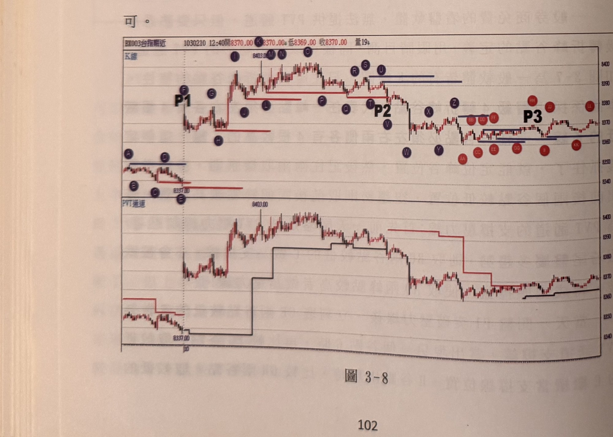
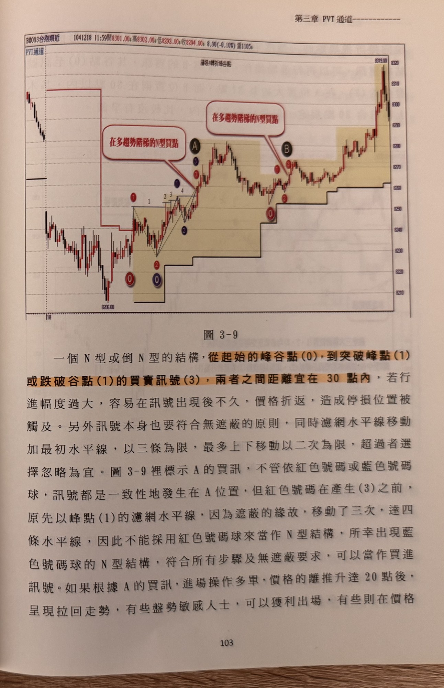

## p.102

H 接任新的支撐位置，再出現新的谷點 J 時，比較 H、J 谷點取 J 為新的支撐位置，當 P2 跌破 J 谷點時，代表行情轉為空頭主導，但此時 L 的右邊還沒出現 4 根較低的 K 線，無法確認為峰點，因此只能先取 K 與 I 兩峰點進行比較，取較高的 I 為壓力線，隨後 J 確認為峰點時，立刻比較 K 與 J 兩峰點，取較高的 K 接替新的壓力位置，依此推演，只要出現新的峰點，即比較最近兩個峰點，這種橋段一直重複進行，直到壓力線被 K 線收盤突破為止，自 P2 跌破後，就沒有 K 線收盤突破壓力位置，代表空趨勢一直持續掌制著行情，則操作便以尋找放空訊號為主。因此，PVT 通道即便無法在一般軟體取得，仍然可以透過目視去建構隱形的通道。多練習幾次，自然駕輕就熟。

圖 3-8 亦是簡易地在盤中畫出 PVT 通道的支撐壓力線，紅色水平線為支撐，藍色水平線為壓力，P1 突破前一天尾盤的 A、D 較高的峰點壓力後，開始轉為畫多趨勢的支撐，尋找最近二個谷點孰低即可。

**圖 3-8**

> 圖說（figure notes）：上下兩部分構成一圖，皆為一分鐘K線圖（報價列「BX003台指期近 1030210 12:40開8370.00 高8370.00 低8369.00 收8370.00 量19」）。上半標示「K線」，以紫色圓圈字母 A～L 依序標示一系列峰谷轉折點，「P1」「P2」標示於圖中兩個關鍵比較位置（P1 位於左段峰點附近，P2 位於中段一個較低的峰點），另有 M～Z、AA～LL 等紫色（谷點）與紅色（峰點）圓圈字母延伸標示右半段的一系列峰谷轉折點，「P3」標示於右段。下半標示「PVT通道」，為對應的價格 K 線圖疊加紅色水平支撐線與黑色（隨後轉紅）水平壓力階梯線：價格自左下「8337.00」附近起漲，突破前波峰點壓力後轉為紅色支撐階梯逐步上移，至中段高點「8403.00」附近（對應 P2）拉回，隨後續漲，右側續創高。全圖示範如何以逐一比較相鄰峰點（或谷點）孰高（孰低）的方式，手動目視建構 PVT 通道的支撐/壓力線。

## p.103

一個 N 型或倒 N 型的結構，從起始的峰谷點 (0)，到突破峰點 (1) 或跌破谷點 (1) 的買賣訊號 (3)，兩者之間距離宜在 30 點內，若行進幅度過大，容易在訊號出現後不久，價格折返，造成停損位置被觸及。另外訊號本身也要符合無遮蔽的原則，同時濾網水平線移動加最初水平線，以三條為限，最多上下移動以二次為限，超過者選擇忽略為宜。圖 3-9 裡標示 A 的買訊，不管依紅色號碼或藍色號碼球，訊號都是一致性地發生在 A 位置，但紅色號碼在產生 (3) 之前，原先以峰點 (1) 的濾網水平線，因為遮蔽的緣故，移動了三次，達四條水平線，因此不能採用紅色號碼球來當作 N 型結構，所幸出現藍色號碼球的 N 型結構，符合所有步驟及無遮蔽要求，可以當作買進訊號。如果根據 A 的買訊，進場操作多單，價格的離推升達 20 點後，呈現拉回走勢，有些盤勢敏感人士，可以獲利出場，有些則在價格

**圖 3-9**

> 圖說（figure notes）：一分鐘K線圖（報價列「BX003台指期近 1041218 11:59開8301.00 高8302.00 低8292.00 收8294.00 8.00(-0.10%) 量1105」），左上角標籤「PVT通道」，圖內另有標題文字「層級4轉折峰谷點」。價格自左側高檔階梯壓力線（紅色）下方走出，下探後打底於低點「8206.00」附近，隨後黑／紅階梯狀 PVT 支撐線隨行情逐步上移。圖中以淺黃色圓角網底標示兩段 N 型買訊區間：第一段於標示 A 附近，以數字⓪①②③④標示 N 型（或倒 N 型再轉正）的各轉折點，紅色對話框「在多趨勢階梯的N型買點」以線指向 A；第二段於標示 B 附近，同樣以⓪①②③標示轉折點，另一個紅色對話框「在多趨勢階梯的N型買點」以線指向 B。價格其後持續走高，右上角最高點標示「8319.00」，PVT 支撐階梯線同步逐級墊高。
