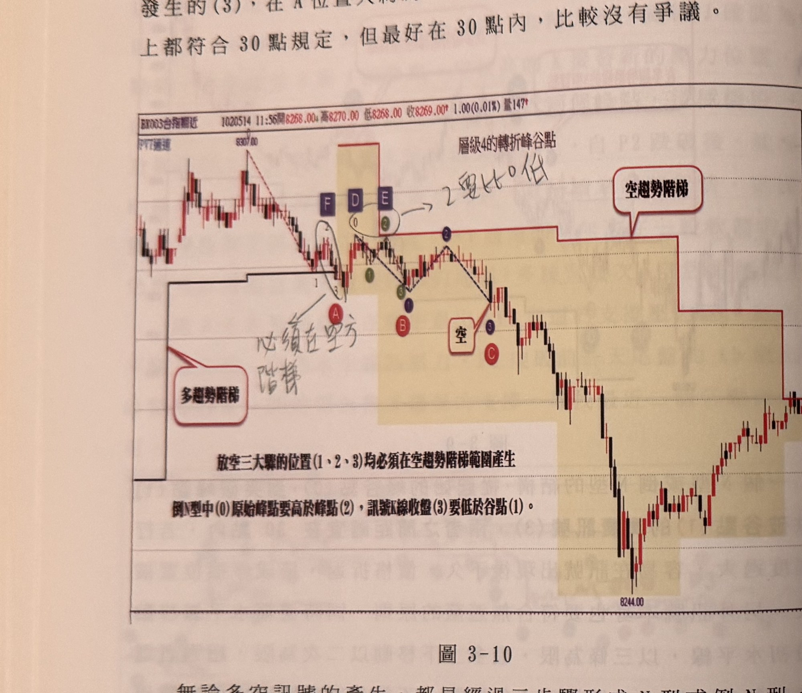
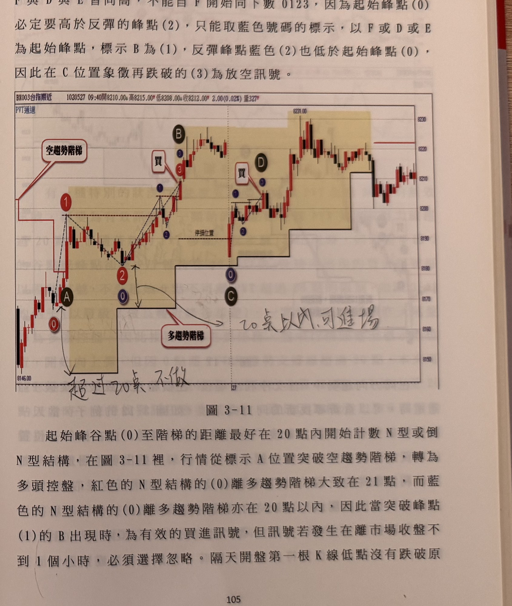

## p.104

拉回接近進場點時，選擇平手離場觀望，稍後出現標示 B 形成 N 型結構買訊，可以再行進場操作，而 A 與 B 的買訊，其谷點（0）至訊號發生的（3），在 A 位置大約為 31 點，而 B 位置則在 30 點以內，基本上都符合 30 點規定，但最好在 30 點內，比較沒有爭議。

**圖 3-10**

> 圖說（figure notes）：一分鐘K線圖（報價列顯示「BX003台指期近 1020514 11:56開8268.00高8270.00低8268.00收8269.00 1.00(0.01%)量147」，副標題「PVT通道」，圖內標題「層級4的轉折峰谷點」），圖上以淺黃色網底標示一段訊號區間。左側價格自高點「8307.00」反轉下跌，深色方框字母 F、D、E 依序標示三個相近高點（旁註手寫「2要比0低」，指反彈峰點須低於起始峰點），下方深色圓圈「0」「2」分別標示於 D、E 下方。紅色階梯狀「空趨勢階梯」線（右上角對話框以線指向）隨後續破底而下移；左下角紅色圓圈「A」搭配對話框「多趨勢階梯」以線指向早段的多趨勢階梯殘留階梯線。價格自 F/D/E 一帶下跌後，以虛線折線依序標示綠色圓圈「1」「3」（小）、藍色圓圈「1」，經一次反彈至藍色圓圈「2」（峰點），再度下跌至紅色圓圈「B」及藍色圓圈「1」，「空」對話框以線指向此處，紅色圓圈「3」與「C」標示放空訊號確認位置。此後價格持續破底下跌，中途小幅反彈整理，最低點約「8244.00」，右側末端小幅止跌反彈。圖下方文字（原圖內建說明）：「放空三步驟的位置（1、2、3）均必須在空趨勢階梯範圍產生」「倒N型中(0)原始峰點要高於峰點(2)，訊號K線收盤(3)要低於谷點(1)。」

無論多空訊號的產生，都是經過三步驟形成 N 型或倒 N 型，分為標示 1（突破或跌破），2（折返），3（再突破或再跌破），但要注意這三個步驟中，除了起始峰點（0）或起始谷點（0）可以在突破或跌破之前標示外，其餘的標示的 123 必須都發生在突破或跌破趨勢階梯之後；換言之，訊號絕對不會發生在突破或跌破趨勢階梯當下；如圖 3-10 的例子，在標示 A 位置為價格跌破多趨勢階梯，雖然剛好跌破時外觀上有個倒 N 型出現，但 A 位置絕對不為放空訊

## p.105

前標示的 1 及 2，都是發生在跌破之前，而非跌破之後，自然不能為訊號，必須以 F 當作起始峰點（0）開始尋找倒 N 型的空訊，在圖中，F 與 D 與 E 皆同高，不能自 F 開始向下數 0123，因為起始峰點（0）必定要高於反彈的峰點（2），只能取藍色號碼的標示，以 F 或 D 或 E 為起始峰點，標示 B 為（1），反彈峰點藍色（2）也低於起始峰點（0），因此在 C 位置象徵再跌破的（3）為放空訊號。

**圖 3-11**

> 圖說（figure notes）：一分鐘K線圖（報價列顯示「BX003台指期近 1020527 09:40開8210.00高8215.00低8208.00收8212.00 2.00(0.02%)量327」，副標題「PVT通道」），圖上以淺黃色網底標示兩段訊號區間。左側紅色階梯狀「空趨勢階梯」線（左上角對話框以線指向）從高點下移，紅色圓圈「1」標示起始峰點，價格下跌至紅色圓圈「2」、黑底白字圓標「A」及藍色圓圈「0」處止跌（對應倒N型的原始谷點 0），隨後反彈，藍色圓圈「1」「2」標示反彈途中的峰谷，「買」對話框與紅色圓圈「3」、藍色圓圈「3」共同標示於標示「B」處的K線（買進訊號，倒N型的確認突破），下方一道虛線標示「停損位置」。買進之後價格持續走高，中途在高檔區間小幅震盪，以垂直虛線分隔進入下一交易日；隨後價格拉回至黑底白字圓標「C」及藍色圓圈「0」處，再度反彈，藍色圓圈「1」「2」標示第二次的峰谷序列，「買」對話框與藍色圓圈「3」標示於標示「D」處的K線（第二次買進訊號），此後價格再度上攻至最高點「8231.00」附近，隨後拉回整理，右側末端在「8210～8220」區間小幅震盪走平。

起始峰谷點（0）至階梯的距離最好在 20 點內開始計數 N 型或倒 N 型結構，在圖 3-11 裡，行情從標示 A 位置突破空趨勢階梯，轉為多頭控盤，紅色的 N 型結構的（0）離多趨勢階梯大致在 21 點，而藍色的 N 型結構的（0）離多趨勢階梯亦在 20 點以內，因此當突破峰點（1）的 B 出現時，為有效的買進訊號，但訊號若發生在離市場收盤不到 1 個小時，必須選擇忽略。隔天開盤第一根 K 線低點沒有跌破原
