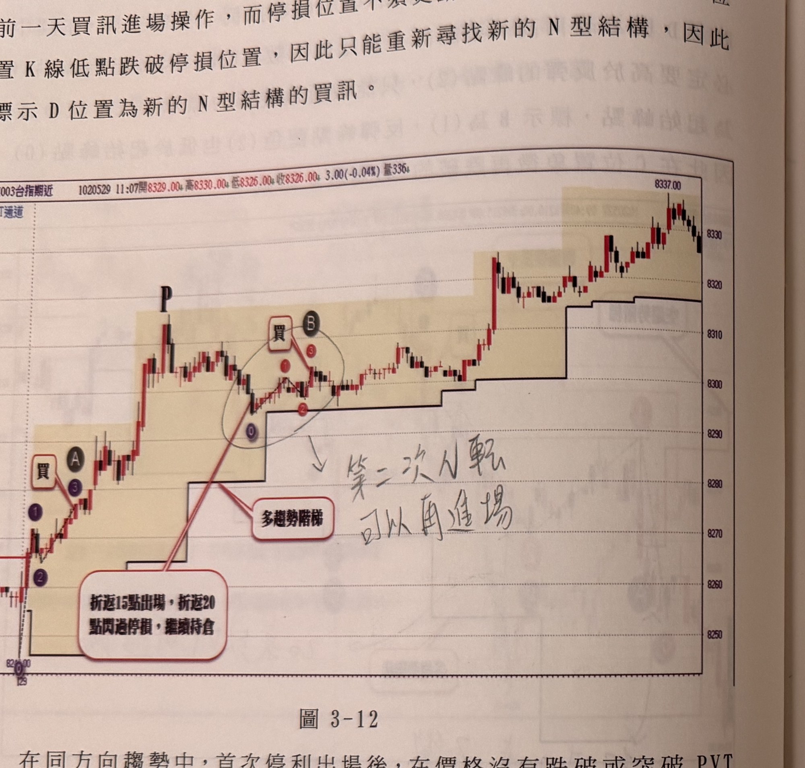
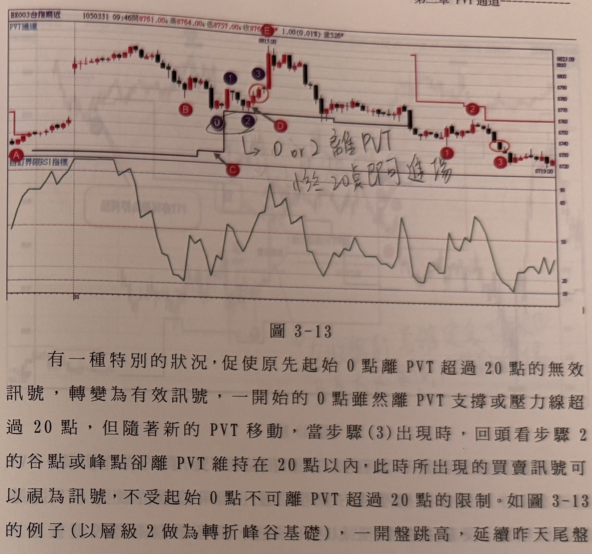

## p.106

來 B 位置買訊的停損位置，那麼可以在第一根一分鐘 K 線收盤承接前一天買訊進場操作，而停損位置不須更動，但本例在開盤的 C 位置 K 線低點跌破停損位置，因此只能重新尋找新的 N 型結構，標示 D 位置為新的 N 型結構的買訊。

在同方向趨勢中，首次停利出場後，在價格沒有跌破或突破 PVT 通道時，可以重新尋找新的同方向訊號，如圖 3-12 的例子，當天一開盤突破空方 PVT 壓力線後，行情轉為多頭趨勢，並在標示 A 位置出現買進訊號，之後價格抵達 P 點紅 K 線，開始出現拉回走勢，如果停利策略採取折返 15 點則會被觸及停損，如果折返採取 20 點折返機制，則閃過觸殺，可以持倉到圖的盡頭，如果被停利出場後，可以再尋找 N 型結構，當然 N 型的起始谷點也必須離 PVT 通道 20 點以內，當標示 B 位置符合三大步驟時，可以重新進場買進。

**圖 3-12**

> 圖說（figure notes）：一分鐘K線圖（報價列「BX003台指期近 1020529 11:07開8329.00 高8330.00 低8326.00 收8326.00 3.00(-0.04%) 量336」）。價格自左下低點「8266.00」附近起漲，紫色圓圈①②與紅框「買」、黑色圓圈 A 標示第一次買進訊號（3）；紅色 PVT 支撐階梯線（以對話框「多趨勢階梯」及長斜紅線指向階梯起點）隨後續漲逐步上移，價格攻抵標示「P」的高點紅 K 線後拉回，於一橢圓圈起的小型整理區（⓪①②③，黑色圓圈 B）形成第二組 N 型結構，紅框「買」標示第二次買進訊號，手寫註記「第二次N轉可以再進場」以線指向此處；另一對話框「折返15點出場，折返20點閃過停損，繼續持倉」以線指向 P 點拉回後的低點（圓圈②附近），說明兩種停利設定的結果差異。其後價格持續走高，至右上角最高點「8337.00」。

## p.107

有一種特別的狀況，促使原先起始 0 點離 PVT 超過 20 點的無效訊號，轉變為有效訊號，一開始的 0 點雖然離 PVT 支撐或壓力線超過 20 點，但隨著新的 PVT 移動，當步驟 (3) 出現時，回頭看步驟 2 的谷點或峰點卻離 PVT 維持在 20 點以內，此時所出現的買賣訊號可以視為訊號，不受起始 0 點不可離 PVT 超過 20 點的限制。如圖 3-13 的例子（以層級 2 做為轉折峰谷基礎），一開盤跳高，延續昨天尾盤轉為多頭控盤，因此找買訊為主要任務，盤中行情回檔至標示 0 位置，開始向上彈，但因 0 點離 PVT 多趨勢支撐線超過 20 點，本來可能忽略訊號的形成，當 N 型結構中拉回的步驟 (2) 離 PVT 縮小至 20 點以內時，使得找買訊任務重新啟動，這是因為標示 B 及 0 這兩個轉折谷點在比較孰低時，將原來在 PVT 在 C 位置向上移動貼近行情價格，當標示 D 的紅 K 線形成雙腳谷點，向上突破峰 (1) 時，在 (3) 產生買訊，則不再受起始 0 點必須離 PVT 小於 20 點的限制。隨後標示 E 位置蹦出一根漲幅超過 30 點以上的紅 K 線，原以為行情將飆上去，卻立刻折返被潑冷水，記得啟動折返 15 點或 20 點停利機制，來面對任何突發意外走勢。

**圖 3-13**

> 圖說（figure notes）：上下兩部分構成一圖。上方為一分鐘K線圖（左上角標籤「PVT通道」，報價列因相片角度模糊「BX003台指期近 1050331 09:4x開87xx.00...」[?]），下方為「自訂界限RSI指標」線圖。價格圖自紅色圓圈 A（鄰近一水平支撐階梯）起漲，經紅色圓圈 B，小幅拉回處以紫色圓圈⓪①②標示一組轉折，手寫註記「0 or 2 離PVT」與「小於20點即可進場」以線指向此處，紅色圓圈 C、D 分別標示相關的 0 點／確認點；隨後價格急拉至最高點「8815.00」，紫色圓圈①③與紅色圓圈 D 標示於高點附近，此後 PVT 壓力階梯線（紅色）隨行情下滑逐級下移，紅色圓圈 E 標示下跌途中一點，價格持續走低至右下角「8719.00」附近，紫色圓圈①③再次標示於此。下方 RSI 指標圖線在全程於約 20～90 之間反覆震盪，走勢與上方價格轉折相呼應。
