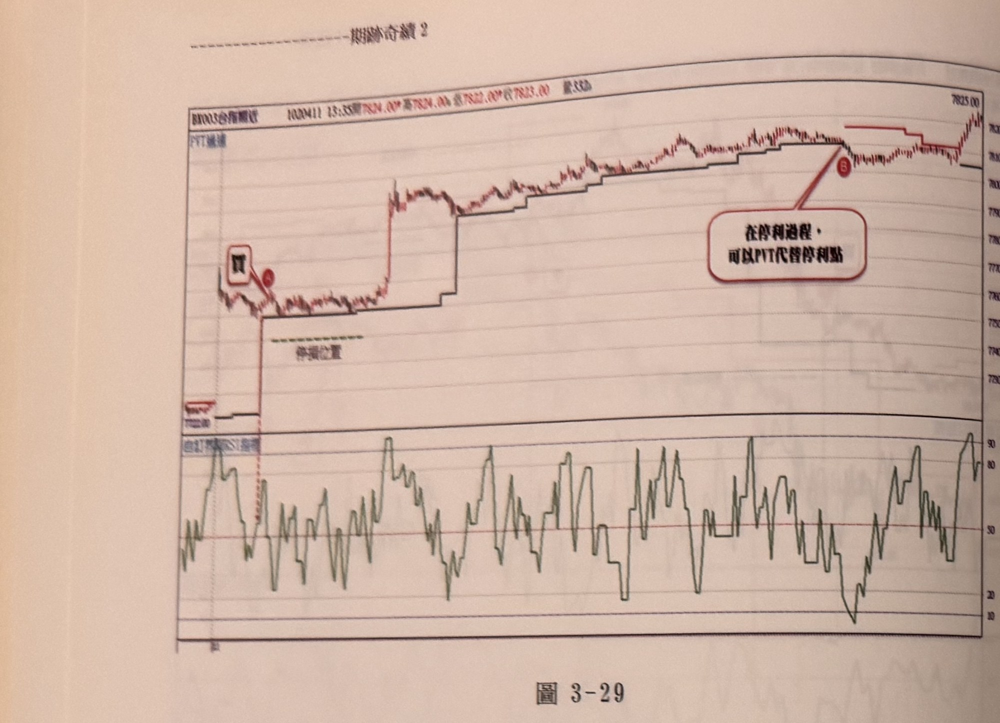
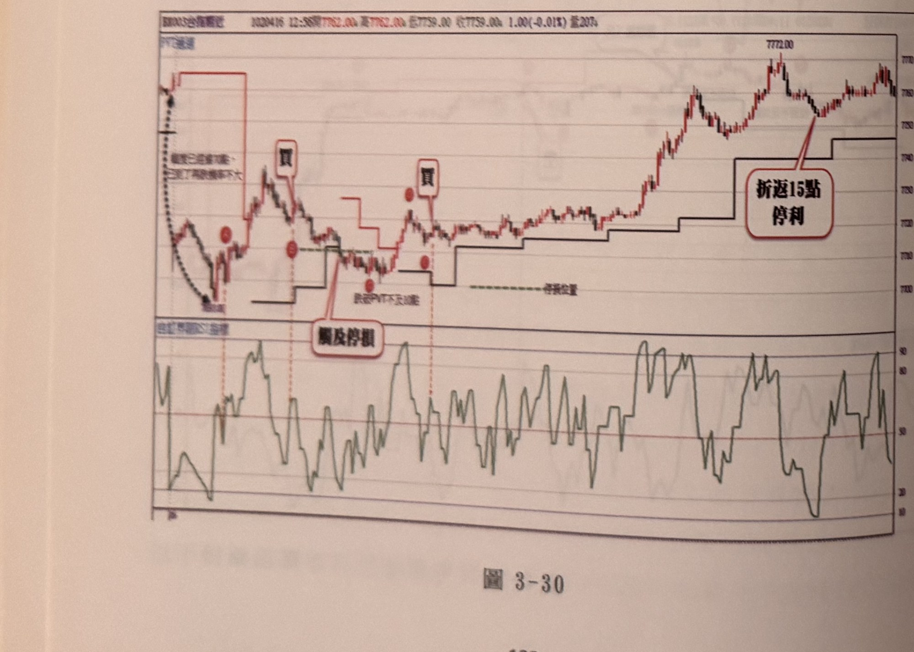
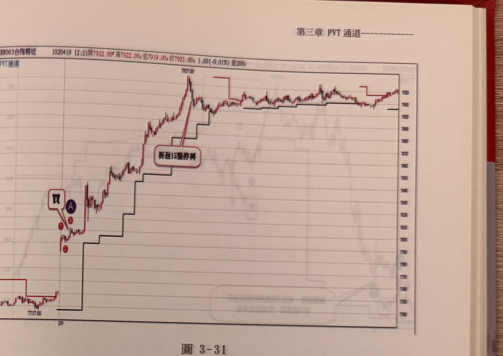
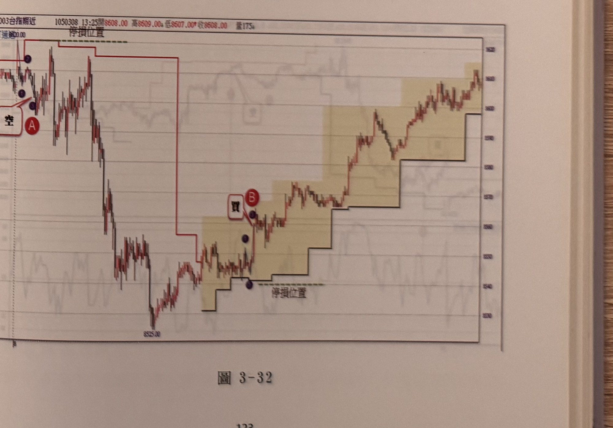

## p.122

**圖 3-29**

> 圖說（figure notes）：台指期近一分鐘K線圖（BX003台指期近，時間1020411 13:33，開7824.00，高7824.00，低7822.00，收7823.00，量532），上方為K線搭配紅色PVT通道階梯線（文字「停損位置」以綠色虛線標示），下方副圖為自訂界限RSI指標。左段價格自低點快速上攻，文字框「買」搭配紅點A標示於起漲點，PVT黑色階梯線隨價格上移；價格持續走高，中段一度加速跳升後續於高檔區間震盪盤堅，價格逐步墊高，至右段高點附近出現紅點B，文字框「在停利過程，可以PVT代替停利點」以線段指向此處，說明可用PVT階梯本身做為移動停利參考；K線尾端收在7823.00附近高檔。

**圖 3-30**

> 圖說（figure notes）：台指期近一分鐘K線圖（BX003台指期近，時間1020416 12:56，開7762.00，高7762.00，低7759.00，收7759.00，跌1.00(-0.01%)，量207），上方為K線搭配紅色PVT通道階梯線（文字「停損位置」以綠色虛線標示），下方副圖為自訂界限RSI指標。左段價格自高點快速下跌至低點（文字「幅度已追蹤不大，主力已陸續獲得不大」），文字框「買」搭配紅點C標示於止跌反彈起點，價格反彈後拉回，紅點D，文字框「觸及停損」以線段指向此處，PVT階梯線在E點附近（文字「跌破PVT不足3點」）小幅下移；價格再度止跌回升，第二個文字框「買」搭配紅點F標示於此段反彈起點；其後價格持續走高，波段高點達7772.00，文字框「折返15點停利」以線段指向高點附近的K線，說明以折返15點做為停利依據；尾端價格於高檔區間小幅震盪整理。

## p.123

**圖 3-31**

> 圖說（figure notes）：台指期近一分鐘K線圖（BX003台指期近，時間1020419 12:21，開7922.00，高7922.00，低7919.00，收7921.00，跌1.00(-0.01%)，量200），上方為K線搭配紅色PVT通道階梯線。左段價格自低點7737.00附近快速上攻，紅點1、2、藍點A、紅點3構成一組買訊結構，文字框「買」標示於起漲點。PVT黑色階梯線隨價格快速上移，價格持續飆漲至波段高點7927.00，文字框「折返15點停利」以線段指向高點附近K線；其後價格拉回並於中高檔區間反覆震盪整理，PVT階梯線隨盤整走勢小幅上下調整，尾端價格收在7930上下。

**圖 3-32**

> 圖說（figure notes）：台指期近一分鐘K線圖（BX003台指期近，時間1050308 13:25，開8608.00，高8609.00，低8607.00，收8608.00，量175），上方為K線搭配紅色PVT通道階梯線（文字「停損位置」標示水平線），下方以淺黃色矩形區塊標示多個階梯區間。左段價格自高點下跌，藍點2、1、3構成一組結構，文字框「空」搭配紅點A標示於下跌起點，PVT紅色階梯線隨跌勢下移；價格持續下跌至低點8525.00，其後止跌反彈，文字框「買」搭配紅點B標示於反彈起漲點附近（下方另有藍點與「停損位置」虛線標示），淺黃色矩形依序標示價格沿黑色PVT階梯線逐階向上推升的區間；價格持續走高，中段一度小幅拉回整理後再創新高，尾端K線收在高檔區間。
