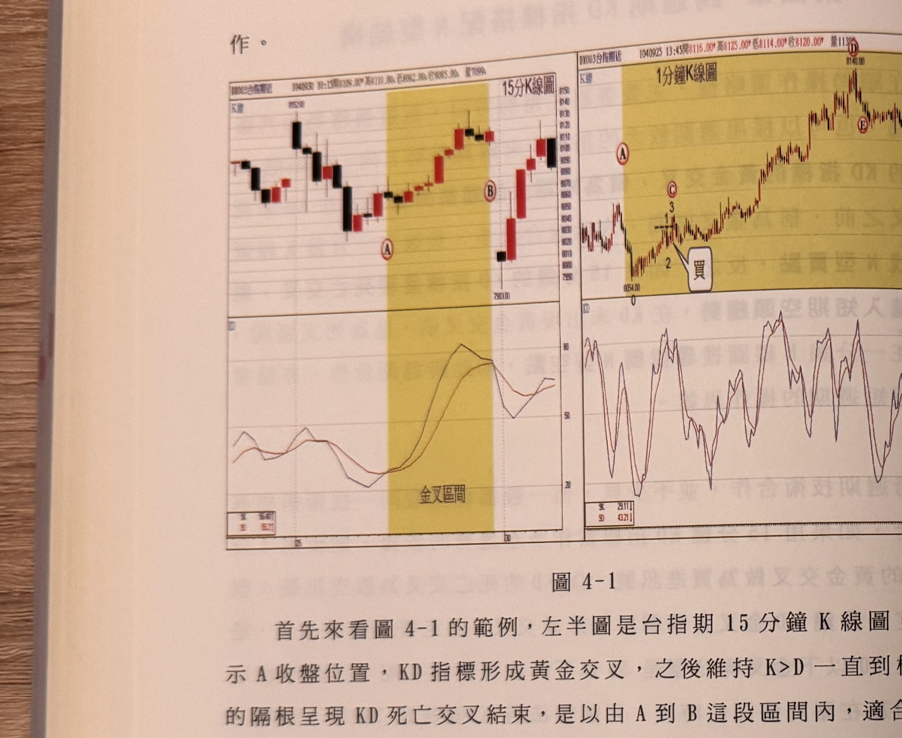
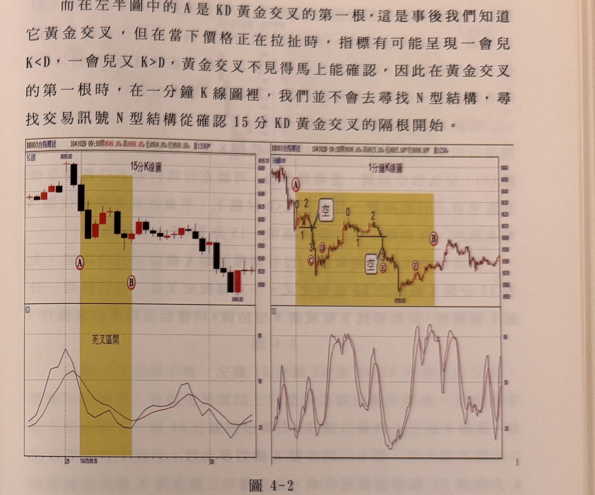

## p.128

作。

**圖 4-1**

> 圖說（figure notes）：左右並排兩張台指期K線圖。左半圖為15分鐘K線圖（BX003合指期近，時間1040930 10:15，開8108.00，高8110.00，低8082.00，收8085.00，量709），下方副圖為KD指標（K線、D線兩條曲線）。K線自左段高點8152附近下跌後止穩，紅點A標示於K線收盤處（KD黃金交叉起點），其後K>D持續維持，直到紅點B所在K線隔根KD轉為死亡交叉為止；A到B之間以黃色矩形區域標示，對應下方KD圖同樣以黃色區域標示「金叉區間」，可見該區間內K線由黑翻紅、持續走高後在B處出現長黑K（低點7983.00）拉回。右半圖為對應同一區間的1分鐘K線圖（DX003台指期近，時間1040925 13:45，開8116.00，高8125.00，低8114.00，收8120.00，量113），黃色矩形區域同樣標示A到B所對應的165根一分鐘K線範圍。1分鐘K線左段自低點8054.00附近（標示0）止跌，經紅點1、2、3構成上升N型三步驟，文字框「買」以線段指向突破點K線，其後價格持續上攻，紅點C、D、E標示於上攻途中的轉折點，最終在右段高點附近出現紅點D（最高8148.00）、E，尾端小幅拉回整理。

首先來看圖 4-1 的範例，左半圖是台指期 15 分鐘 K 線圖，在標示 A 收盤位置，KD 指標形成黃金交叉，之後維持 K>D 一直到標示 B 的隔根呈現 KD 死亡交叉結束，是以由 A 到 B 這段區間內，適合偏多操作，此協助確定操作的方向；而右半圖一分鐘 K 線圖裡的黃色區域中標示 A 到 B，是左半圖 15 分鐘 K 線圖裡的 A 到 B 換成一分鐘 K 線圖的範圍，在 15 分 K 線圖裡只有 11 根 K 線，轉換到一分鐘 K 線圖裡，它就變成 165 根一分鐘 K 線的組合。

因為大週期的 15 分鐘 KD 呈現偏多趨勢，我們只要在一分鐘 K 線圖裡黃色區域裡，尋找 N 型結構步驟中的 123 各定點位置，當找到突破峰位(1)的(3)時，就是買進訊號出現，如在標示 C 位置，它出現了上升 123 步驟組合 N 型，因此在突破峰位(1)時，在(3)出現 K 線收盤突破(1)，就產生買進訊號。

## p.129

而在左半圖中的 A 是 KD 黃金交叉的第一根，這是事後我們知道它黃金交叉，但在當下價格正在拉扯時，指標有可能呈現一會兒 K<D，一會兒又 K>D，黃金交叉不見得馬上能確認，因此在黃金交叉的第一根時，在一分鐘 K 線圖裡，我們並不會去尋找 N 型結構，尋找交易訊號 N 型結構從確認 15 分 KD 黃金交叉的隔根開始。

**圖 4-2**

> 圖說（figure notes）：左右並排兩張台指期K線圖。左半圖為15分鐘K線圖（BX003台指期近，時間1041029 09:30，開8649.00，高8660.00，低8604.00，收8609.00，量13569），下方副圖為KD指標。K線自左段高點8695.00處開始一路下跌，紅點A標示黃金交叉/死亡交叉起算的K線，其後以黃色矩形區域標示「死叉區間」（對應下方KD圖同樣以黃色標示），區間內K線持續下跌至紅點B所在K線，其後跌勢趨緩、於低檔區間震盪整理（低點標示8464.00附近）。右半圖為對應同一區間的1分鐘K線圖（BX003台指期近，時間1041029 09:30，開8606.00，高8615.00，低8605.00，收8609.00，量1258），黃色矩形區域標示A到B所對應的一分鐘K線範圍。1分鐘K線左段自高點（紅點A）快速下跌，標示0、1、2、3構成下降結構，文字框「空」標示於突破後的下殺K線，紅點C、D，其後價格於低點附近止跌小幅反彈，再出現標示0、1、2、3的第二組倒N型結構，第二個文字框「空」標示於此處，紅點E、F；最終在B點附近止跌，右段價格反彈後於高檔區間震盪整理。

什麼狀況下可以在黃金交叉或死亡交叉第一根裡，尋找買賣訊號呢？15 分鐘 K 線收盤係在 15、30、45 及 60 分確認，因此如果在一分鐘形成 N 型或倒 N 型結構完成的步驟(3)，剛好出現在 15 分鐘 K 線收盤時間，那麼在大週期確認趨勢轉向同時，一分鐘剛好也完成 N 型或倒 N 型結構，這種狀況是允許在金叉及死叉當根尋找訊號並操作的。

以圖 4-2 的例子來說明這種狀況，左半圖的 15 分鐘 K 線圖裡，標示 A(09:30)這根 K 線為 KD 死亡交叉的第一根，確認短線上偏空
