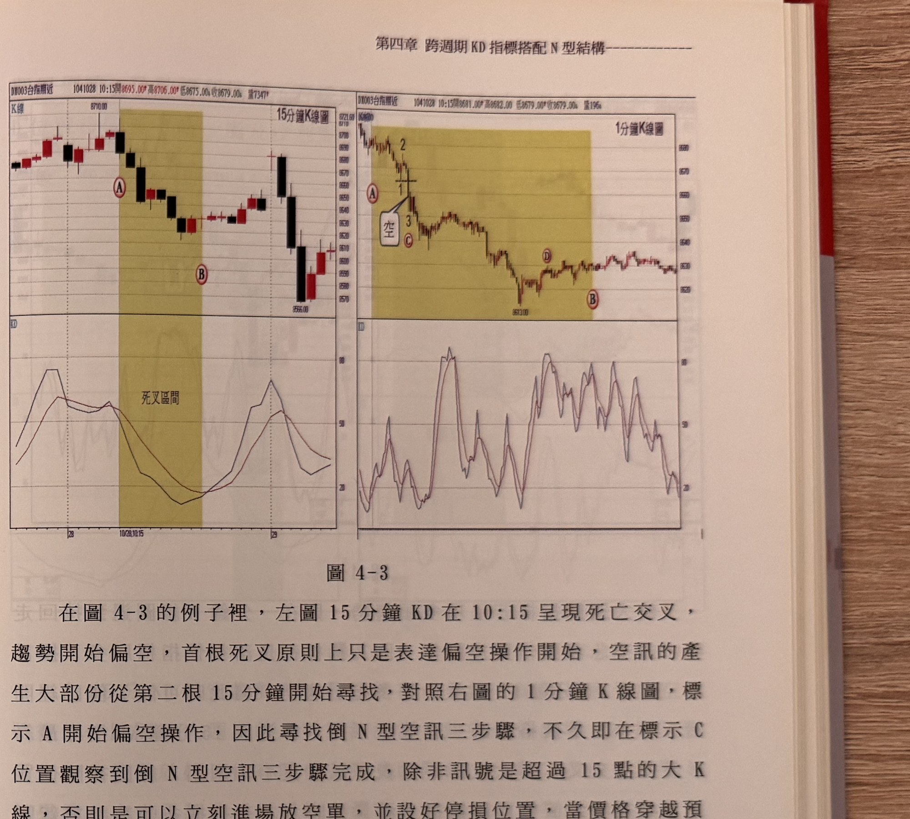

## p.130

操作，照理說放空訊號應該出現在 A 的隔根才進行尋找倒 N 型，但右半圖一分鐘 K 線圖裡，卻標示 C 位置完成倒 N 型的三步驟，而這個 C 位置剛好是 15 分 KD 死亡交叉標示 A 的 K 線收盤時間 (09:30)，兩者撞到同一時間，兩好變一好，形成第一時間放空點。

而放空後，根據停利機制，折返 15 點時，在標示 D 位置平倉，接著行情反彈結束後，重新向下形成倒 N 型，在標示 E 位置完成步驟 (3)，是為放空訊號，進場操作後，可能在行情折返 F 位置觸及停利點平倉。只要指標一直處在 K<D 狀態下，平倉後就繼續尋找倒 N 型來放空，直到標示 B 位置的隔根，15 分 KD 黃金交叉為止。

讀者所使用的看盤軟體，沒有兩種週期 K 線圖並列的功能，先看 15 分鐘 K 線圖的 KD 是否交叉，一旦確認交叉後，再切換到一分鐘 K 線圖裡，開始尋找 N 型或倒 N 型結構，同樣能運用本法來操作。

## p.131

**圖 4-3**

> 圖說（figure notes）：左右並列兩組「K線＋KD」子圖。左圖標題「15分鐘K線圖」（報價列「DX003台指期近 1041028 10:15開8695.00 高8706.00 低8675.00 收8679.00 量7347」）：K 線自左側高檔區反轉下跌，紅色圓圈 A 標示於高點附近的死亡交叉起始 K 線（黃色網底區間標示「死叉區間」），價格持續下探至紅色圓圈 B（低點「8566.00」附近），隨後反彈。下方 KD 子圖中，K 值（黑線）與 D 值（紅線）在死叉區間內由高檔同步下彎至低檔糾結，B 對應處兩線觸底後轉折向上。右圖標題「1分鐘K線圖」（報價列「DX003台指期近 1041028 10:1x開8681.00 高8682.00 低8579.00 收8679.00 量196」）：K 線自高點下殺，紫色數字②①③標示一組倒 N 型轉折，紅色圓圈 A 與紅框「空」標示放空訊號位置（對應左圖 A 死叉時間點），紅色圓圈 C 標示倒 N 型步驟 (3) 完成處；價格續跌至低點「8613.00」附近，紅色圓圈 D 標示反彈的停利平倉點，其後小幅整理，紅色圓圈 B 標示於圖右下方。下方 KD 子圖線在低檔反覆糾結震盪，於右側翻揚向上。
