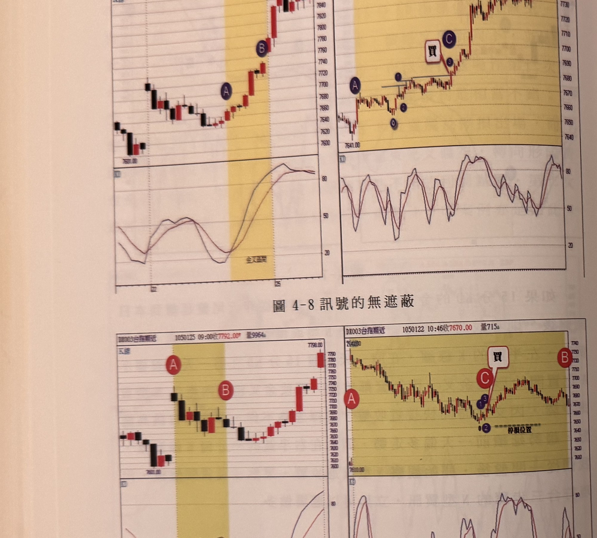
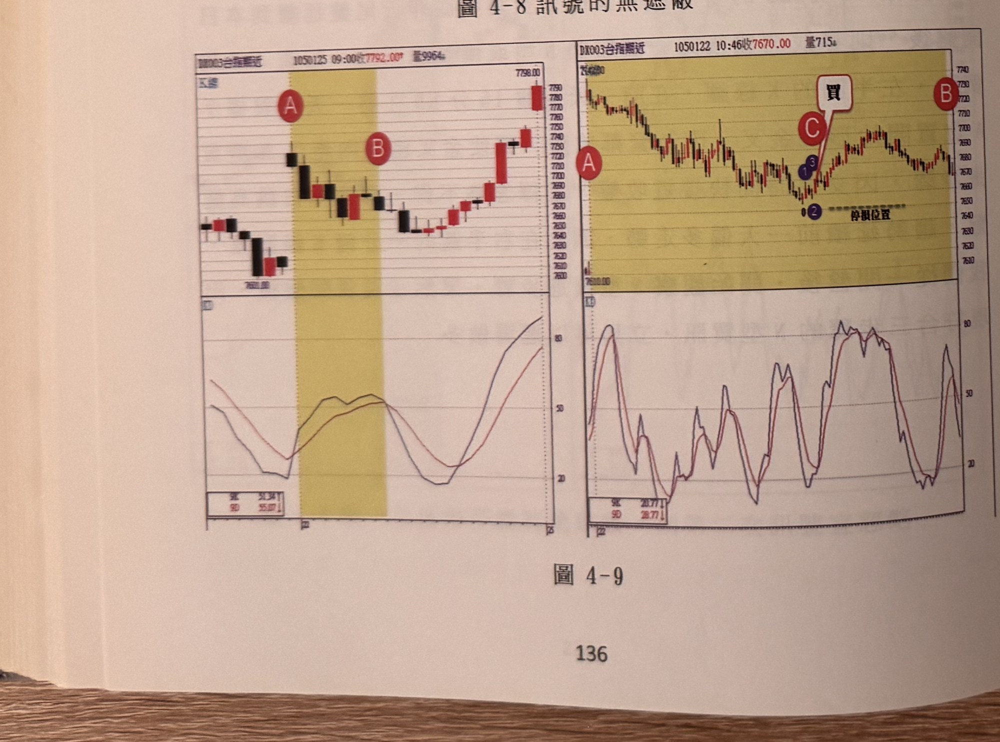
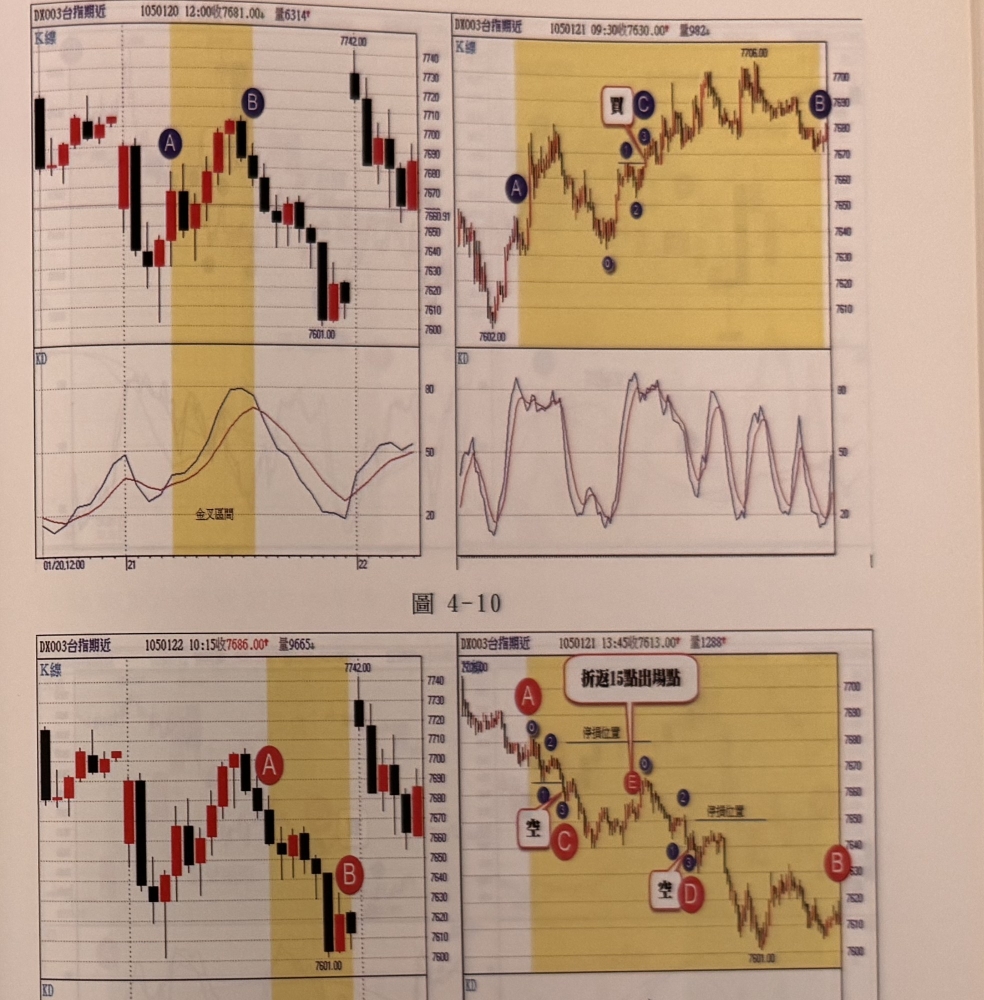
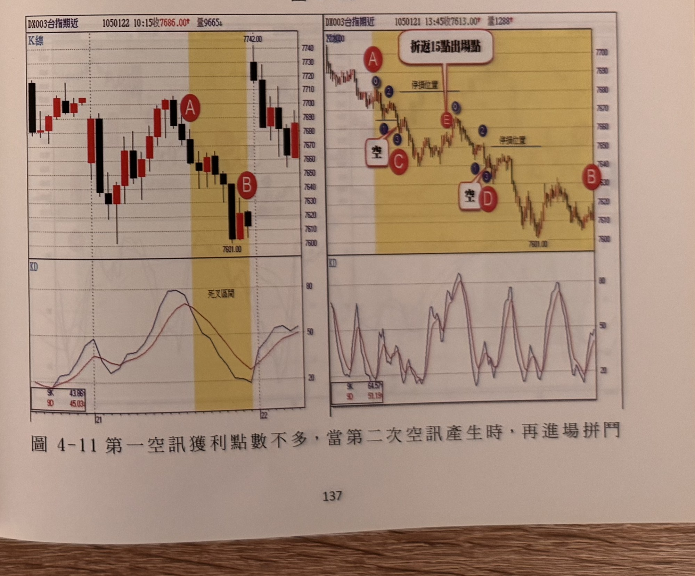

## p.136

以下附圖請讀者自行參閱練習

**圖 4-8 訊號的無遮蔽**

> 圖說（figure notes）：左右並列兩組「K線＋KD」子圖（皆為 DX003 台指期近）。左圖（報價列「1050125 10:45收7853.00 量3632」）：K 線自低點「7601.00」附近反彈走高，紫色圓圈 A 標示於 15 分 KD 死亡交叉起點（黃色網底區間，下方 KD 圖標「金叉區間」），紫色圓圈 B 標示於黃色區間末端、行情持續墊高處，其後續漲至高點「7881.00」。右圖（報價列「1050122 13:45收7748.00 量1843」）：K 線自低點「7641.00」反彈，紫色圓圈 A 標示起漲點，⓪①②標示一組 N 型轉折，紅框「買」與紫色圓圈③、C 標示買進訊號位置，其後價格一路上攻至右上角高點「7752.00」（紫色圓圈 B）。下方兩組 KD 子圖走勢皆與各自 K 線圖同步，於黃色網底區間內由低檔翻揚。

**圖 4-9**

> 圖說（figure notes）：左右並列兩組「K線＋KD」子圖。左圖（報價列「1050125 09:00收7792.00 量9964」）：K 線先下跌至紅色圓圈 A（黃色網底區間起點）附近，隨後在區間內築底走高，紅色圓圈 B 標示於區間末端、續漲處，最終上攻至高點「7798.00」。右圖（報價列「1050122 10:46收7670.00 量715」）：K 線自高點反轉下跌，紅色圓圈 A 標示於區間起點，價格續跌至低點附近出現紫色⓪①②③與紅框「買」、紅色圓圈 C 標示的買進訊號（旁註「停損位置」水平虛線），隨後價格反彈走高至右側紅色圓圈 B。下方兩組 KD 子圖分別呈現對應的低檔糾結與翻揚走勢。

## p.137

**圖 4-10**

> 圖說（figure notes）：左右並列兩組「K線＋KD」子圖。左圖（報價列「1050120 12:00收7681.00 量6314」）：K 線於高點「7742.00」附近拉回，紫色圓圈 A、B 標示於黃色網底區間（金叉區間）起訖，下方 KD 圖同步標示「金叉區間」，行情其後再度走低至「7601.00」附近。右圖（報價列「1050121 09:30收7630.00 量982」）：K 線自低點「7602.00」反彈，紫色圓圈 A 標示起漲，⓪①②標示一組轉折，紅框「買」與紫色圓圈 C、③標示買進訊號，其後續漲至高點「7706.00」，紫色圓圈 B 標示於右側末端。

**圖 4-11 第一空訊獲利點數不多，當第二次空訊產生時，再進場拼鬥**

> 圖說（figure notes）：左右並列兩組「K線＋KD」子圖。左圖（報價列「1050122 10:15收7686.00 量9665」）：K 線於高點「7742.00」附近反轉，紅色圓圈 A 標示黃色網底區間（死叉區間）起點，價格持續下跌至低點「7601.00」附近，紅色圓圈 B 標示於區間末端。右圖（報價列「1050121 13:45收7613.00 量1288」）：K 線自高點反轉下跌，紅色圓圈 A 標示起跌，紫色⓪①②與紅框「空」、紅色圓圈 C 標示第一次放空訊號（旁註「停損位置」），對話框「折返15點出場點」以線指向此處；行情反彈後再度下跌，紫色⓪①②③與紅框「空」、紅色圓圈 D 標示第二次放空訊號（另一「停損位置」水平線），最終價格於低點「7601.00」附近整理，紅色圓圈 B 標示於右側末端。
