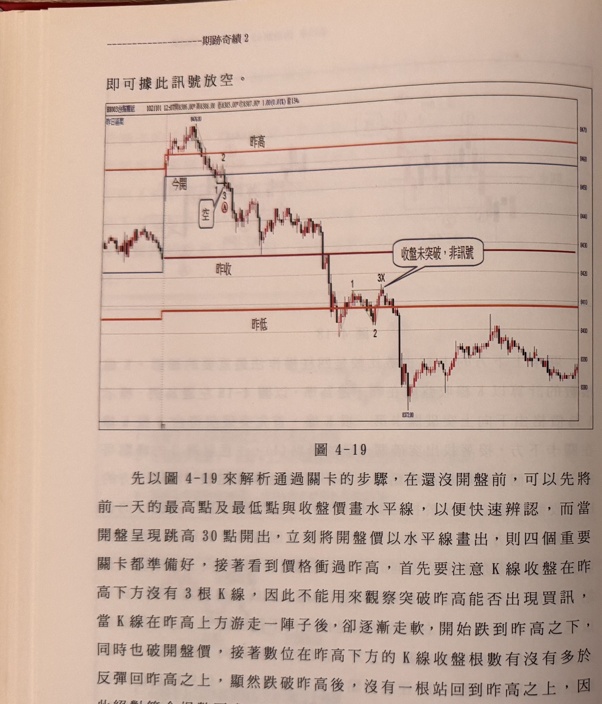
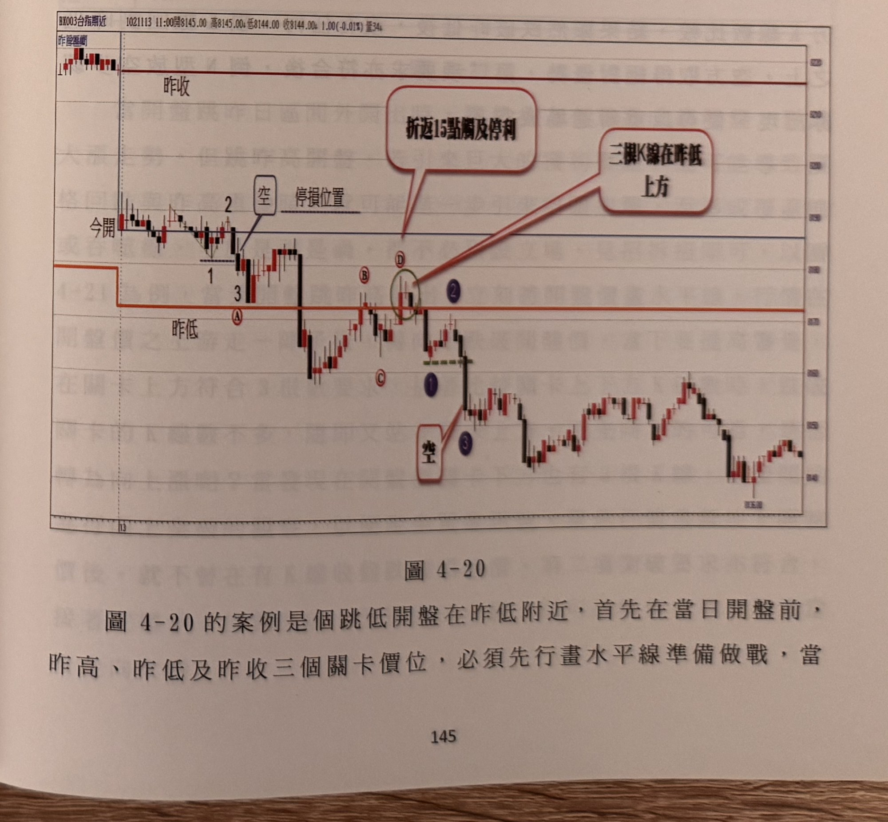

## p.144

即可據此訊號放空。

**圖 4-19**

> 圖說（figure notes）：一分鐘K線圖（報價列「BX003台指期近 1021101 12:07開8386.00 高8388.00 低8385.00 收8387.00 1.00(0.01%) 量134」），左上角標「昨日區間」。圖上以水平線標示四個關卡：紅色「昨高」線、藍色「今開」線、褐紅「昨收」線、紅色「昨低」線。價格開盤跳空走高衝過昨高（峰點「8478.00」），數字 2 標示於一個較低峰點，1、3 與紅色圓圈 A、白框「空」標示放空訊號位置（K 線收盤跌破今開及昨高關卡後形成倒 N 型三步驟）；隨後價格持續下跌，於昨收關卡下方出現數字 1、3X 一組型態，對話框「收盤未突破，非訊號」以線指向此處（說明價格雖一度反彈觸及但收盤未站上關卡，不構成訊號）；價格續破昨低關卡，殺至低點「8372.00」，其後於低檔區間反覆震盪整理。

## p.145

以跌破開盤價來找空訊呢？實在是以開盤價為觀察關卡，那麼會發現跌破開盤價的 K 線收盤根數少於反彈回開盤價之上的 K 線收盤根數，就不能符合跌破關卡，下方 K 線數要多於上方的條件，因此本例只能以跌破昨高為主軸，進行觀察判斷。

而當行情後來一路跌破昨低時，試圖在昨低進行絕地反攻，首先向上突破昨低的關卡前，K 線數多於 3 根，符合第一項要求，接著比較突破昨低關卡上下方 K 線數，亦看出，在關卡上方的 K 線數的確多於關卡下方，又符合第二項要求，接著就是觀察有沒有 N 型買進三步驟，結果卻沒能看到 K 線收盤突破峰點 (1)，當成弱勢橫盤，稍後進一步快速下挫，直至當日收盤，價格未再向上跨越昨低。

**圖 4-20**

> 圖說（figure notes）：一分鐘K線圖（報價列「BX003台指期近 1021113 11:00開8145.00 高8145.00 低8144.00 收8144.00 1.00(-0.01%) 量34」），左上角「昨開區間」。圖上以水平線標示「昨收」（紅）、「今開」（藍）、「昨低」（紅，下移一階）三個關卡。開盤跳低後盤跌，數字 2 標示反彈峰點，紅色圓圈 A 標示於跌破昨低關卡處，1、3 與白框「空」標示放空訊號（下方有「停損位置」虛線）；行情續跌後反彈，紅色圓圈 B、C 標示一段整理，紫色圓圈 D（綠色圈起處）標示價格再度貼近昨低關卡下方，對話框「折返15點觸及停利」以線指向 D 附近、「三根K線在昨低上方」以線指向同一帶，說明此處三根 K 線收盤雖在昨低之上但未能形成有效突破；隨後價格再度下跌，紫色圓圈①③與白框「空」標示另一次放空訊號，價格持續破底後於低檔反覆震盪，尾段小幅走高。
