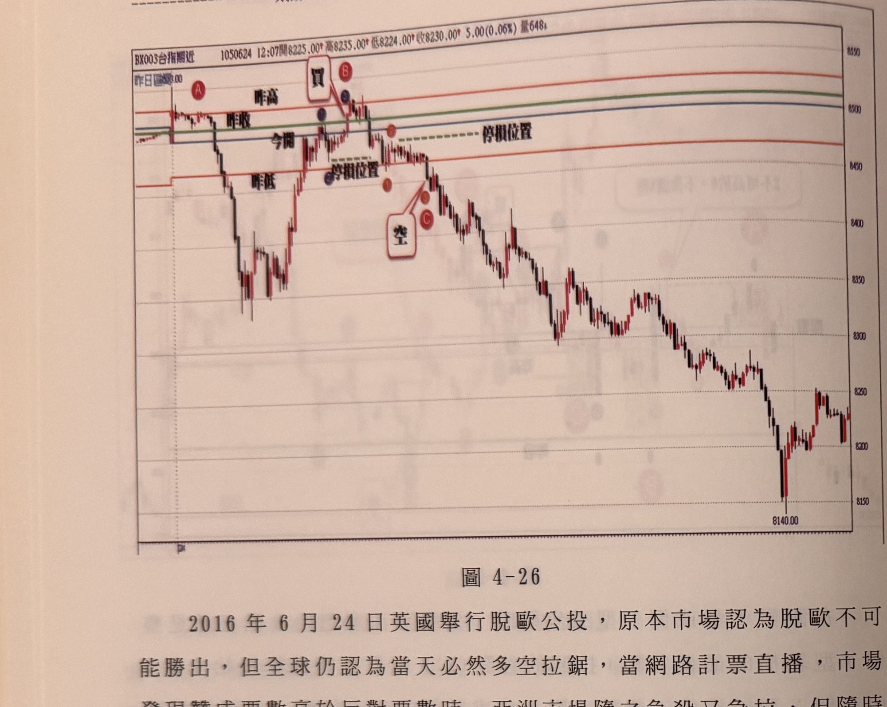
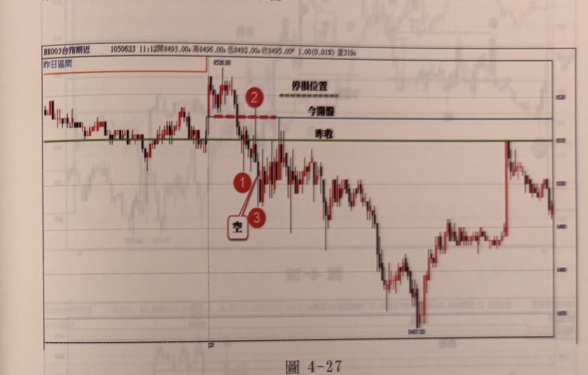
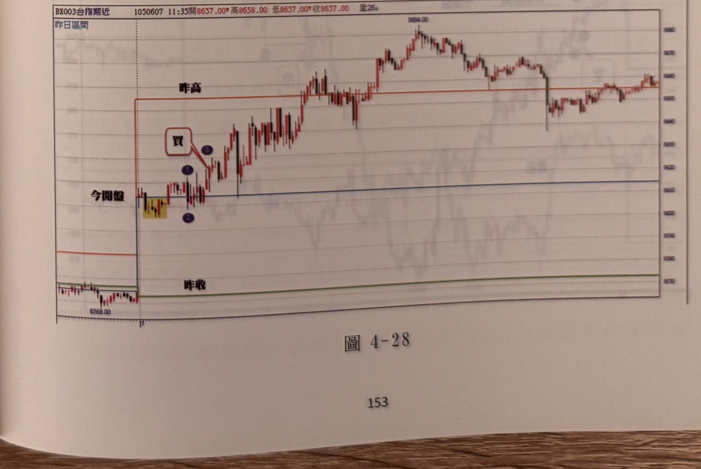

## p.152

成，稍後在 C 位置符合步驟，成為放空訊號，並以 (2) 為停損位置，點數會超過 20 點以上，但這是在重要事件時，要做適當的調整。

**圖 4-26**

> 圖說（figure notes）：一分鐘K線圖（報價列「BX003台指期近 1050624 12:07開8225.00 高8235.00 低8224.00 收8230.00 5.00(0.06%) 量648」），左上角「昨日區間」，圖上以水平線標示「昨高」（紅）、「昨收」（綠）、「今開」（藍）、「昨低」（紅，下移）等關卡。開盤先小幅震盪，紅色圓圈 A 標示於左段；價格向上突破今開、昨收、昨高關卡，紅框「買」與紅色圓圈 B 標示買進訊號，上方另有一條「停損位置」虛線；隨後價格拉回跌破今開、昨收關卡，另一「停損位置」虛線標示於下方，紅框「空」與紅色圓圈 C 標示放空訊號，其後行情持續破底下跌，一路盤跌至低點「8140.00」，尾段小幅反彈。

## p.153

2016 年 6 月 24 日英國舉行脫歐公投，原本市場認為脫歐不可能勝出，但全球仍認為當天必然多空拉鋸，當網路計票直播，市場發現贊成票數高於反對票數時，亞洲市場隨之急殺又急拉，但隨時贊成票一路領先，市場認為事情大條了，開始一路下殺，這種重要事件發生的當下，價格的波動必然放大，停損的機制必然也要隨之變動，但如果不接受停損放大的要求，就只當觀察不要下場操作為宜。那怎麼變動停損風險呢？可以 N 型買進步驟的谷點 (2) 或倒 N 型放空步驟的峰點 (2) 為停損位置。如圖 4-26 為脫歐公投當日走勢，開盤後從 A 一路下跌的過程，並沒有倒 N 型可供尋找，但稍後的急速反彈過程，雖出現 N 型買進三步驟，但訊號卻出現在由當下盤中最低點反漲上來超過 150 點才產生訊號，可以忽略，但若執意進場，則停損位置須設在谷點 (2) 位置，當彈升至 B 位置後，重新下跌，我們可以以開盤或昨收為關卡，來觀察倒 N 型空訊三步驟的形

以下附圖請讀者自行參閱練習

**圖 4-27**

> 圖說（figure notes）：一分鐘K線圖（報價列「BX003台指期近 1050623 11:12開8493.00 高8496.00 低8492.00 收8495.00 1.00(0.01%) 量319」），左上角「昨日區間」，圖上標示「今開盤」（藍）、「昨收」（綠）兩條水平關卡線，另有「停損位置」虛線於高點附近。價格自左段低檔盤整後跳空走高至高點「8526.00」，隨後拉回跌破今開盤、昨收關卡，數字 2 標示於拉回途中一峰點，1、3 與白框「空」標示放空訊號，其後行情持續破底下跌至低點「8457.00」附近，尾段跳空回升後再度走低。

**圖 4-28**

> 圖說（figure notes）：一分鐘K線圖（報價列「BX003台指期近 1050607 11:35開8657.00 高8658.00 低8657.00 收8657.00 量25」），左上角「昨日區間」，圖上標示「昨高」（紅）、「今開盤」（藍）、「昨收」（綠）三條水平關卡線。開盤自低點「8568.00」跳空走高，於今開盤關卡上方一黃色網底區間小幅整理，數字①②標示一組轉折，紅框「買」與③標示買進訊號，隨後價格突破昨高關卡持續走高，最高至「8694.00」，其後於高檔反覆震盪整理，尾段小幅拉回後再度回升。
