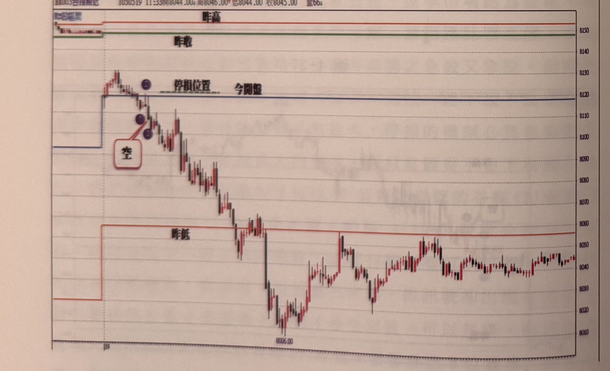
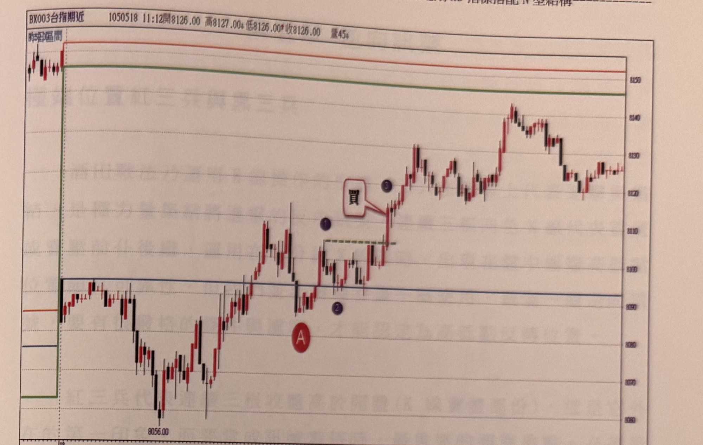

## p.154

[本頁僅有兩幅圖表與圖說編號，無獨立段落正文，正文續於下頁；圖表周邊可見對頁背面滲印的極淡鏡像文字殘影，非本頁內容，予以略過。]

**圖 4-29**

> 圖說（figure notes）：台指期近一分鐘K線圖（BX003台指期近，時間1050531 11:06，開8473.00，高8473.00，低8470.00，收8471.00，跌2.00(-0.02%)，量131），圖上疊「昨日區間」「昨高」「昨收」「今開盤」四條參考水平線。左段開盤後（紅點A）快速下跌至今開盤線下方，隨即止穩回升，站上今開盤與昨收線，紅點①（藍點）、藍點②，文字框「買」以線段指向突破點K線（紅點③），價格持續上攻站上昨高線，續創高後在頂部出現藍點②、黑點①、③，文字框「空」以線段指向轉折向下的K線（頂點8546.00附近），隨後價格快速下殺跌破昨收、今開盤線，最低來到8455.00，尾端於低檔區間小幅反彈整理。

**圖 4-30**

> 圖說（figure notes）：台指期近一分鐘K線圖（BX003台指期近，時間1050519 11:33，開8044.00，高8046.00，低8044.00，收8045.00，量66），圖上疊「昨高」「昨收」「今開盤」「昨低」及「停損位置」參考線。左段開盤後價格於今開盤線上方小幅走高至波段高點，藍點②、①，文字框「空」以線段指向確認放空的K線（藍點③），其後價格持續下跌，穿越今開盤、昨低等參考線，最低來到8006.00附近，尾端於低檔區間小幅震盪回升整理。

## p.155

[本頁僅有兩幅圖表與圖說編號，無獨立段落正文；圖表周邊可見對頁背面滲印的極淡鏡像文字殘影（隱約可辨「起始位置紅三兵與黑三兵」等字樣，屬對頁內容），非本頁內容，予以略過。]

**圖 4-31**

> 圖說（figure notes）：台指期近一分鐘K線圖（BX003台指期近，時間1050518 11:12，開8126.00，高8127.00，低8126.00，收8126.00，量45），圖上疊「昨高」「昨收」「今開盤」「昨低」參考線。左段開盤後價格（紅點A，低點8056.00附近）於今開盤線下方震盪走低後止穩，隨即一路上攻穿越今開盤、昨收線，中段出現藍點①、②，文字框「買」以線段指向突破確認K線（藍點③），價格持續上攻穿越昨高線，最高來到8140上下，尾端於高檔區間小幅震盪整理。

**圖 4-32**

> 圖說（figure notes）：台指期近一分鐘K線圖（BX003台指期近，時間1050511 09:26，開8156.00，高8161.00，低8153.00，收8159.00，漲3.00(0.04%)，量1260），圖上疊「昨日區間」及「停損位置」參考線。開盤後價格快速上攻至高點8192.00（紅點A），隨即出現藍點②（次高點），其後價格反轉向下，藍點①、③構成倒N型結構，文字框「空」以線段指向確認放空的K線，「停損位置」水平虛線標示於此附近；其後價格持續破底下跌，最低來到8081.00，尾端於低檔區間震盪反彈整理，收在8120上下。
