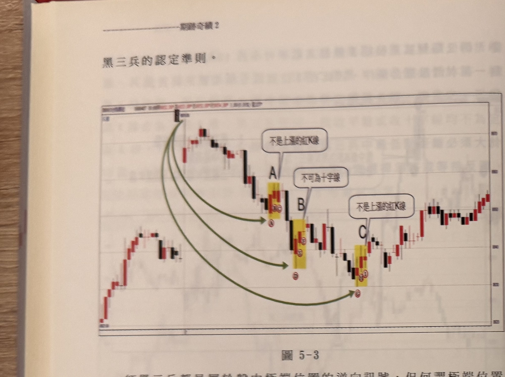
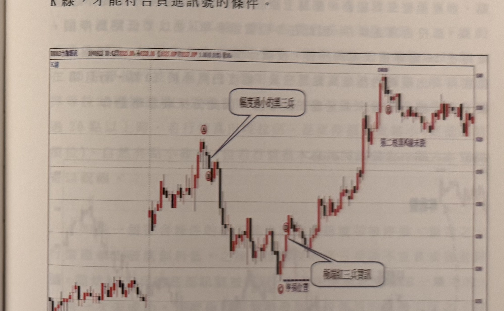

## p.160

黑三兵的認定準則。

**圖 5-3**

> 圖說（figure notes）：一分鐘K線圖（報價列因相片模糊細部數字無法完全確讀 [?]）。價格自左側低檔盤堅走高至最高峰點 H（頂端），隨後反轉下跌，圖上以三個黃色網底區塊分別標示 A、B、C 三處候選「紅三兵」組合，並以三條深綠色弧形箭頭由峰點 H 分別指向 A、B、C。A 處對話框「不是上漲的紅K線」以線指向該組最後一根 K 線（收平盤，非真正上漲紅 K）；B 處對話框「不可為十字線」以線指向該組第三根 K 線（收十字線）；C 處對話框「不是上漲的紅K線」以線指向該組末根 K 線（同樣收平盤）。三處皆因不符合「三根皆為上漲紅 K 線」的嚴格條件，而被判定不能算作有效的紅三兵買訊。C 之後價格持續於低檔整理後回升，右側走勢收斂於較窄區間內震盪走高。

## p.161

到 A 紅三兵的最低點，幅度沒超過 30 點，因此即使 A 符合紅三兵，亦不能使用當作買訊，而 H 到 B 或 H 到 C 在幅度上都符合超過 30 點，但 B 的紅三兵組合裡，第三根 K 線是收十字線，不是紅 K 線也非上漲 K 線，而 C 位置的紅三兵與 A 一樣，第三根紅 K 線收平盤，非上漲紅 K 線。因此在辨認紅三兵最重要是它必須出現在極端位置，即盤中高低距離得超過 30 點，紅三兵組合的第一根 K 線低點必須符合當下盤中最低點且為層級 2 轉折谷點，三根紅 K 線都為上漲 K 線，才能符合買進訊號的條件。

**圖 5-4**

> 圖說（figure notes）：一分鐘K線圖（報價列因相片模糊細部數字無法完全確讀 [?]）。價格自左下低檔走高至峰點 A（紅色圓圈），對話框「臆為過小紅三兵」以線指向 A 下方的一小段紅 K 組合，說明此處紅三兵組合長度過小、表態不夠明顯；隨後價格下跌至低點（旁註「停損位置」虛線），對話框「無效紅三兵訊」以線指向此低點附近的小紅三兵組合，說明因幅度不足而判定無效。價格其後反彈續漲至更高峰位（紅色圓圈 B），對話框「第二根黑K撐盤」標示於此附近，之後於高檔區間反覆震盪整理，收在較窄範圍內。
