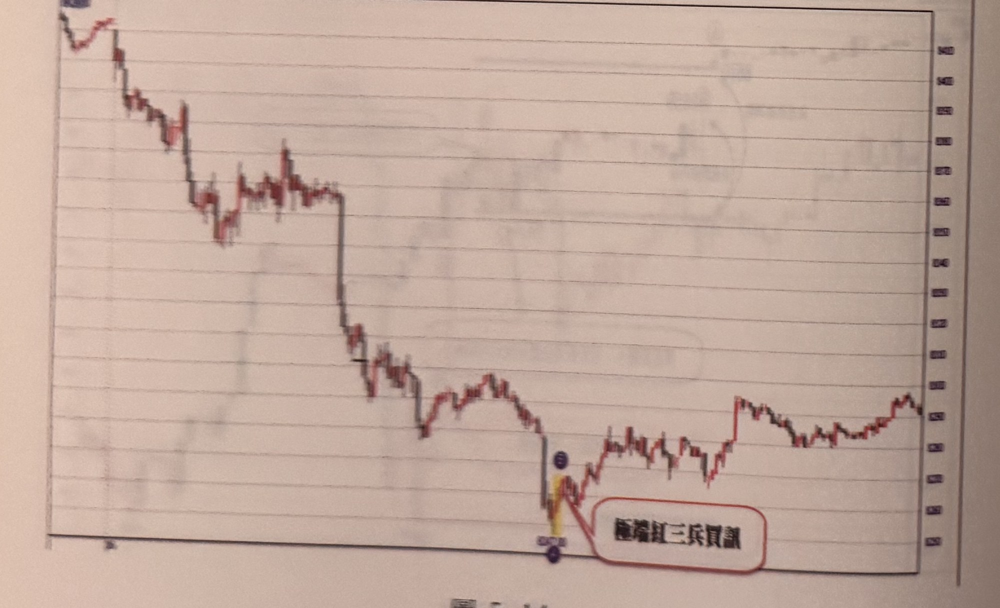
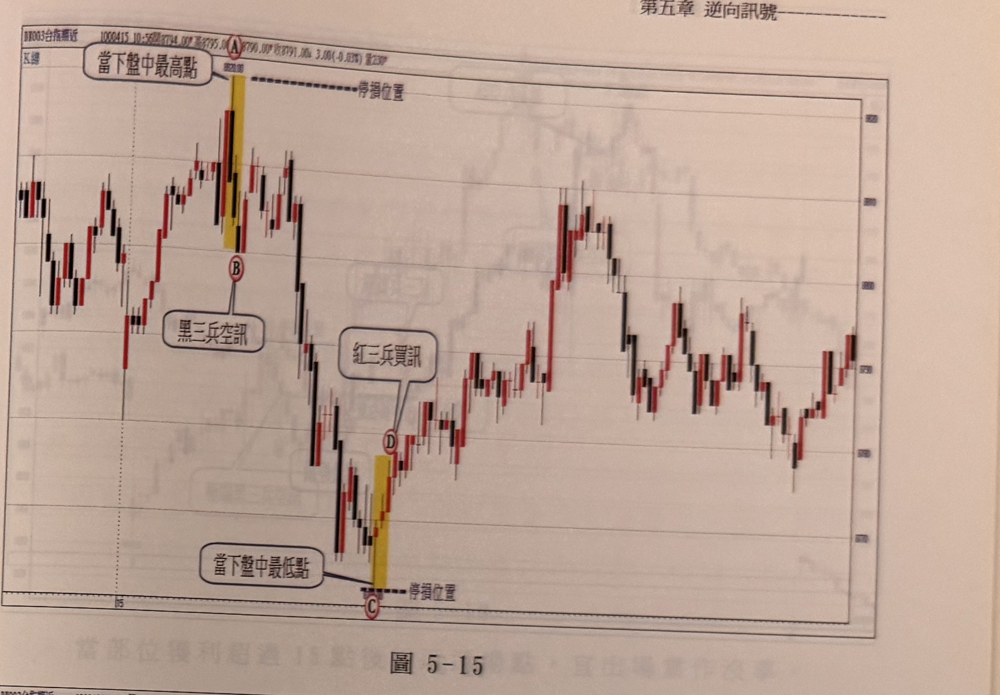
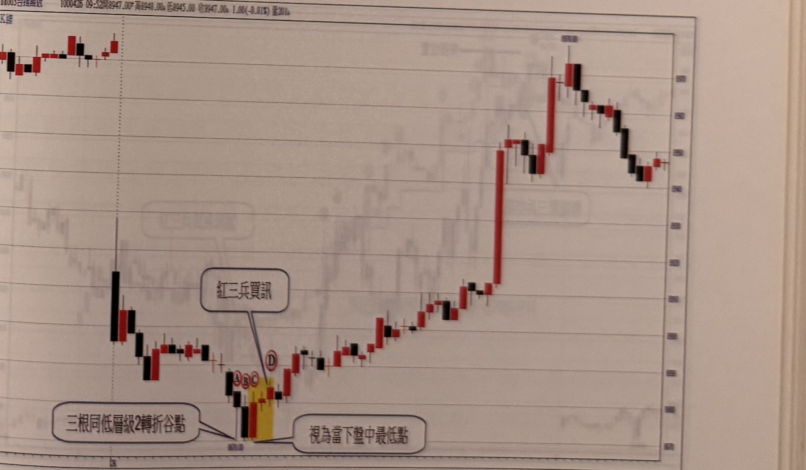

## p.168

**圖 5-13**

> 圖說（figure notes）：台指期近走勢圖（頂部報價列文字模糊無法辨識 [?]），圖左上方標示一高點價位（約8540，字跡模糊 [?]）。行情自開盤高點一路震盪下跌，中途數度反彈拉回，最終跌至全圖最低點，該處以黃色網底標示一段紅 K 線，並以圓圈標示一點（字母模糊 [?]），文字框「紅三兵買訊」以線指向此處；其下另以圓圈標示最低點（字母模糊 [?]），文字框「盤中最低點」以線指向該處。此低點之後，行情強勁反彈走高，中途小幅震盪整理，於圖右緣回升收在接近全圖次高點的價位附近。

**圖 5-14**

> 圖說（figure notes）：台指期近（BX003）走勢圖（頂部報價列文字模糊無法辨識 [?]）。行情自圖左側高點一路持續下跌，中途數度小幅反彈後再破底，最終跌至全圖最低點，該處以黃色網底標示一段紅 K 線，並以紫色圓圈標示上下兩點，文字框「極端紅三兵買訊」以紅色線框圈住並以線指向此低點。此後行情反彈走高，中途震盪整理數次，於圖右緣回升至接近前波高點的價位收尾。

## p.169

**圖 5-15**

> 圖說（figure notes）：台指期近（BX003）K 線走勢圖，報價列顯示「1000415 10:56開8794.00* 高8795.00* 低8790.00* 收8791.00↓ 3.00(-0.03%) 量230*」，圖左上角標示「K線」。行情震盪走高至一峰頂，以紅色圓標示 A，文字框「當下盤中最高點」以線指向 A，A 處以黃色網底標示一段 K 線，並以水平虛線「停損位置」向右延伸；黃色網底下緣以紅色圓標示 B，文字框「黑三兵空訊」以線指向 B。A、B 之後行情反轉重挫，一路下探至全圖最低點，該處以紅色圓標示 C，並以水平虛線「停損位置」向右延伸，文字框「當下盤中最低點」以線指向 C；C 上方以黃色網底標示一段紅 K 線，其上緣以紅色圓標示 D，文字框「紅三兵買訊」以線指向 D。D 之後行情反彈走高，中途歷經多次高低震盪（約在 730～800 區間），於圖右緣小幅回升收尾。

**圖 5-16**

> 圖說（figure notes）：台指期近（BX003）K 線走勢圖，報價列顯示「1000426 09:52開8947.00* 高8948.00↓ 低8945.00 收8947.00↓ 1.00(-0.01%) 量201↓」，圖左上角標示「K線」。行情自圖左側高點一路重挫下跌，跌勢末段於低點附近以紅色圓圈緊密標示三個字母 A、B、C（三根同低層級2轉折谷點），文字框「三根同低層級2轉折谷點」以線指向此處，另一文字框「視為當下盤中最低點」亦指向同一低點區域；緊鄰其右以黃色網底標示一段紅 K 線，其上緣以紅色圓標示 D，文字框「紅三兵買訊」以線指向 D。D 之後行情強勁反彈，一路震盪走高，中途在約 8570 附近出現一根長紅 K 線急拉，其後續於高檔區間（約 8540～8570）反覆震盪整理，最終於圖右緣小幅拉回收尾。
