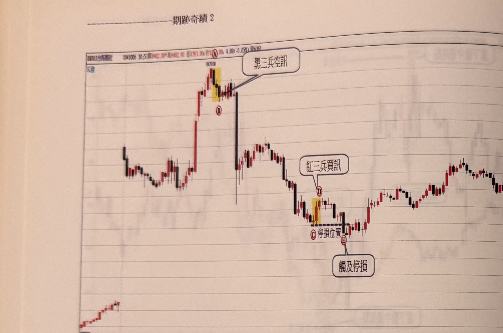

## p.170

**圖 5-17**

> 圖說（figure notes）：台指期近走勢圖，報價列顯示「1041006 10:51開9402.00* 高9402.00 低9383.00 收[?].00* 4.00(-0.05%) 量[?]」。行情震盪走高至一峰頂，以紅色圓標示 A（頂點價位標示約 9470），其下以黃色網底標示一段黑 K 線，下緣以紅色圓標示 B，文字框「黑三兵空訊」以線指向此處。B 之後行情反轉重挫，一路下探，於低點附近以黃色網底標示一小段紅 K 線，上緣以紅色圓標示 D，文字框「紅三兵買訊」以線指向 D；同一低點另以紅色圓標示 C，並以水平虛線「停損位置」向右延伸；C 右下方以紅色圓標示 E，文字框「觸及停損」以線指向 E，表示該紅三兵訊號其後觸及停損出場。此後行情止跌回升，一路震盪走高，於圖右緣收在接近全圖次高點的價位附近。

**圖 5-18**

> 圖說（figure notes）：台指期近走勢圖，報價列顯示「1041005 10:4[?]開9336.00↓ 高9337.00* 低9336.00 收9337.00* 1.00(0.01%) 量231↓」。行情震盪走高至全圖最高點附近，以紅色圓標示緊鄰的 A、B 兩點，其下以黃色網底標示一段黑 K 線，並以水平虛線「停損位置」向右延伸；黃色網底右下方以紅色圓標示 C，文字框「極端黑三兵空訊」以線指向峰頂黃色區域。C 之後行情持續破底下跌，一路重挫至全圖低點，其後強勁反彈，中途小幅震盪整理數次，於圖右緣一路走高收在接近全圖高點的價位。

## p.171

**圖 5-19**

> 圖說（figure notes）：台指期近（BX003）K 線走勢圖，報價列顯示「1040907 10:26開7904.00↓ 高7917.00 低7904.00 收7914.00* 10.00(0.13%) 量1012↓」，圖左上角標示「K線」。圖左下方行情先在低檔盤整後走高至一小峰，以紅色圓標示 A，其下以黃色網底標示一段 K 線，並以水平虛線「停損位置」向右延伸；虛線右側以紅色圓標示 C，文字框「平倉點」以線指向 C，另有紅色圓標示 B 於黃色網底下緣（相關文字框因跨頁裁切未能完整辨識 [?]）。C 之後行情一路強勁上攻，直達全圖最高點，以紅色圓標示 D，其下以黃色網底標示一段 K 線，並以水平虛線「停損位置」向右延伸；黃色網底下方以紅色圓標示 F，文字框「極端黑三兵空訊」以線指向此處。D 之後行情反轉重挫，一路破底下跌，於圖右緣收在全圖低點附近（約 730 一帶）。

當部位獲利超過 15 點後折返進場點，宜出場當作沒事。

**圖 5-20**

> 圖說（figure notes）：台指期近（BX003）走勢圖，報價列顯示「1041104 10:23開8877.00↓ 高8882.00* 低8877.00* 收8881.00* 3.00(0.03%) 量411↓」，圖左上角標示「多空出場機制」。行情於低檔盤整後，以黃色網底標示一段紅 K 線（低點區），文字框「紅三兵買進訊號」以線指向此處，旁邊另有文字「預設初始獲利20點後啟動折返20點停利」說明出場邏輯。訊號之後行情以階梯式型態逐波墊高，沿途以紅色圓圈依序標示 A、B、C、D、E、F、G、H、I（或J）等多個轉折點，每個階梯轉折處均有小紅字「20」標示（表示每階段約 20 點的移動停利間距）；在接近最高點 H 附近以文字框「平倉」以線指向該處，標示獲利了結位置。行情於最高點（約 8900，圖上方標示價位模糊 [?]）觸頂後，回落至一個區間反覆震盪，於圖右緣呈現高檔區間整理收尾。
