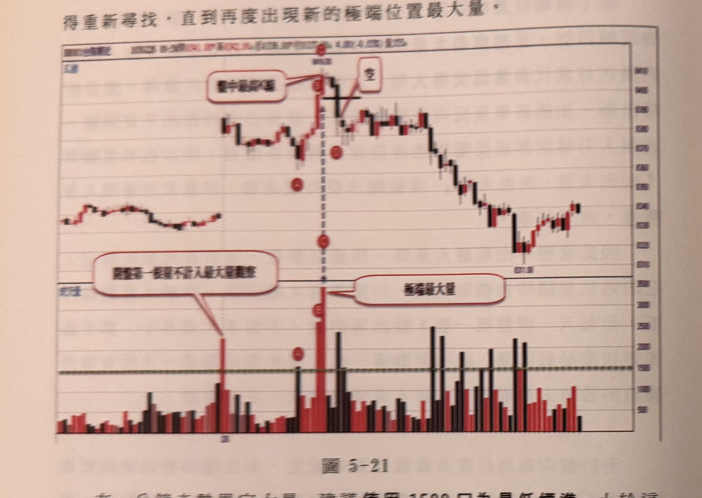
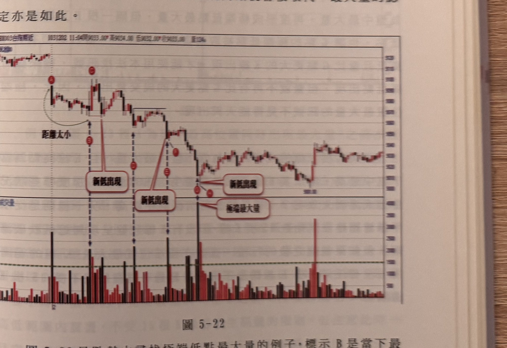

## p.174

高的 K 線出現，同樣的，也不能有任何 K 線的低點，極端最低位置最大量的 K 線更低，一旦出現更高或更低的 K 線，整個極端最大量得重新尋找，直到再度出現新的極端位置最大量。

**圖 5-21**

> 圖說（figure notes）：台指期近走勢圖，上為 K 線價格圖，下為對應成交量柱狀圖，兩者以垂直虛線對齊。行情先在左側區間盤整，隨後急拉走高至一峰頂，文字框「盤中最高點」（字跡模糊 [?]）以線指向峰頂 K 線，峰頂右側另有方框「空」，峰頂處以黑色水平短線標示關卡。峰頂沿垂直虛線向下，於價格圖與成交量圖上各以紅色圓圈依序標示多個點（由上而下，對應文字中 A、B、C、D 等標示，因字體極小、部分模糊，僅部分可辨），其中成交量圖上該垂直虛線對應之柱體為全圖最高量柱，文字框「極端最大量」以線指向此柱；成交量圖左側另有一根獨立高量柱，文字框「開盤第一根量不計入最大量觀察」以線指向該柱，說明開盤第一根 K 線的量不參與最大量評選。峰頂之後行情反轉重挫，一路震盪下跌至圖右側低點，最後小幅反彈收尾；成交量圖下方以綠色虛線標示 1500 口的最低量門檻水平線。

在一分鐘走勢界定大量，建議**使用 1500 口為最低標準**，小於這個水準，即使出現在盤中最高位置，都不能當作候選訊號看待。在圖 5-21 的例子中，開盤第一根 K 線的成交量不例入最大量觀察名單，行情隨著時間發展。在標示 A 置來到盤中最低位置，同時量亦出現盤中最大量，且大於 1500 口水準，的確可以視為最低點最大量，但這裡有一個重要觀點要釐清，何謂極端位置？照理來說，盤中由高在低或由低在高震盪總不能幅度只有 30 點，就代表價格走到極端位置，顯然在常識上很難接受，因為必須取一個**最小幅度的要求，至少要超過 30 點以上**，這樣的範圍所產生的反向訊號，獲利空間不致被過度壓縮。

## p.175

因此，標示 A 的最低點最大量，因為當下行情由開盤高點到 A 的低點，幅度不到 30 點，必須忽略，哪怕在本例中，後來的 K 線收盤突破 A 的高點，的確出現走高。到標示 B 位置突破新高，為盤中新高，量亦是當下最大量，而由 A 的低點到 B 的高點，已超過 40 點，符合極端高點最大量。B 的低點可為空訊濾網，但隔一根的 C 再度創新高，量也比 B 位置更大，立刻取代 B 成為新的極端高點最大量，取其 C 的最低點做為新的空訊濾網，等到 D 位置的黑 K 線收盤跌破濾網，放空訊號成立。在本例主要說明極端位置隨著時間經過，只要有新 K 線創新高，舊的極端高點就會被取代，最大量的認定亦是如此。

**圖 5-22**

> 圖說（figure notes）：台指期近（BX003）走勢圖，報價列顯示「1031202 11:04開9033.00* 高9034.00 低9032.00* 收9033.00* 量12*」，上為 K 線價格圖，下為對應成交量柱狀圖。行情自左側區間走高至第一個小峰頂，以紅色圓圈標示 A，其後拉回，並以彎曲箭頭與文字框「距離太小」說明 A 到隨後低點的幅度不足；該低點沿虛線向下對應成交量圖並有文字框「新低出現」。行情再度反彈至更高的峰頂，以紅色圓圈標示（第二點，緊鄰 A 右側），隨後再破底，同樣以垂直虛線對應成交量圖，文字框「新低出現」再次標示。此後行情又一次反彈至第三峰頂（同樣以紅色圓圈標示），再度重挫破底，垂直虛線對應成交量圖上文字框「新低出現」；此波下跌後段的成交量柱為全圖最高量柱，文字框「極端最大量」以線指向此處。這一段陡直下跌之後，行情止跌回穩，於中段區間反覆震盪盤整，其後一根長紅 K 線急拉走高，接著在高檔區間橫向整理收尾；成交量圖下方以綠色虛線標示最低量門檻水平線。
