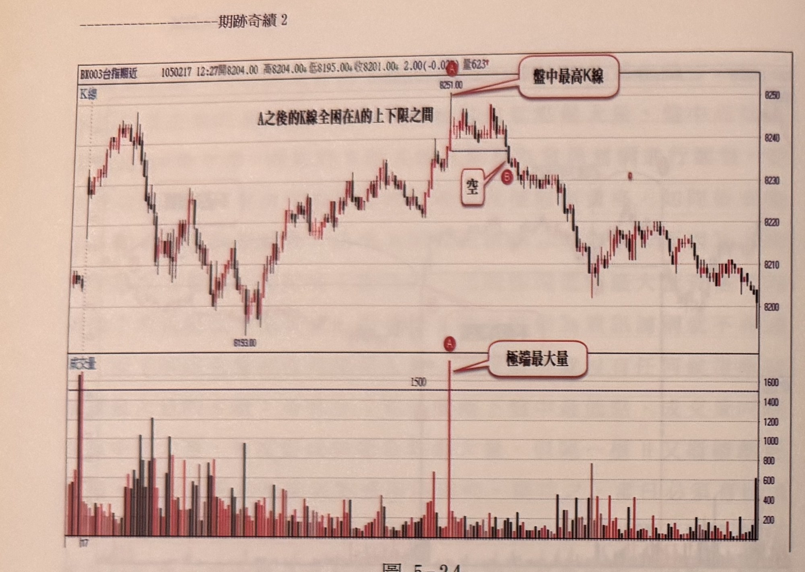
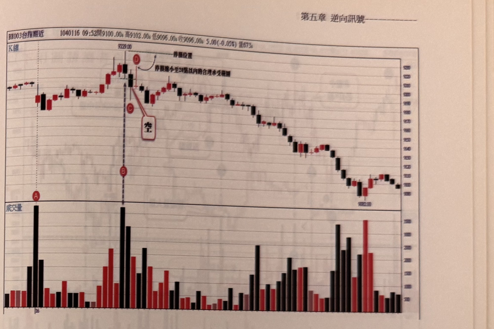

## p.178

**圖 5-24**

> 圖說（figure notes）：台指期近（BX003）K 線走勢圖，報價列顯示「1050217 12:27開8204.00 高8204.00* 低8195.00* 收8201.00* 2.00(-0.02%) 量623*」，上為 K 線價格圖，下為對應成交量柱狀圖。行情自左側區間震盪走高，於價位 8251.00 處出現盤中最高點，以紅色圓標示 A，文字框「盤中最高K線」以線指向此處，對應成交量圖上該處為全圖最高量柱（超過 1500 口），文字框「極端最大量」以線指向此量柱。A 之後價格於方框標示的高低區間內來回游走，文字「A之後的K線全困在A的上下限之間」說明此區間內包走勢；直到方框右側以紅色圓標示 B，並有文字框「空」，表示 B 位置一舉收盤跌破濾網下限，形成放空訊號。B 之後行情持續下跌，中途小幅反彈，最終於圖右緣續探低至約 8200 附近收尾。

濾網產生訊號根數限制在 15 根 K 線的例外狀況，請看圖 5-24 的例子，當天行情進行至中段，出現 A 創盤中新高位置，同時量也爆出最大量，形成極端位置最大量的反轉徵兆，因此以 A 的 K 線最低點做為產生空訊的觀察濾網，而後行情一直在 A 的 K 線高低點之間游走，在 B 跌破濾網之前，早已超過 15 根 K 線，但因為屬於內包走勢，而 B 位置 K 線收盤又是一舉收盤跌破，沒壞了規矩，可以認定為放空訊號。因此，當行情一直走在濾網 K 線高低範圍內，雖不受根數限制，但卻必要一次就呈現無遮蔽突破，沒有第二次機會。假設 B 點只有下影線跌破，而收盤未跌破濾網，則因為行情已經超過內含走勢的下限，不再享有根數不受限制的特權了。立刻時效消失。

## p.179

**圖 5-25**

> 圖說（figure notes）：台指期近（BX003）K 線走勢圖，報價列顯示「1040116 09:52開9100.00* 高9102.00* 低9096.00* 收9096.00* 5.00(-0.05%) 量673*」，上為 K 線價格圖，下為對應成交量柱狀圖。開盤第一根 K 線成交量於成交量圖以紅色圓標示 A（此量不列入最大量評選）。行情走高至價位 9229.00 附近，以紅色圓標示 D（位於峰頂 K 線上緣），並有水平虛線「停損位置」向右延伸，文字「停損縮小至20點以內的合理承受範圍」說明後續調整；峰頂 K 線對應成交量圖上為全圖最高量柱，以紅色圓標示 B（緊鄰 A 右側，位於價格圖峰頂下緣），為當下盤中最大量。峰頂之後行情拉回，以紅色圓標示 C（位於峰頂右下方一根 K 線處），文字框「空」以線指向 C，表示 C 位置收盤乾脆地跌破濾網，形成放空訊號。C 之後行情持續破底下跌，一路重挫至圖右下方低點約 9082.00，最後小幅震盪回升，於低檔區間收尾。

對操作的風險控管方面，我們一直強調停損限制在 20 點以內，因此如果訊號產生當下，衡量訊號 K 線收盤至停損位置之距離若超過 20 點時，會採取忽略訊號，或者等待稍後行情折返使得價格離停損位置縮小在控制範圍內，才再考慮進場操作，以圖 5-25 來說，盤中行情走到 B 位置時，出現盤中最高點，剔除開盤第一根成交量 A，B 位置的成交量是最大量，符合極端位置最大量的反轉徵兆，因之以 B 的 K 線最低點為產生空訊的觀察濾網，隔根 C 的收盤相當乾脆地跌破濾網，形成放空訊號，但訊號 K 線收盤離停損位置將近 40 點，遠遠超過 20 點的控制範圍，因此一開始我們必須選擇忽略這個空訊，不能馬上跳進去放空，得等待價格出現反彈時，離停損位置縮小距離至 20 點以內，再考盤進場，結果又在隔根的 D 位置出現反彈，使得價格離停損位置縮小在 20 點以內時，才重新進場放空訊，如果行情不反彈的話，那就真的忽略訊號別玩了。
