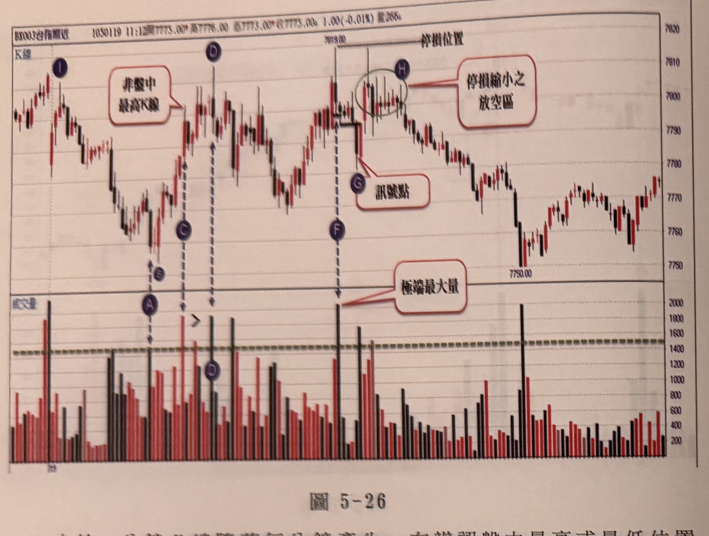
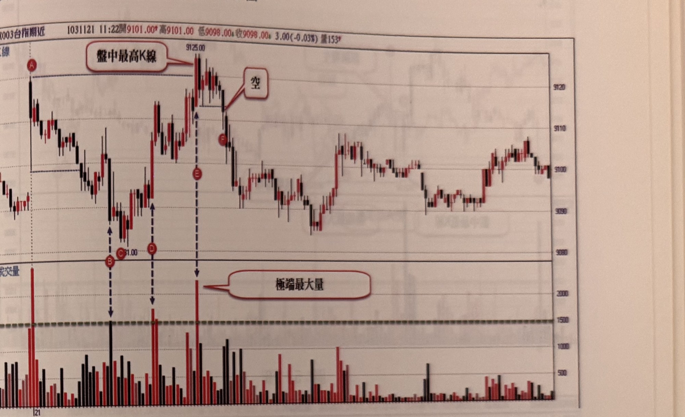
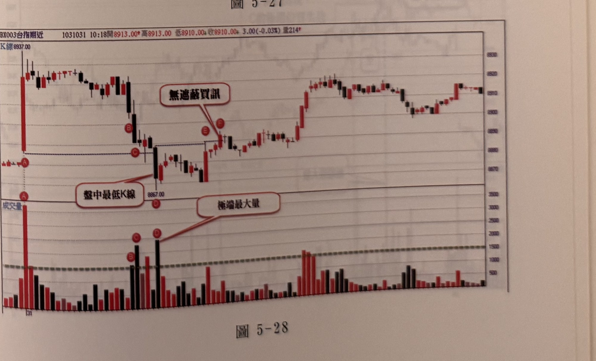

## p.180

**圖 5-26**

> 圖說（figure notes）：台指期近（BX003）K 線走勢圖，報價列顯示「1050119 11:12開7775.00* 高7776.00 低7773.00* 收7775.00↓ 1.00(-0.01%) 量266↓」，上為 K 線價格圖，下為對應成交量柱狀圖。開盤後行情先在 I（深藍圓標示，位於左側次高點）附近走高，隨後下跌至 A（深藍圓，成交量圖上）位置，文字框「非盤中最高K線」（原文如此，說明 I 並非全日最高）以線指向 I 上方的 K 線。價格自 A 反彈，沿垂直虛線可見 B、C 依序標示於成交量圖，各對應價格圖上不同的局部高點；行情持續墊高，於價位 7818.00 出現全日最高點，並以水平虛線「停損位置」向右延伸；該高點右側以綠色圓圈圈出一段區間，內含 H（深藍圓），文字框「停損縮小之放空區」以線指向此區間。價格自高點拉回，於 G（深藍圓）位置以文字框「訊號點」標示，說明此處出現放空訊號。沿另一條垂直虛線向下可見 D、F（深藍圓）依序標示於成交量圖，F 對應之柱體為全圖最高量柱，文字框「極端最大量」以線指向此柱。G 訊號之後，行情持續破底下跌，一路重挫至價位 7750.00，其後小幅反彈，於低檔區間震盪，最終小幅回升收在約 7770～7775 附近。

由於一分鐘 K 線隨著每分鐘產生，在辨認盤中最高或最低位置會發生眼花誤植，例如在圖 5-26 裡，從開盤後的 I 位置高點下跌至 A 位置當下盤中最低點，同時量也是剔除開盤第一根成交量的最大量，往往見獵心喜想著立刻會有買訊可進場操作，而忽略了 B 點續創盤中最低點的事實，這種自我催眠的行為，並非罕見，而 C 位置出現比 A 更大量，卻非當日盤中最高點，因此不能視為極端最大量，D 位置顯然是當下盤中新的極端最高點，但量卻沒有比 C 更大量，亦不能以極端最大量來看待，直到 F 位置出現另一次創盤中新高點，同時量亦比先前的 C 更大量，符合了極端位置最大量的反轉徵兆，以 F 的 K 線最低點做為觀察濾網，並在 G 位置出現了無遮蔽的放空訊號，但別立刻就進場，因為訊號收盤至停損位置距離超過 20 點，因此宜先忽略訊號，並等待價格是否反彈縮小停損點數，因此當價格果真反彈至 H 區間時，進場離停損位置縮小至 20 點以內，則

## p.181

考慮進場。

以下附圖請讀者自行參閱練習

**圖 5-27**

> 圖說（figure notes）：台指期近（BX003）K 線走勢圖，報價列顯示「1031121 11:22開9101.00* 高9101.00 低9098.00* 收9098.00* 3.00(-0.03%) 量153*」，上為 K 線價格圖，下為對應成交量柱狀圖。開盤後行情下跌，於左側高點以紅色圓標示 A，其後續跌至一低點，沿垂直虛線於成交量圖上以紅色圓依序標示 B、C（緊鄰，價位約 9081.00）；價格反彈至一高點後再度拉回，另一垂直虛線對應成交量圖上標示 D；隨後行情急拉走高，於價位 9125.00 創全日最高點，以水平線「盤中最高K線」標示，該處對應成交量圖上為全圖最高量柱（極端最大量），沿垂直虛線標示於成交量圖。峰頂之後，文字框「空」以線指向峰頂右側的下跌 K 線，顯示此處出現放空訊號；行情持續下跌，中途以紅色圓標示 F。F 之後行情持續走低，於中段低點止跌，其後緩步震盪走高，於圖右側呈現高檔區間反覆整理，最終回落至接近 9100 附近收尾。

**圖 5-28**

> 圖說（figure notes）：台指期近（BX003）K 線走勢圖，報價列顯示「1031031 10:18開8913.00* 高8913.00 低8910.00* 收8910.00* 3.00(-0.03%) 量214*」，左上角另標示「K線 8937.00」，上為 K 線價格圖，下為對應成交量柱狀圖。開盤後行情急跌，於左側高點以紅色圓標示 A（同時對應成交量圖上另一紅色圓 A，為全圖次高量柱），隨後續跌至一低點，以紅色圓標示 B、C（成交量圖上緊鄰標示），價位約 8867.00 處以文字框「盤中最低K線」標示全日最低點，並以線指向該處；D（紅色圓，位於成交量圖，為全圖最高量柱）對應同一低點區。此後行情反彈震盪，於 E、F（紅色圓，緊鄰標示於價格圖）處，文字框「無遮蔽買訊」以線指向 F，表示此處出現無遮蔽的買進訊號。F 之後行情持續走高，中途小幅震盪整理數次，一路盤堅攀升，於圖右側高檔區間反覆整理，最終收在接近 8910～8915 附近。
