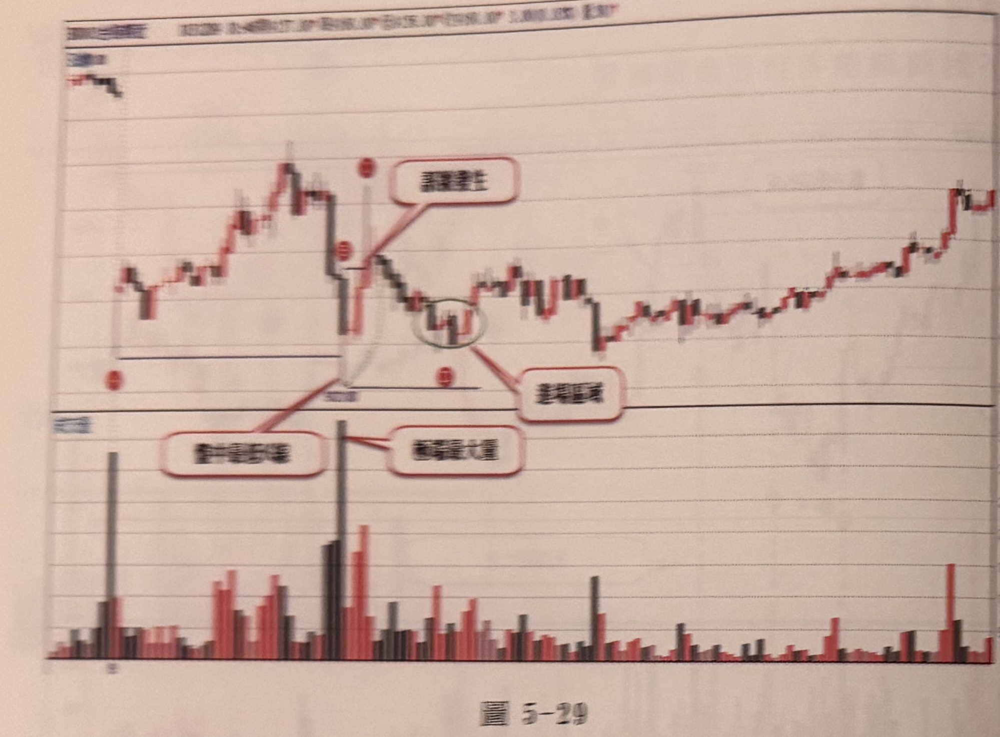
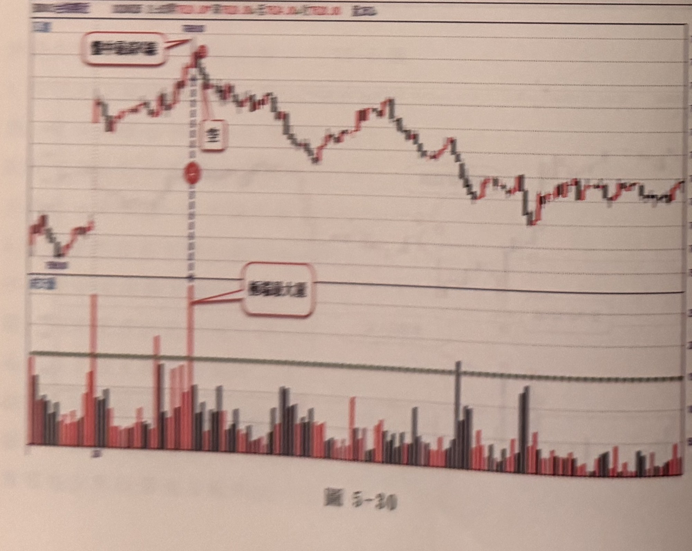
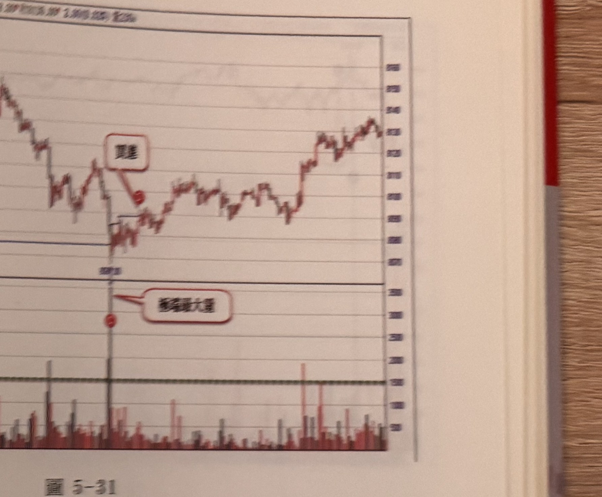
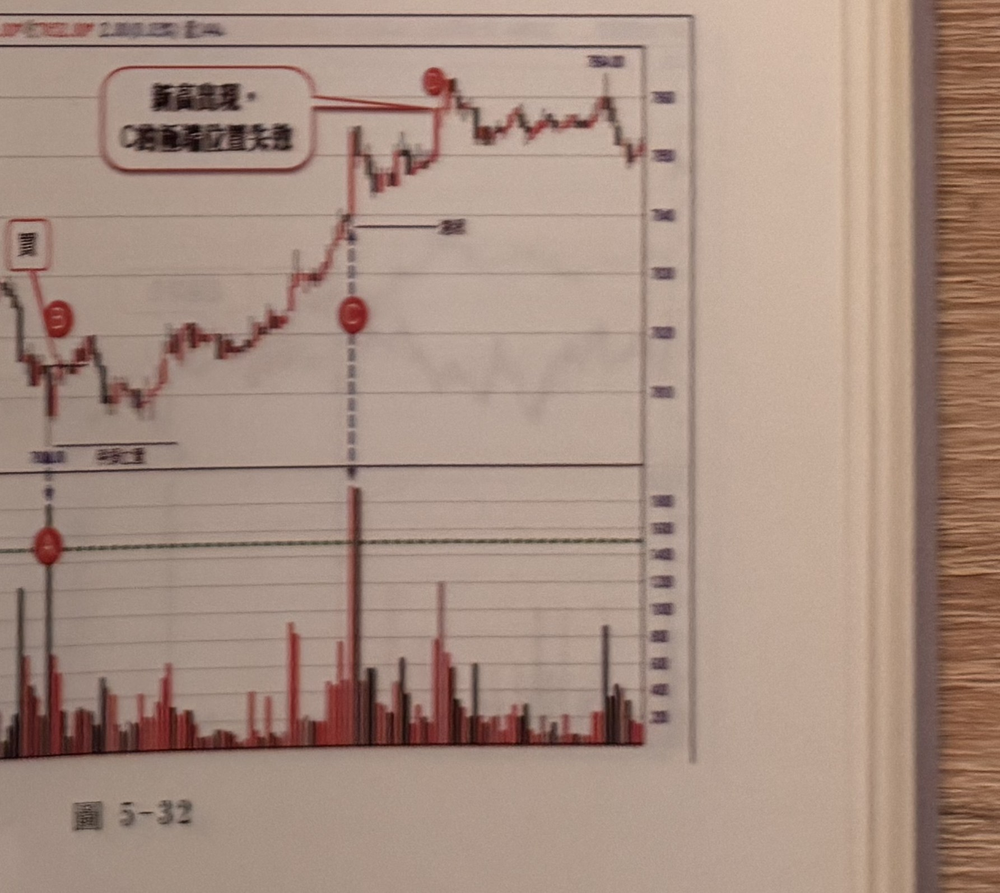

## p.182

[本頁僅有圖表，無正文段落]

**圖 5-29**

> 圖說（figure notes）：台指期近 1 分 K 走勢圖（含上方即時報價列與下方成交量柱狀圖，報價數字因相片模糊無法確讀 [?]）。左段為一小段紅黑 K 線緩步盤堅上升，至最高點後出現一根巨大黑 K 棒向下急殺（伴隨下方成交量出現全圖最高的深灰色長柱），價格瞬間跌破先前低點所在的水平支撐線。急跌起點與止跌點各以紅色圓點標示。止跌後第一根反彈 K 棒上方有紅色圓角文字框，文字為「谷底重生」，以紅線指向止跌反彈起漲點。止跌點另以紅線連到左下方一個紅色文字框，框內文字因相片模糊無法確讀 [?]（推測與下方成交量長柱或止跌訊號有關）。反彈後價格在低檔以綠色橢圓圈起一段窄幅紅黑 K 整理，右側另有紅色文字框「盤整區間」以紅線指向此綠色圈起的整理區。整理完成後價格轉為一波緩步走高的紅黑 K 線段，直到圖右側最高點附近小幅震盪收尾。

## p.183

[本頁僅有圖表，無正文段落]

**圖 5-30**

> 圖說（figure notes）：台指期近 1 分 K 走勢圖（含上方即時報價列，數字因相片模糊無法確讀 [?]）。左段先是一段震盪盤堅的紅黑 K 線上升，至一高點（紅色圓點標示，並有藍色虛線垂直向下連到下方成交量圖之最高長柱，長柱旁紅色文字框標示「轉折最大量」）後反轉向下，出現一大段黑 K 為主的持續下跌走勢，中途夾雜多次小幅反彈又續跌，最終在圖右側止跌後小幅震盪走高。高點紅色圓點上方另有一個較小的紅色文字框，框內為單一文字，因相片模糊無法確讀 [?]（推測為標示此高點性質，例如頭部/峰點之類的標記字）。

**圖 5-31**

> 圖說（figure notes）：台指期近 1 分 K 走勢圖（含上方即時報價列，數字因相片模糊無法確讀 [?]）。走勢圖起始於一段下跌後的低檔整理，隨後出現一波反彈上衝至一高點，高點處有紅色圓角文字框，框內文字因相片模糊無法確讀 [?]（框型與位置和圖 5-30 高點旁的小字框相似，推測性質相同），並以紅線指向高點下方一顆紅色圓點。該點另有藍色垂直細線向下連到下方成交量圖的最高長柱，長柱右側紅色文字框標示「轉折最大量」。高點回落後價格在一水平支撐帶上下震盪一段時間，隨後轉為一波持續走高的紅黑 K 線段，直到圖右側高點附近呈小幅上下震盪收尾。

**圖 5-32**

> 圖說（figure notes）：台指期近 1 分 K 走勢圖（右側 Y 軸價格刻度可見，最上緣標示約 750.00 附近之數字，其餘報價列文字因相片模糊無法確讀 [?]）。圖左段先下跌至一低點，低點處以紅色圓圈標示字母「A」，圓圈下方有紅色文字框，框內文字因相片模糊無法確讀 [?]，並有一條水平線向右延伸作為濾網／參考線。價格自 A 反彈後持續走高，中途以紅色圓圈標示字母「C」（位於一根帶長上影線的黑 K 棒下方），C 上方有藍色虛線垂直向上連到該波段高點，高點右側有一條黑色細線加箭頭指向右方，箭頭旁有文字因相片模糊無法確讀 [?]（推測為「起漲」之類的標記字）。價格續創新高後，於圖右上方另一高點以紅色圓圈標示字母「B」，其上方紅色圓角文字框文字為「新高再現，C 浪起漲位置失守」，以紅線指向 B 所在的高點。此後價格在高檔窄幅震盪，最終小幅拉回收在圖右側邊緣。下方成交量圖中，A 點與 C 點正下方各有一根全圖最高的深灰／暗紅色成交量長柱，其餘各根量能相對低平，並有一條綠色水平虛線橫貫成交量圖作為參考基準線。
