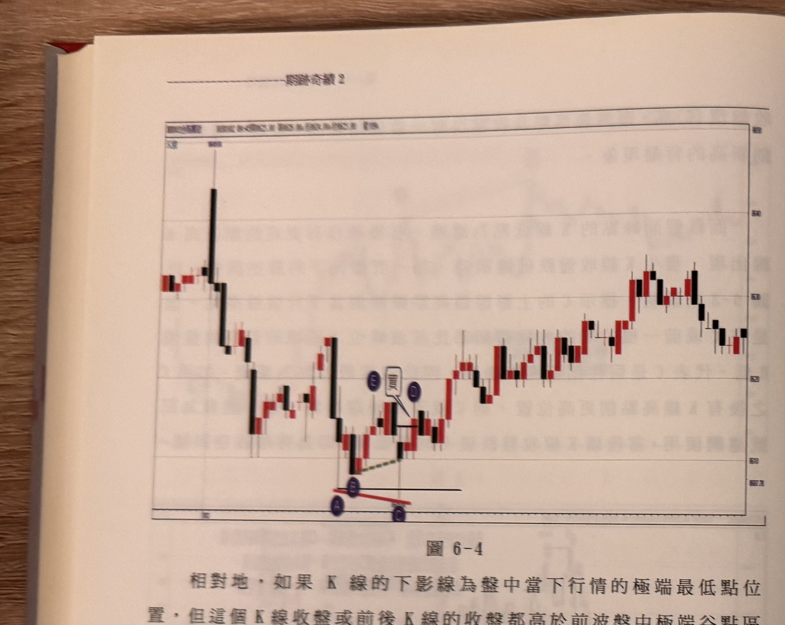
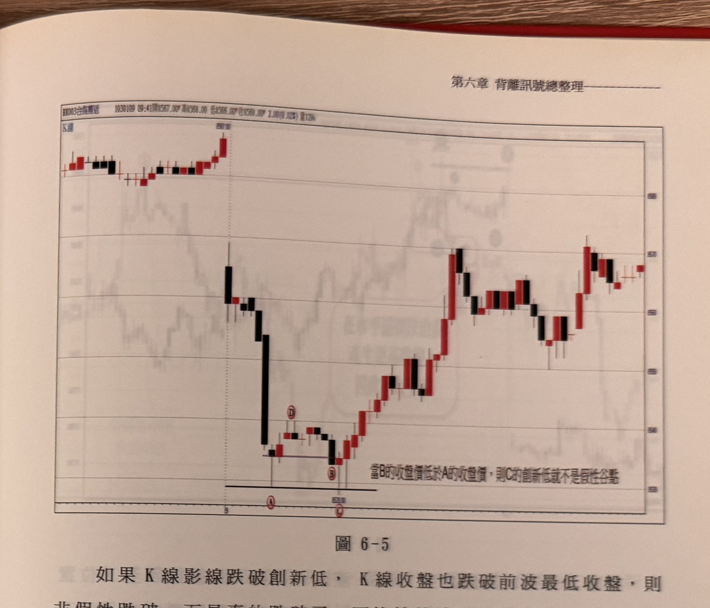

## p.192

相對地，如果 K 線的下影線為盤中當下行情的極端最低點位置，但這個 K 線收盤或前後 K 線的收盤都高於前波盤中極端谷點區域的最低收盤價，換言之用下影線來比，是極端最低點，但用收盤來比，卻不是極端最低收盤價，這就是假性谷點，以這根假性谷點 K 線的最高點為濾網，後續 K 線收盤突破濾網，則為背離向上買進訊號。再以圖 6-4 為例，標示 C 的下影線創新低，為盤中當下極端谷點，但用收盤價來比，前波谷點區域的 B 才是最低收盤價，換言之，論外在特徵，C 是盤中最低谷點（比前波 A 低），但論內涵的收盤，C 區域（前後）的收盤沒有比 B 更低，形成假面谷點背離，因此，以 C 的 K 線最高點為濾網，當 D 位置的 K 線收盤突破濾網，即是背離向上的買進訊號。

**圖 6-4**

> 圖說（figure notes）：一分鐘K線圖（報價列因相片模糊細部數字無法完全確讀 [?]）。價格自左側高點以一根長黑 K 急殺下跌，隨後於低檔反覆震盪，紫色圓圈 A 標示於某低點下影線（前波谷點，收盤價區域），紫色圓圈 B 標示於其後另一低點的下影線（盤中當下極端最低點，但收盤未創新低），A、B 之間以紅色斜直線連接（紅線右端下傾，代表 B 的下影線低於 A，但收盤price 比較另計），黑色水平線標示 B 所在的濾網水平（本波谷點 K 線最高點）。紫色圓圈 C（黑色圓圈 D 旁）標示於濾網水平上方，白框「買」以線指向 D，代表 K 線收盤突破濾網、形成背離向上買進訊號。此後價格持續反彈走高，於圖右段呈紅黑 K 交替上升。

## p.193

如果 K 線影線跌破創新低，K 線收盤也跌破前波最低收盤，則非假性跌破，而是真的跌破了，而比較前波最低收盤的 K 線，並非特指創新低的 K 線，可以是創新低 K 線的前一根或前二根亦可，或者在創新低 K 線的高點濾網未被突破之前，只要出現 K 線收盤低於前波最低收盤，都可以認定真跌破，而非假性跌破，例如在圖 6-5 的例子裡，標示 A 代表先前盤中最低 K 線，它的收盤亦是先前盤中最低，當反彈到 D 形成層級 2 轉折峰點後，再度下挫，標示 C 的影線跌破了 A 低點，是為創新低 K 線，但它的收盤卻不是本波最低收盤，而是標示 B 為本波最低收盤，拿來跟 A 的收盤比較，發現 B 的收盤低於 A，所以 C 的創新低，連帶 B 的收盤也是比前波收盤低，就不能認定為假性跌破的狀況了。

**圖 6-5**

> 圖說（figure notes）：一分鐘K線圖（報價列「BX003台指期近 1030109 09:41開8567.00 高8568.00 低8566.00 收8568.00 2.00(0.02%) 量120」）。價格自左側高點「8590.00」附近以長黑 K 急殺下跌，於低檔區間震盪整理，紅色圓圈 A 標示於本波第一個低點（收盤創低，下方黑色水平線標示濾網），紅色圓圈 D 標示於其後一個較高的反彈點，隨後價格再度下探，紅色圓圈 C 標示於影線創新低處（另一條較低的水平線標示於此），紅色圓圈 B 標示於本波最低收盤 K 線；圖右下方文字方塊「當B的收盤價低於A的收盤價，則C的創新低就不是假性谷點」說明此處 B 收盤低於 A 收盤、C 屬於真實跌破而非假性谷點。此後價格觸底反彈，一路走高並於高檔區間反覆震盪，尾段收在相對高位。
