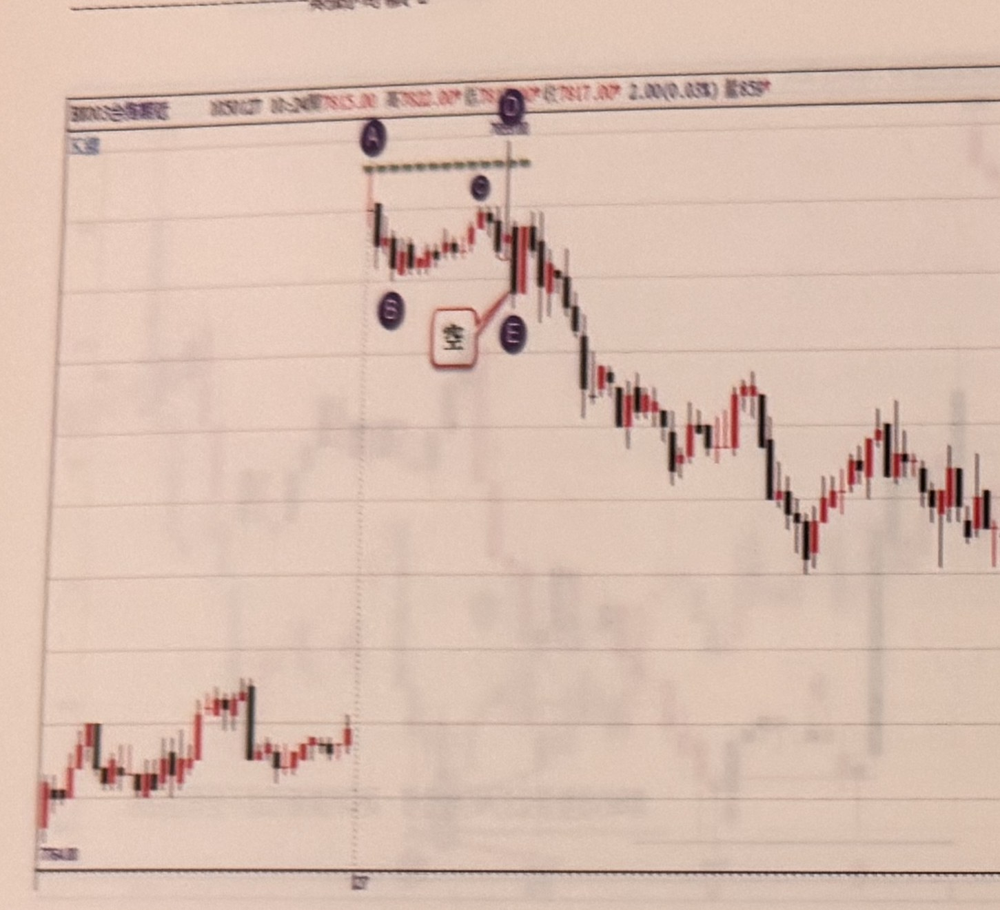
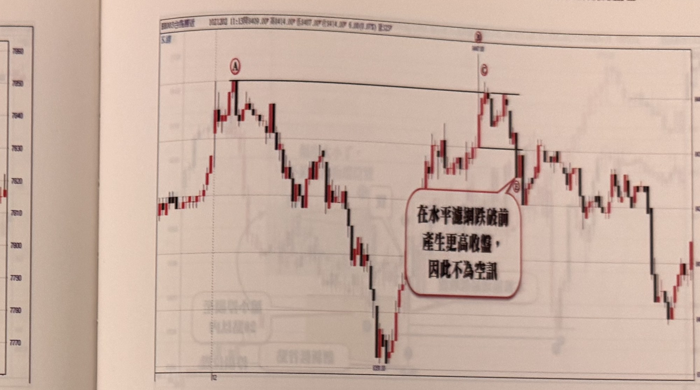

## p.194

在圖 6-6 裡，開盤跳空 70 點，產生 A 高點，而後拉回至 B 位置形成層級 2 轉折谷點後，緩慢推升，在標示 D 位置影線突穿 A 創下新高點，由 B 谷點到 D 峰點，幅度不到 20 點，如果本例跳空只有 20 點，那我們可能會對 D 峰點的極端性產生質疑，但是因為跳空 70 點，讓我們能夠認可 D 峰點是可能的極端高點，一般盤中高低震幅沒有超過 40 點（包括跳空至盤中高低點），比較難以說服它是極端峰谷位置，C 是本波區域最高收盤 K 線，還是比 A 的收盤低了一檔，顯然 D 的突破是假性峰點，因此以 D 的低點畫水平濾網，做為產生空點的觀察，隔一根 D 位置果然收盤跌破 D 的低點，形成放空訊號，但同時我們必須審視停損位置（D 的峰點）距離訊號 K 線收盤超過 20 點，如果要控制風險在 20 點之內，應該可以等稍後行情走高，致使價格離 D 高點縮小至 20 點或 10 點以內時，再考慮進場放空。

**圖 6-6**

> 圖說（figure notes）：台股期指分時走勢圖，日期 105/01/27，開盤 7815.00，最高 7822.00*，最低 7817.00*（略），2.00(0.03%)，量 859*。圖左側標示「大盤」。K 線圖顯示開盤跳空上漲產生 A 高點（以紫色圓圈標示 A），A 高點處有一段綠色虛線水平濾網延伸向右。價格從 A 拉回至 B（紫色圓圈標示 B，層級 2 轉折谷點），隨後緩慢震盪上升，中途有一點標示 C（紫色圓圈）。行情繼續盤整後在 D 位置（紫色圓圈，標示於一條垂直對齊線上方）以影線突破 A 的水平濾網創下新高。D 位置下方有紅色方框文字「空」，並以紅線指向 E 點（紫色圓圈標示 E），表示在 D 之後果然收盤跌破前低，形成放空訊號。整體走勢在訊號之後持續下跌至圖右下方低點，再小幅反彈。

## p.195

在辨認假性突破或跌破中，關鍵的一環在於創新低或創新高後，開始比較收盤價在本波區域中，是否比前波最高收盤高或比前波最低收盤低，但這個比較過程，在本波創新低 K 線最高點濾網未被突破前若產生更低收盤或者在本波創新高 K 線最低點濾網未被跌破前若產生更高收盤 K 線時，則以更低收盤比前波最低收盤或以更高收盤比前波最高收盤；以圖 6-7 來做說明，標示 A 為早盤最高點，之前行情向下急跌，再反彈拉高至 B 突破 A 高點，但顯然 B 的收盤比 A 的收盤低，到目前為止，標示 B 是假性突破是蠻明確的，因此以 B 的 K 線低點畫水平濾網，跌破即為放空訊號，然而在 B 的濾網未被跌破前，卻連接出現二根向上的紅 K 線，造成更高的收盤 C，比較 C 與前波區域最高收盤 A 時，發現兩者的收盤一般高，這樣平手現象，並不能以假性突破視之，就得放棄訊號的尋找動作。

**圖 6-7**

> 圖說（figure notes）：台股期指分時走勢圖，日期 107/03/02，11:15，開 8409.00*，高 8414.00*，低 8407.00*，收 8414.00*，4.00(0.05%)，量 325*。圖左側標示「大盤」。K 線圖左方先出現一段震盪上揚走勢，在標示 A（紅色圓圈）處為早盤最高點，有一條黑色水平線從 A 向右延伸作為濾網。價格自 A 向下急跌後反彈上升，在標示 C（紅色圓圈，位於一條垂直虛線上方）處以長紅 K 線向上突破 A 的水平濾網並創新高，但隨後收盤略為拉回，另有一水平線標示在 C 下方附近價位（前波區域）。圖中央偏右有一個紅色圓角對話框，文字為「在水平濾網跌破前產生更高收盤，因此不為空訊」，對話框右上角以線條指向標示 D（紅色圓圈）的位置。此處說明：早盤高點 A 之後出現的次高點被判定為假突破（因收盤低於 A），但在其濾網（低點水平線）尚未被跌破前，連續出現兩根紅 K 線推升收盤價，使收盤價與 A 的收盤價打平，因此依規則放棄視為假突破 / 空頭訊號的判斷。走勢後續持續下探至圖右下方低點後再度反彈震盪。
