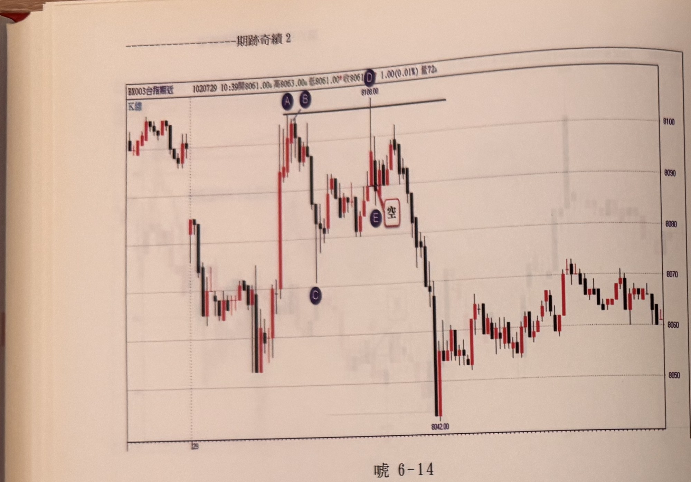
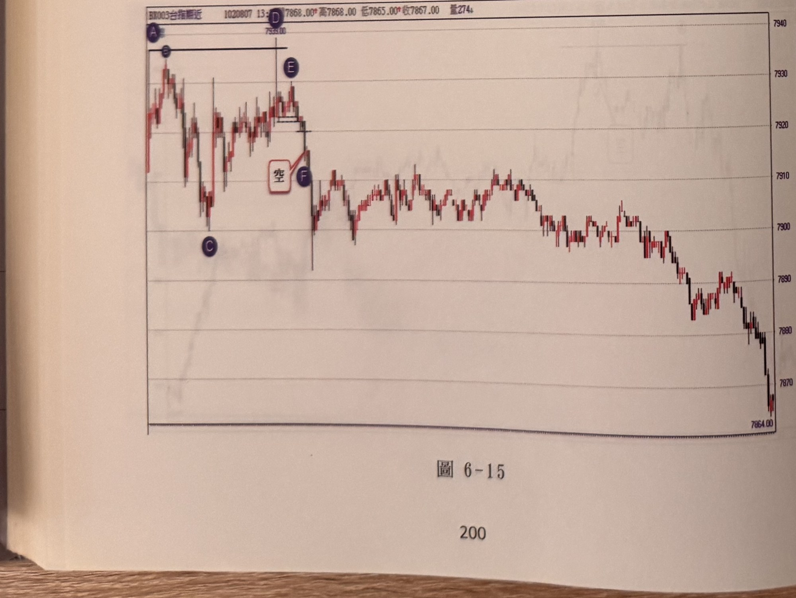
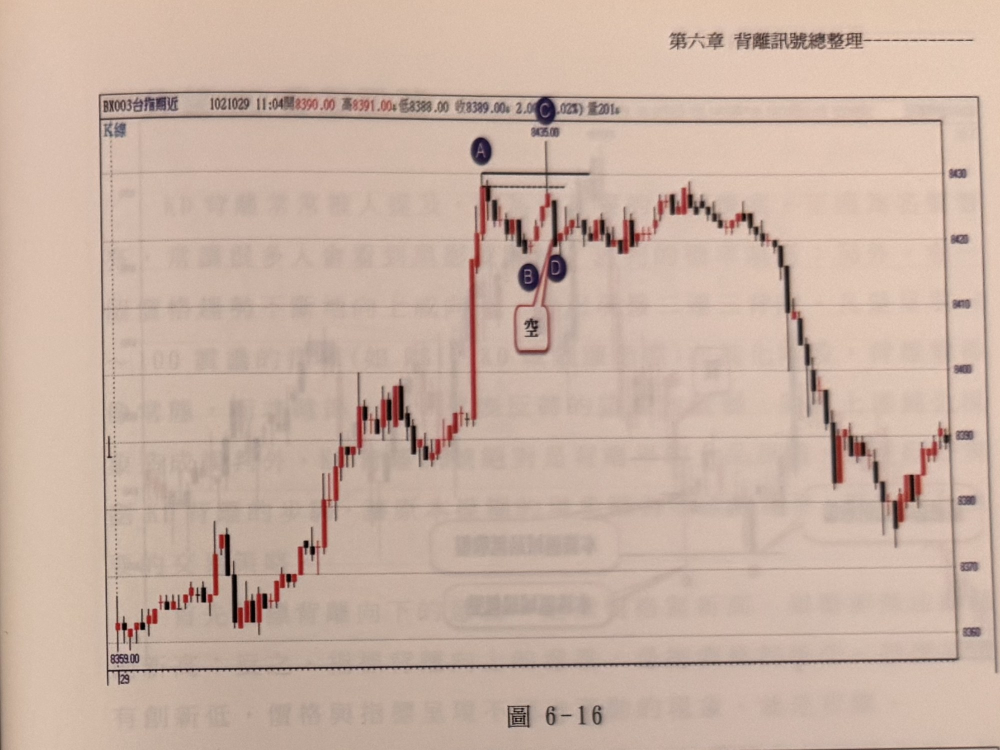
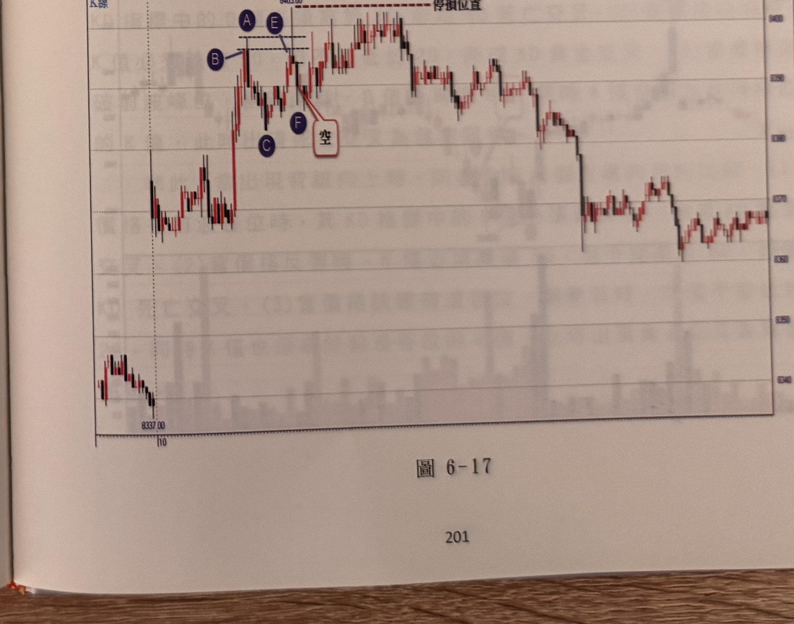

## p.200

[本頁僅有圖表（圖6-14、圖6-15），無正文段落，供讀者自行參閱練習]

**圖 6-14**

> 圖說（figure notes）：一分鐘K線圖（報價列「BX003台指期近 1020729 10:39開8061.00 高8063.00 低8061.00 收8061.00 1.00(0.01%) 量72」）。價格自左段低檔盤整後急拉走高，黑色圓圈 A、B 標示於峰點「8100」附近（A、B 之間以水平線相連），隨後拉回至低點（黑色圓圈 C），再反彈至另一峰點，黑色圓圈 D 標示於峰點「8108.00」處（與 A/B 峰點以水平線相連，顯示 D 略高於前峰），黑色圓圈 E 與白框「空」標示於 D 之後的拉回處，為放空訊號位置。其後價格急殺下跌至低點「8042.00」，此後於低檔區間反覆震盪整理。

**圖 6-15**

> 圖說（figure notes）：一分鐘K線圖（報價列「BX003台指期近 1020807 13:?? 開7868.00 高7868.00 低7865.00 收7867.00 量274」）。價格自左側高點，黑色圓圈 A 標示於峰點（水平線標示其壓力位），隨後小幅拉回，黑色圓圈 C 標示於一個較低的谷點，價格再度反彈至黑色圓圈 D、E 一帶（峰點約「7935.00」，與 A 同一水平線比較，略低於 A），白框「空」以線指向 E 後方，黑色圓圈 F 標示放空訊號位置。其後價格持續下跌，經歷一段區間整理後再度破底，一路走低至圖右下角低點「7864.00」。

## p.201

[本頁僅有圖表（圖6-16、圖6-17），無正文段落，供讀者自行參閱練習]

**圖 6-16**

> 圖說（figure notes）：一分鐘K線圖（報價列「BX003台指期近 1021029 11:04開8390.00 高8391.00 低8388.00 收8389.00 2.00(0.02%) 量201」）。價格自左段低檔盤堅走高，急拉至黑色圓圈 A 標示的峰點（水平線標示壓力），小幅拉回後再度上攻至黑色圓圈 C 標示的峰點「8435.00」（略高於 A，與 A 以水平虛線比較），黑色圓圈 B、D 與白框「空」標示於 C 之後的拉回處，為放空訊號位置。其後價格於高檔區間反覆震盪整理一段時間，尾段反轉一路下跌至圖右下角低檔。

**圖 6-17**

> 圖說（figure notes）：一分鐘K線圖（報價列「BX003台指期近 1030210 11:54開8368.00 高8368.00 低8366.00 收8367.00 量57」）。價格自左下低點「8337.00」反彈走高，黑色圓圈 B、A 標示於一個峰點（水平線標示壓力），小幅拉回後（黑色圓圈 C）再度上攻至黑色圓圈 E、D 標示的峰點「8403.00」（高於 A/B，上方另有紅色虛線「停損位置」），黑色圓圈 F 與白框「空」標示於 D 之後的拉回處，為放空訊號位置。其後價格於高檔區間反覆震盪整理，尾段反轉下跌至圖右下角低檔區間。
