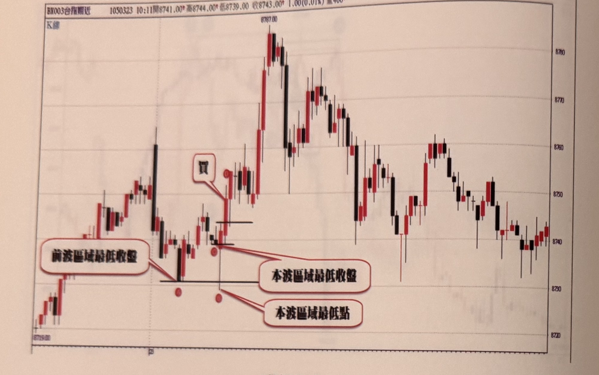
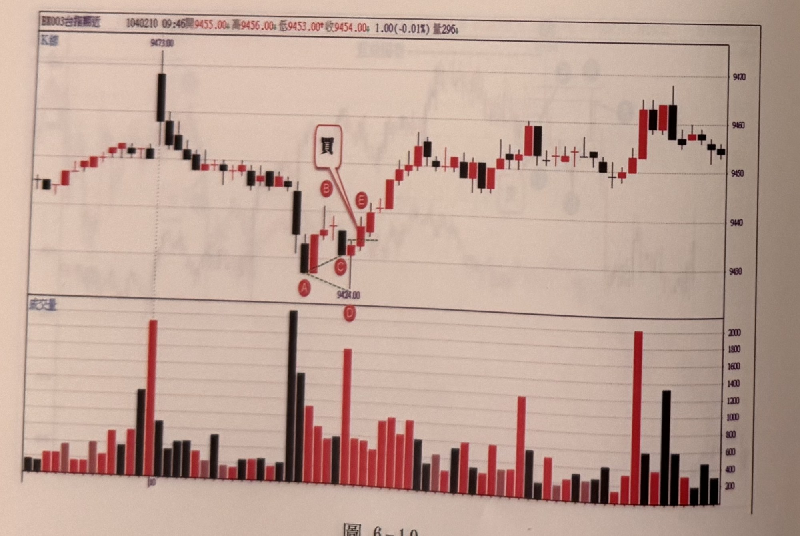

## p.202

[頁面主要為圖 6-18、圖 6-19 兩張附圖及其標註文字，無獨立段落正文]

**圖 6-18**

> 圖說（figure notes）：台股期指分時走勢圖，BX003台指期近，日期 105/03/23，10:11，開 8741.00*，高 8744.00*，低 8739.00，收 8743.00*，1.00(0.01%)，量 406*。圖左側標示「K線」。走勢圖左段自 8719.00 附近盤整上升，中途一根長黑 K 線大幅下探後回升，再度爬升至一高點，隨後拉回至標示 A（紅色圓圈）低點，A 左側有紅色圓角對話框「前波區域最低收盤」以線條指向 A 附近的水平線。價格自 A 附近小幅反彈後再度回測，於標示 C（紅色圓圈，緊鄰 A 右側偏上）處形成，C 下方另一水平線與紅色對話框「本波區域最低收盤」「本波區域最低點」以線條分別指向 C 位置及其下方另一個紅色圓圈標示點，說明本波區域最低點與最低收盤的相對位置關係。C 右上方有白色對話框文字「買」以線條指向訊號 K 線，表示收盤突破濾網形成買進訊號。其後行情強力上漲，於中段出現長紅 K 線急拉至最高點 8787.00，隨後震盪回落，歷經數次高低起伏，最終於圖右側收斂在 8740-8745 附近窄幅盤整。

**圖 6-19**

> 圖說（figure notes）：台股期指分時走勢圖（含下方成交量子圖），BX003台指期近，日期 104/02/10，09:46，開 9455.00*，高 9456.00*，低 9453.00*，收 9454.00*，1.00(-0.01%)，量 296*。圖左側標示「K線」，下方子圖標示「成交量」。上方 K 線圖：走勢先小幅盤整於 9473.00 附近出現一根長黑 K 線後急跌，下跌至標示 A（紅色圓圈）低點，A、B（紅色圓圈，A 右上方）、C（紅色圓圈，A 右側，價位標示 9424.00）之間以虛線連成一個下降三角形／楔形圖案，D（紅色圓圈，位於 C 正下方）另外標示於圖形下緣。B 右上方有白色對話框文字「買」以線條指向 E（紅色圓圈）附近的訊號位置，表示收盤突破濾網形成買進訊號。其後走勢反轉向上，經多次紅黑 K 線交替盤整後持續走高，於圖右側上方達到相對高點（約 9465-9468）後略為拉回收斂。下方成交量子圖以紅、黑柱狀顯示各根 K 線對應成交量，量能於行情急跌（A 附近）及買進訊號後（E 附近）皆出現明顯放大柱狀（分別接近 2000 及 1900 的高量），其餘期間量能相對平穩，介於約 400～1200 之間。

## p.203

# 一分鐘 KD 背離訊號

KD 背離常常被人提及，認為是重要的反轉徵兆，正因為名聲響亮，常讓很多人會看到黑影就開槍，誤判的機率頗高；另外，在一個價格趨勢不斷地向上或向下，會出現接二連三背離，凡是呈現 0～100 震盪的指標（如 RSI、KD 或威廉指標）在鈍化階段，背離變得像常態，而非難得一見，代表反轉的證據力就弱，除了上述鈍化現象造成誤判外，KD 背離訊號絕對是背離界的上品訊號。只要好好規劃 KD 背離的步驟，讓原本模糊的現象轉為明確的條件，就能成為重要的交易策略。

首先指標背離向下的意義，是指價格創新高，指標卻無法跟隨創新高；反之，指標背離向上的意義，是指價格創新低，指標卻沒有創新低，價格與指標呈現不同步運動的現象，就是背離。

背離向下會有兩個對應的峰位比較，(1) 價格在前波峰位時，其 KD 指標中的 D 值必須高於 80，形成 KD 死亡交叉，(2) 當價格拉回時，K 值必須跌破 50，但不能低於 20，形成 KD 黃金交叉，(3) 當價格突破前波峰位，創新高時，D 值不再過 80，同時 K 值也低於前波峰位的 K 值，此時出現死亡交叉為放空訊號。

準此，當出現背離向上時，同樣會有兩個對應的谷位比較，(1) 價格在前波谷位時，其 KD 指標中的 D 值必須低於 20，形成 KD 黃金交叉，(2) 當價格反彈時，K 值必須突破 50，但不能高於 80，形成 KD 死亡交叉，(3) 當價格跌破前波谷位，創新低時，D 值不能低於 20，同時 K 值也須高於前波谷位的 K 值，此時出現黃金交叉為買進訊號。
