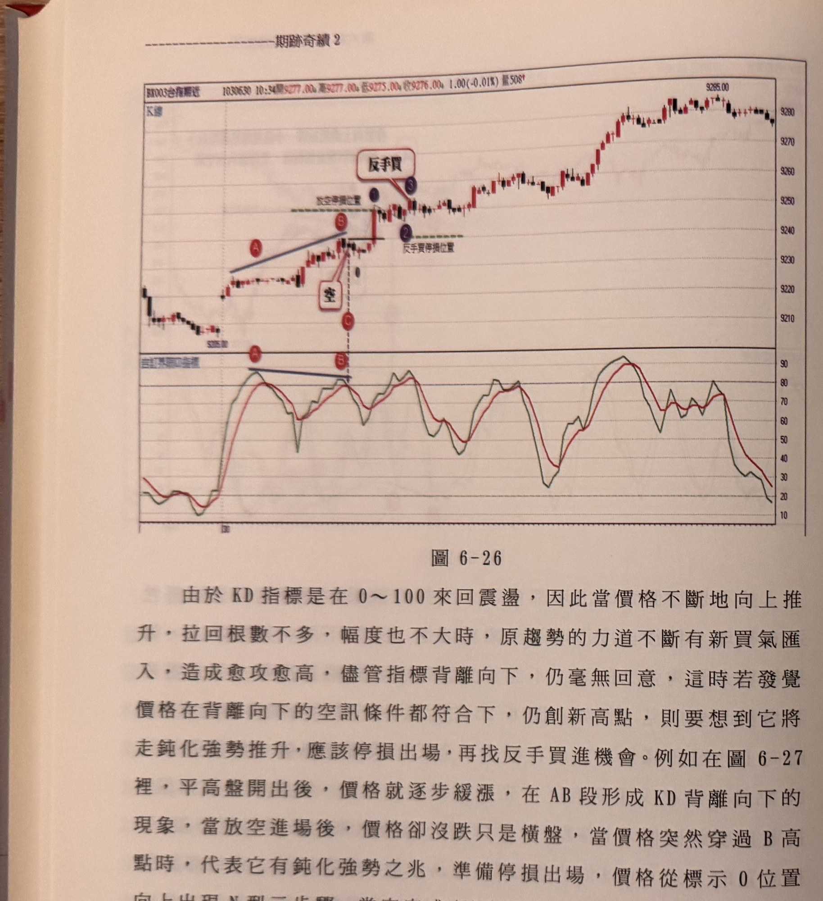
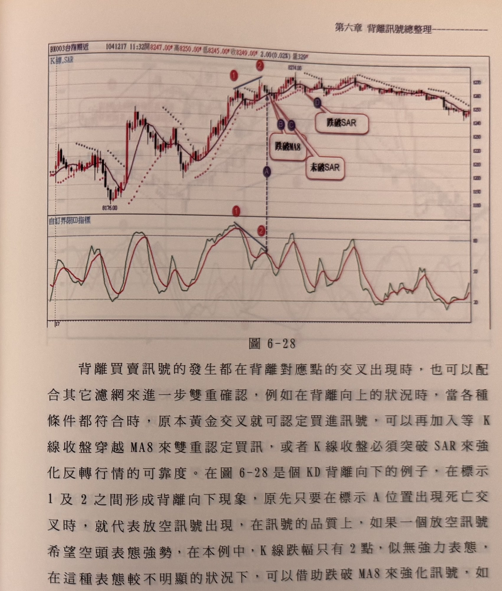

## p.210

由於 KD 指標是在 0～100 來回震盪，因此當價格不斷地向上推升，拉回根數不多，幅度也不大時，原趨勢的力道不斷有新買氣匯入，造成愈攻愈高，儘管指標背離向下，仍毫無回意，這時若發覺價格在背離向下的空訊條件都符合下，仍創新高點，則要想到它將走鈍化強勢推升，應該停損出場，再找反手買進機會。例如在圖 6-27 裡，平高盤開出後，價格就逐步緩漲，在 AB 段形成 KD 背離向下的現象，當放空進場後，價格卻沒跌只是橫盤，當價格突然穿過 B 高點時，代表它有鈍化強勢之兆，準備停損出場，價格從標示 0 位置向上出現 N 型三步驟，當它完成 (3) 步驟時，代表鈍化買進訊號，可以進場反手買進，順著趨勢跟隨。

**圖 6-26**

> 圖說（figure notes）：上下兩部分構成一圖。上方為一分鐘K線圖（報價列「BX003台指期近 1030630 10:34開9277.00 高9277.00 低9275.00 收9276.00 1.00(-0.01%) 量508」），下方為「自訂界限KD指標」線圖。價格自左段低檔走高，紅色圓圈 A（KD 圖對應紅色圓圈 A）標示於一段上升途中，藍色斜直線連接 A 至紅色圓圈 B（峰點附近，上方有綠色虛線「反空停損位置」），B 之後小幅拉回至紫色圓圈①，紅框「反手買」與紫色圓圈③標示於此，白框「空」與紫色圓圈①（另一組標號）標示於 B 稍後的拉回處；綠色虛線「反手買停損位置」標示於紫色圓圈②附近。此後價格持續走高，於高檔區間反覆震盪，最終攻抵右上角高點「9285.00」。下方 KD 圖中，紅色圓圈 A、B 分別對應上方峰點位置，A、B 之間以藍色斜直線連接，顯示價格創新高但 KD 未同步創新高的背離向下現象；其後 KD 於高檔區間反覆震盪，尾段明顯走低。

## p.211

背離買賣訊號的發生都在背離對應點的交叉出現時，也可以配合其它濾網來進一步雙重確認，例如在背離向上的狀況時，當各種條件都符合時，原本黃金交叉就可認定買進訊號，可以再加入等 K 線收盤穿越 MA8 來雙重認定買訊，或者 K 線收盤必須突破 SAR 來強化反轉行情的可靠度。在圖 6-28 是個 KD 背離向下的例子，在標示 1 及 2 之間形成背離向下現象，原先只要在標示 A 位置出現死亡交叉時，就代表放空訊號出現，在訊號的品質上，如果一個放空訊號希望空頭表態強勢，在本例中，K 線跌幅只有 2 點，似無強力表態，在這種表態較不明顯的狀況下，可以借助跌破 MA8 來強化訊號，如果跌破均線的 K 線亦以小跌破線，則仍屬弱勢表態，則可以借助 K 線收盤跌破 SAR 來雙重確認，如標示 B 位置為價格跌破 MA8，但卻還是跌幅很小的 K 線，空方力道沒有強勢作為，直到 D 位置時，K 線收盤正式跌破 SAR，且是跌幅較大的 K 線，可以視為品質較佳的訊號。

**圖 6-28**

> 圖說（figure notes）：上下兩部分構成一圖。上方標題「K線,SAR」，為一分鐘K線圖疊加黑色 MA8 均線與紅色點狀 SAR 線（報價列「BX003台指期近 1041217 11:32開8247.00 高8250.00 低8245.00 收8249.00 2.00(0.02%) 量329」），下方為「自訂界限KD指標」線圖。價格自低點「8176.00」走高，紅色圓圈 1 標示於一峰點，藍色斜直線連接 1 至紅色圓圈 2（另一峰點，略低於 1，峰點價位標示「8274.00」附近）；峰點 2 之後，紫色圓圈 A（垂直虛線向下對應至 KD 圖同位置）、B、C、D 依序標示價格拉回過程，三個紅色對話框分別為「跌破MA8」（指向 B/C 附近）、「跌破SAR」（指向 D 附近）與「未破SAR」，說明拉回初期僅跌破均線 MA8（跌幅小，力道不足），直到 D 位置才正式收盤跌破 SAR（確認訊號）。此後價格持續走低，MA8 與 SAR 皆同步下彎，一路盤跌至圖右段低檔。下方 KD 圖中，紅色圓圈 1、2 分別對應上方兩峰點，以藍色斜直線連接，顯示價格次高但 KD 未同步創高的背離向下現象，虛線垂直對應至 A 點；其後 KD 於中低檔區間反覆震盪走低。
