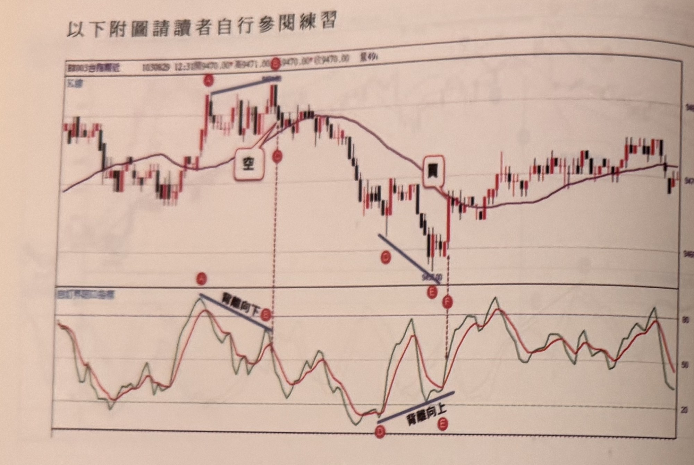
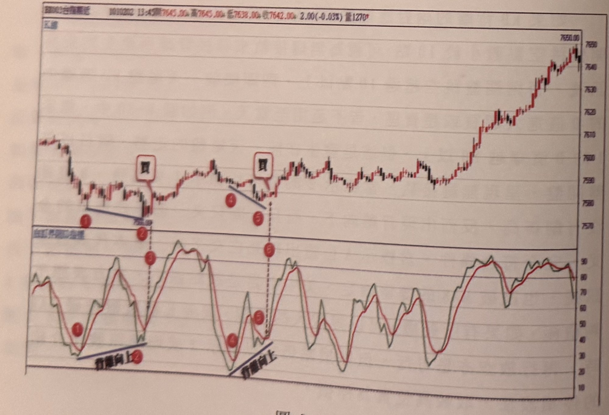
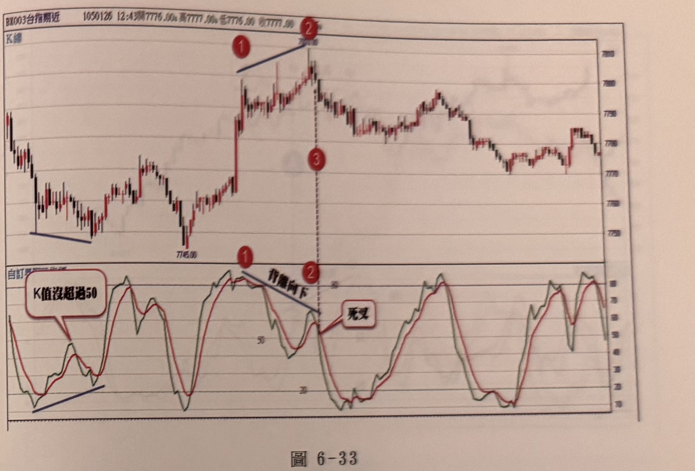
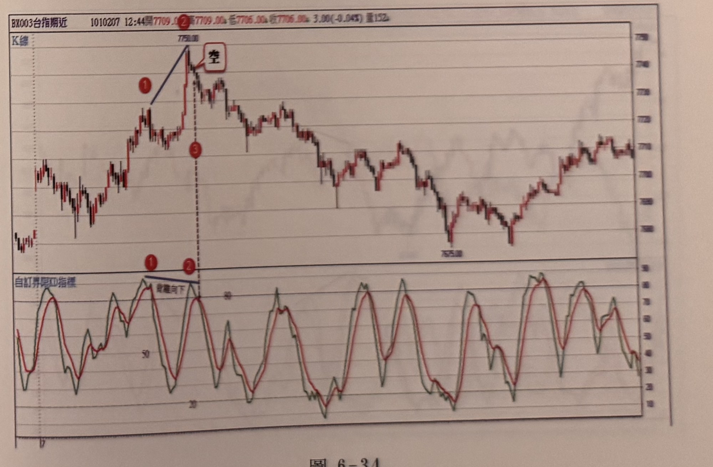

## p.214

以下附圖請讀者自行參閱練習

**圖 6-31**

> 圖說（figure notes）：上方為台股期指分時 K 線圖，日期 103/08/29，12:31，開 9470.00*，高 9471.00*，低 9470.00*，收 9470.00，量 49*。圖左側標示「大盤」。走勢自左段震盪上升至標示 A（紅色圓圈）高點，A 有深藍色斜線向右延伸至另一峰位標示 E（紅色圓圈），A、E 之間下方文字「背離向下」。E 之後價格拉回，上方白色對話框文字「空」以線條指向 E 附近訊號 K 線。走勢持續下跌至標示 C、D（紅色圓圈，下方深藍色斜線連接，價位標示約 9450）附近止跌，隨後價格急速反彈，上方白色對話框文字「買」以線條指向反彈起漲 K 線（標示 E、F 紅色圓圈相鄰，以虛線垂直向下對應至下方 KD 子圖）。此後走勢持續盤整回升至圖右側收在約 9470-9480 區間。下方為「自訂界限KD指標」子圖：K（深綠線）、D（紅線）值於標示 A、E 對應位置以深藍斜線連接（「背離向下」），隨後於標示 D、E 對應位置的低檔區再以深藍斜線連接（「背離向上」），顯示本圖包含一組背離向下放空訊號與一組背離向上買進訊號的完整範例供讀者練習判讀。

**圖 6-32**

> 圖說（figure notes）：上方為台股期指分時 K 線圖，BX003台指期近，日期 101/02/02，13:43，開 7645.00*，高 7645.00*，低 7638.00*，收 7642.00*，2.00(-0.03%)，量 1270*。圖左側標示「大盤」。走勢自左側高點下滑至標示①（紅色圓圈）附近，①下方深藍色斜線向右延伸至標示②（紅色圓圈，價位標示 7580.00 附近），②之後價格反彈，上方白色對話框文字「買」以線條指向反彈起漲 K 線（對應標示③，以虛線垂直向下連接至下方 KD 子圖）。價格其後小幅震盪再度拉回至標示④（紅色圓圈）附近，④下方深藍色斜線延伸至標示⑤（紅色圓圈），⑤之後再度出現白色對話框「買」訊號（對應標示⑥）。此後走勢強力上漲，經多次紅黑 K 線交替後於圖右側衝高至全圖最高點 7650.00 附近。下方為「自訂界限KD指標」子圖：K（深綠線）、D（紅線）值分別於①②之間、④⑤之間以深藍色斜線連接（皆標示「背離向上」），對應標示③、⑥處出現金叉買進訊號。

## p.215

**圖 6-33**

> 圖說（figure notes）：上方為台股期指分時 K 線圖，BX003台指期近，日期 105/01/26，12:43，開 7776.00*，高 7777.00*，低 7776.00*，收 7777.00*（略）。圖左側標示「K線」。走勢自左側低點（價位標示 7745.00）反彈急漲，標示①（紅色圓圈）以深藍斜線向右上連接至標示②（紅色圓圈，價位標示於 K 線最高點附近）；②之後價格於高檔震盪盤整回落，標示③（紅色圓圈，以虛線垂直向下連接至下方 KD 子圖）。此後走勢緩步下滑整理，於圖右側末段小幅反彈後再度收斂。下方為「自訂界限KD指標」子圖：左下角有紅色圓角對話框「K值沒超過50」以線條指向左側低檔區一段 K 值未站上 50 的區域；標示①、②之間以深藍色斜線連接（文字「背離向下」），對應標示③處以白色對話框「死叉」標示死亡交叉發生位置，說明此處雖出現背離向下但仍須配合死亡交叉確認訊號。

**圖 6-34**

> 圖說（figure notes）：上方為台股期指分時 K 線圖，BX003台指期近，日期 101/02/07，12:44，開 7709.00*，高 7709.00*，低 7706.00*，收 7706.00*，3.00(-0.04%)，量 152*。圖左側標示「K線」。走勢自左側震盪盤整後急速上漲，標示①（紅色圓圈）以深藍斜線向右上連接至標示②（紅色圓圈，價位標示 7750.00），②右側有白色對話框文字「空」以線條指向訊號 K 線（對應標示③，以虛線垂直向下連接至下方 KD 子圖）。此後走勢反轉持續下跌，經多次紅黑 K 線交替後於中段觸及低點（價位標示 7575.00 附近），尾段小幅反彈回升至圖右側收斂。下方為「自訂界限KD指標」子圖：K（深綠線）、D（紅線）值於標示①、②之間以深藍色斜線連接（文字「背離向下」），對應標示③處出現死亡交叉，形成放空訊號。
