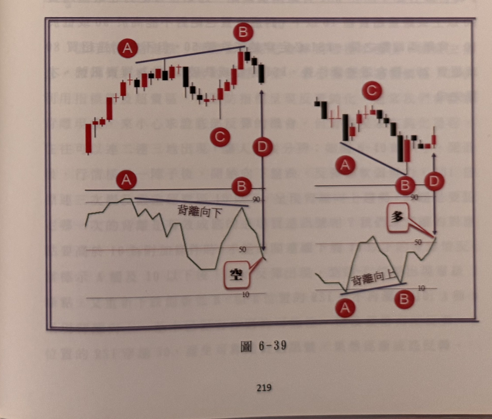

## p.218

[本頁無印刷正文。頁面底色可見極淡且非鏡像的殘影，隱約可辨兩段折線圖輪廓（疑為鄰頁圖表透印或疊印殘留），但線條與數字皆已模糊無法辨識 [?]，故不予謄寫、亦不製作對應圖片。本頁應為前一節末頁（僅圖或空白），無頁碼可辨。]

## p.219

**一分鐘 RSI 背離訊號**

KD 背離訊號的條件與濾網，亦可運用在一分鐘 RSI 指標背離，外觀上 RSI 背離情形與 KD 背離有相似之處，但並非完全相同，其中訊號條件必須符合四大步驟：(1) 前波峰位所對應的 RSI 數值必須超過嚴重超買區 90 以上，之後 (2) 行情拉回，RSI 下探至 50 以下，但必須維持在 20 以上，但沒像 KD 背離嚴格只限簡單一個交叉，即下探 50 以下，可以反覆穿越，而且價格要形成層級 2 谷點；當價格重新回升 (3) 突破前波峰位時，RSI 卻未過不了前波 90 水準，形成指標背離向下，然後進入最重要的訊號發生時刻，(4) 當 RSI 向下跌破 50 時，即為放空訊號，如圖 6-39 左半圖所示。

**圖 6-39**

> 圖說（figure notes）：藍色方框內並列兩組示意圖（示範性繪圖，非實際看盤軟體截圖），各由上方 K 線示意圖與下方對應 RSI 折線示意圖構成。左半圖：K 線自左下起漲，紅色圓圈 A 標示於一峰點，藍色斜直線連接 A 至更高的紅色圓圈 B（峰點），其後價格拉回至紅色圓圈 C，再度上攻至紅色圓圈 D（略高於 B，藍色雙向箭頭標示 B 到 D 的漲幅），下方 RSI 圖中對應紅色圓圈 A、B 以藍色斜直線連接（A 高於 B，文字「背離向下」標示於連線上方，對應水平線標示「90」），RSI 隨後下探至「50」以下、「10」附近，白框「空」標示於 RSI 向下跌破 50 處，即為放空訊號。右半圖為鏡像結構：K 線自左側高檔反轉下跌，紅色圓圈 A 標示峰點，藍色斜直線連接 A 至較低的紅色圓圈 B（谷點附近），其後價格反彈，紅色圓圈 D 標示於 B 之後的反彈點（藍色雙向箭頭標示跌幅），下方 RSI 圖中紅色圓圈 A、B 以藍色斜直線連接（文字「背離向上」標示於連線上方，對應水平線標示「10」），RSI 隨後回升穿越「50」，紅框「多」標示於此處，即為買進訊號。
