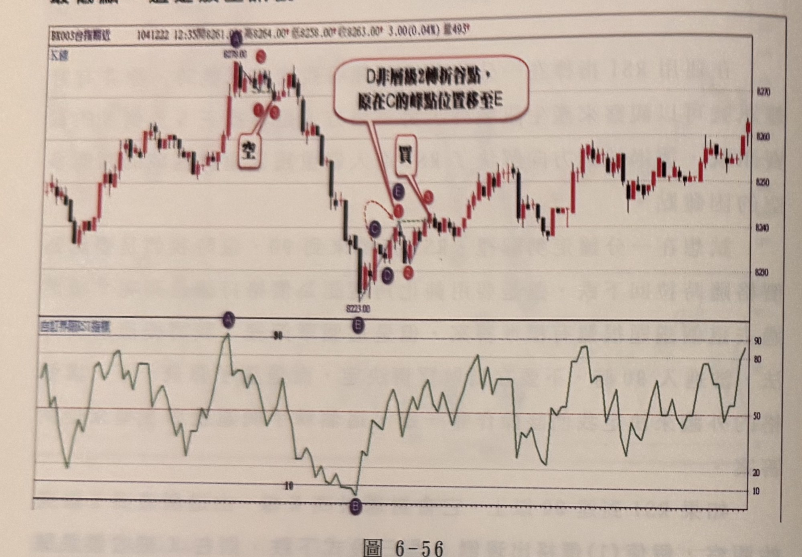
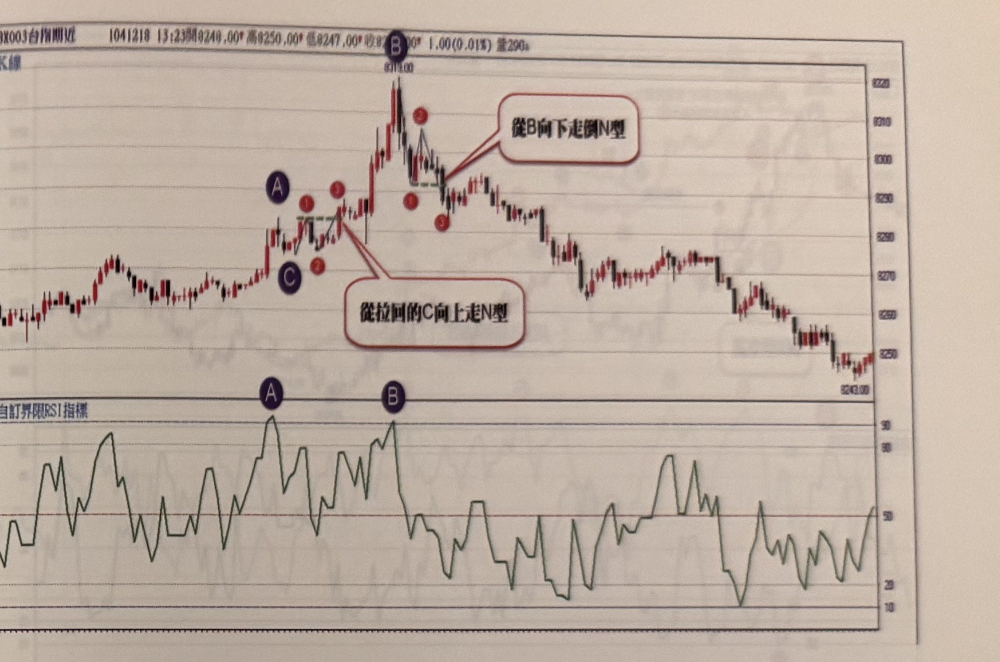

## p.234

[頁首承接前頁末句]

最低點，這是放空訊號。

**圖 6-56**

> 圖說（figure notes）：台指期近分時走勢圖，左上角報價列標示「BX003台指期近 1041222 12:35開8261.00 高8264.00 低8258.00 收8263.00 3.00(0.04%) 量493」。上方為 K 線圖，下方為「自訂界限RSI指標」圖。K 線走勢先上漲至最高點 8278.00（標示紫色圓圈字母 A），A 上方另標示紅色圓圈字母 C（緊鄰 A 右側，位置略低），A、C 之間有兩個紅色圓圈（無字母標示）以紅線相連，並有白底紅框文字方塊「空」，以線條指向該處，代表此為放空訊號位置。價格自高點反轉下跌，跌至最低點 8223.00（下方標示紫色圓圈字母 B）附近時，出現一段小幅 V 形反轉：先標示紫色圓圈字母 C（低點）、其右上方有紅色圓圈字母 D（虛線圓弧箭頭指示由 C 轉折向上）、再右側有紫色圓圈字母 E，D、E 之間以綠色虛線水平連接。E 上方另有一紅色圓圈（無字母），並有白底紅框文字方塊「買」，以線條指向此處，代表買進訊號位置。圖右上方有一個紅色文字框「D非層級2轉折谷點，原在C的峰點位置移至E」，以紅線指向 D、E 一帶，說明 D 點因不符合層級 2 轉折谷點定義，訊號位置需由原本 C 的峰點位置調整移到 E。買進訊號之後，價格反彈走高，中途多次紅黑 K 交替整理，最終在圖右側小幅走高收尾。下方 RSI 圖中，對應 A 的位置為一波峰（紫色圓圈標示字母 A，數值超過 90 的嚴重超買區），對應 B 的位置為一波谷（紫色圓圈標示字母 B，數值低於 10 的嚴重超賣區），A、B 分別對應上方 K 線圖的最高點與最低點。RSI 曲線在 A、B 之間及其後持續在 10～90 區間反覆震盪。

在圖 6-56 的例子，行情自早盤低點開始上漲至標示 A 位置，RSI(5) 抵達嚴重超買區 90 以上，自 K 線圖在的最高 K 線 8278(A) 開始觀察行情變化，結果價格出現倒 N 型，當 K 線收盤跌破倒 N 型的谷點(1)在(3)位置出現放空訊號，而設置停損的方式，可以取最高點 A 為停損位置，或照均線買賣策略的停損設置，亦可比較兩者取較高者，但仍宜控制停損點數在 20 點以內；當空單進場後，行情果然向下運動，到達標示 B 位置時，其 RSI(5) 亦進入嚴重超賣區 10 以下，此時開始觀察行情變化，隨後價格出現向上的正 N 型三段式上漲，當 K 線收盤突破正 N 型的峰點(1)時，是為買進訊號。A 與 B 的買賣訊號都屬於指標進入嚴重超買超賣區即發生逆轉行情，剛好透過倒 N 及正 N 型判斷而得到訊號。

## p.235

**圖 6-57**

> 圖說（figure notes）：台指期近分時走勢圖，左上角報價列標示「BX003台指期近 1041218 13:23開8240.00 高8250.00 低8247.00 收8２??.00 1.00(0.01%) 量290」（部分數字因相片模糊無法完全確讀 [?]）。上方為 K 線圖，下方為「自訂界限RSI指標」圖。K 線走勢緩步上升，至標示紫色圓圈字母 A 處出現一小段拉回，拉回低點標示紫色圓圈字母 C，A、C 附近另各有一個紅色圓圈數字「①」「②」標示。價格自 C 附近重新拉升，以綠色虛線水平標示前波高點（A 與 C 之間的高點連線），突破後續漲至最高點 8318.00（頂端標示紫色圓圈字母 B），B 下方有紅色圓圈數字「②」，再下方另有紅色圓圈數字「①」「③」。圖中有兩個紅色文字方塊說明：「從拉回的C向上走N型」以線條指向 A、C 之間向上突破的路徑；「從B向下走倒N型」以線條指向 B 之後價格下跌又反彈、以綠色虛線水平標示的頸線位置。B 之後價格反轉持續下跌，中途小幅反彈整理，最終在圖右側低檔盤整收尾，右下角標示價位 8243.00。下方 RSI 圖中，對應 A 的位置為一波峰（紫色圓圈標示字母 A，數值接近 90），對應 B 的位置為另一波峰（紫色圓圈標示字母 B，數值超過 90 的嚴重超買區）。RSI 在 A、B 之間反覆震盪於高檔區，B 之後隨價格下跌而持續走低，在 20 以下區間震盪。

在圖 6-57 的例子，演示了鈍化續漲的現象，行情緩緩攀升，到達 A 位置，RSI(5) 卻已經進入嚴重超買 90 以上，不用急於判斷，開始觀察，讓價格外形引導我們判斷，從 A 高點開始拉回至標示 C 形成谷點後，價格重新拉上，如果拉上形成的峰點低於 A 的高點，那麼多空皆有可能，因為若向下跌破 C 谷點，則形成倒 N 型的放空訊號，但在本例中，自 C 谷點拉升，在號碼球 1 位置的高點與 A 的高點同高時，向下的可能性就去除了，剩下來的是朝正 N 型考慮，當拉回形成另一個谷點（注意此谷點 2 必須高於 C），隨後 K 線收盤向上突破峰點(1)，在標示 3 位置形成買進訊號，這是 RSI 鈍化的買訊，請注意所有 N 型或倒 N 型皆為層級 2 的峰谷轉折點。當價格漲到標示 B 位置時，出現逆襲線反轉組合，可以當做平倉出場，而在 B 位置，RSI(5) 亦抵達 90 以上，隨之價格呈現倒 N 型，當 K 線收盤跌破谷點 1 時，為放空訊號。
