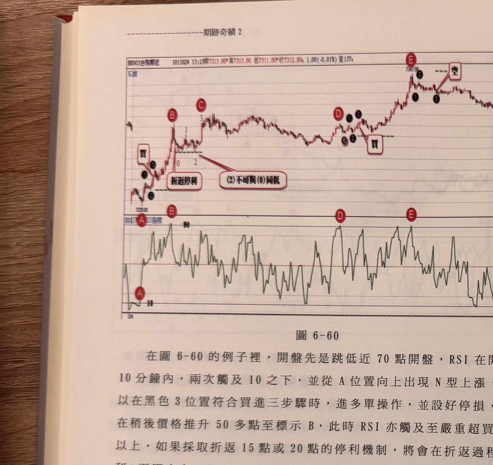
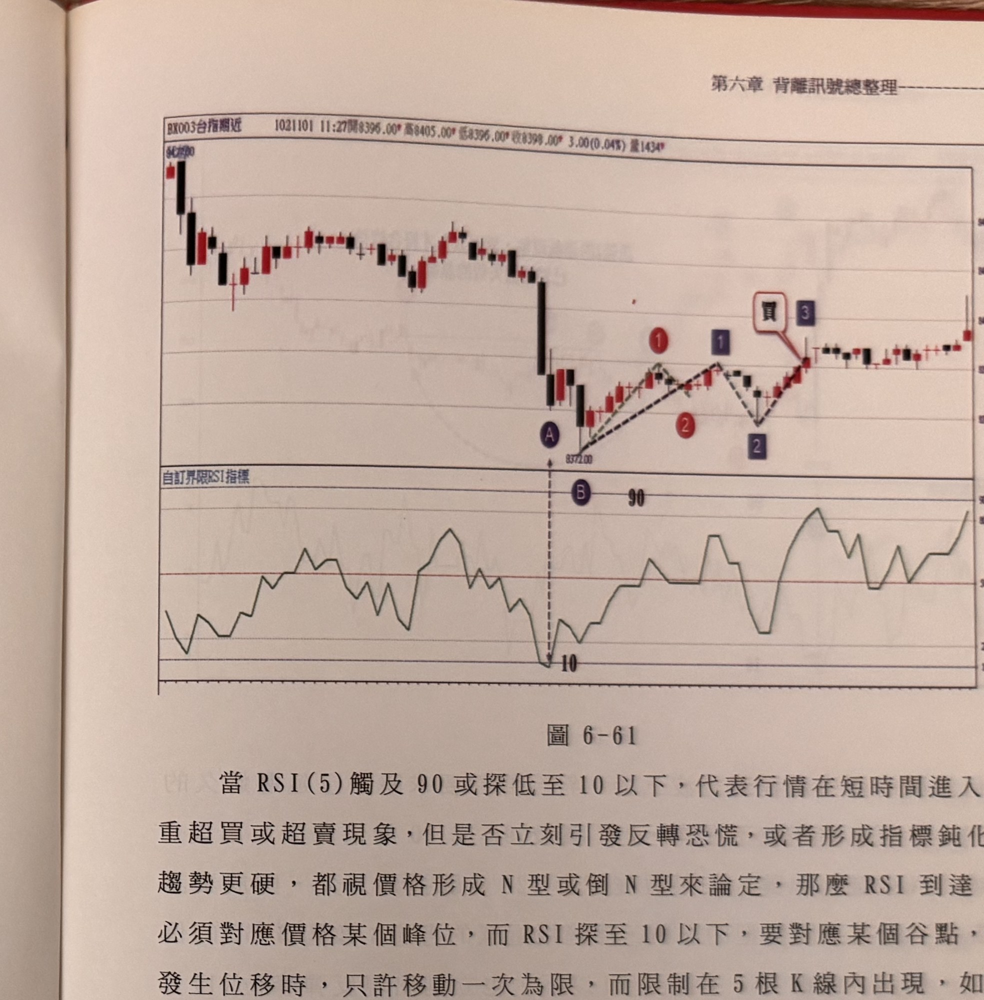

## p.238

（承接前頁，說明最低 K 線）最低點，這是放空訊號。

在圖 6-60 的例子裡，開盤先是跳低近 70 點開盤，RSI 在開盤 10 分鐘內，兩次觸及 10 之下，並從 A 位置向上出現 N 型上漲，可以在黑色 3 位置符合買進三步驟時，進多單操作，並設好停損，而在稍後價格推升 50 多點至標示 B，此時 RSI 亦觸及至嚴重超買 90 以上，如果採取折返 15 點或 20 點的停利機制，將會在折返過程停利；而原本在 B 位置可以出現鈍化買點，但因為拉回的谷點 (2) 與起始 (0) 谷點同低，不符鈍化買點的條件，直到標示 D 位置，RSI 再次觸及嚴重超買區 90，拉回一波後，自黑 (0) 向上形成 N 型鈍化買訊，請注意鈍化買訊的 K 線收盤一定要超過 RSI 觸及 90 的 D 峰點，再者鈍化買訊也不能超過 D 峰位太遠，最好在 20 點以內為佳，太遠要提防獲利回吐賣壓。在 D 開始的 N 型鈍化買訊，果然看到行情急速拉升，至標示 E 位置 RSI 又觸及 90，開始向下形成倒 N 型空訊，同時之前的買訊至此停利平倉。

**圖 6-60**

> 圖說（figure notes）：上下兩部分構成一圖。上方為一分鐘K線圖（報價列「BX003台指期近 1011024 13:13開7313.00 高7313.00 低7311.00 收7312.00 1.00(-0.01%) 量137」），下方為「自訂界限RSI指標」線圖。價格自低點「7225.00」起漲，黑色圓圈①③與白框「買」標示第一次買進訊號（紅色圓圈 A 對應下方 RSI 圖），隨後急拉至紅色圓圈 B（伴隨數字 0/1/2/3 標示 N 型步驟，綠色虛線「折返停利」標示折返出場位置），再突破至紅色圓圈 C（數字 3，文字方塊「(2)不可與(0)同低」以線指向此處說明鈍化買點的排除條件）。其後價格於中段區間反覆震盪整理，至右段紅色圓圈 D 附近再度出現黑色圓圈⓪①②③與白框「買」標示的鈍化買進訊號（綠色虛線標示濾網），價格隨後急速上攻，至紅色圓圈 E 附近（峰點「7347.00」）出現黑色圓圈①③與白框「空」標示的放空訊號（綠色虛線標示濾網）。下方 RSI 圖中，紅色圓圈 A 標示於左段觸及「10」以下之處，B、D、E 分別對應觸及「90」的位置，此後 RSI 於中高檔區間反覆震盪。

## p.239

當 RSI(5) 觸及 90 或探低至 10 以下，代表行情在短時間進入嚴重超買或超賣現象，但是否立刻引發反轉恐慌，或者形成指標鈍化，趨勢更硬，都視價格形成 N 型或倒 N 型來論定，那麼 RSI 到達 90 必須對應價格某個峰位，而 RSI 探至 10 以下，要對應某個谷點，若發生位移時，只許移動一次為限，而限制在 5 根 K 線內出現，如圖 6-61 的例子，在標示 A 位置時，RSI 下探 10 以下之嚴重超賣區，而 A 也是層級 2 谷點，正常情況要從 A 開始數 N 型 123 或倒 N 型 123，即以 A 為基準 0 點，開始尋找 N 型三步驟，先找反彈的 (1) 峰點，但行情卻沒出現反彈而繼續探底至 B 位置後，才開始向上產生 N 型；從 A 位移到 B，之所以允許如此作法，是因為 A 之後沒有出現反彈峰點 (1)，才允許位移至 B 谷點，如果 A 之後有了反彈峰點 (1) 存在，則當出現更低的 B 谷點時，絕不允許從 B 起算 N 型。

**圖 6-61**

> 圖說（figure notes）：上下兩部分構成一圖。上方為一分鐘K線圖（報價列「BX003台指期近 1021101 11:27開8396.00 高8405.00 低8396.00 收8399.00 3.00(0.04%) 量1434」，左上角另標高點「8420.00」），下方為「自訂界限RSI指標」線圖。價格開盤後急殺下跌，紫色圓圈 A（垂直虛線向下對應）標示於低點「8372.00」，紅色數字①標示於 A 之後第一個反彈峰點，藍色數字①另標示於稍高的峰點，紅色數字②標示於其後谷點，藍色數字②標示於另一個更低的谷點，灰色虛線連接①-②-①-②描繪 N 型步驟的位移過程，白框「買」與藍色數字③標示於最終突破處的買進訊號。其後價格持續走高，於中高檔區間反覆震盪整理。下方 RSI 圖中，紫色圓圈 B（虛線向上對應 A）標示於「90」水準附近，RSI 曲線自左段中檔震盪，於 A 對應時間點觸及「10」，其後於中高檔區間反覆震盪走高。
