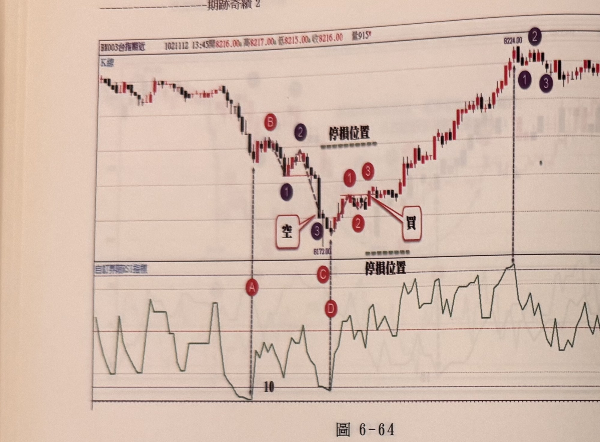
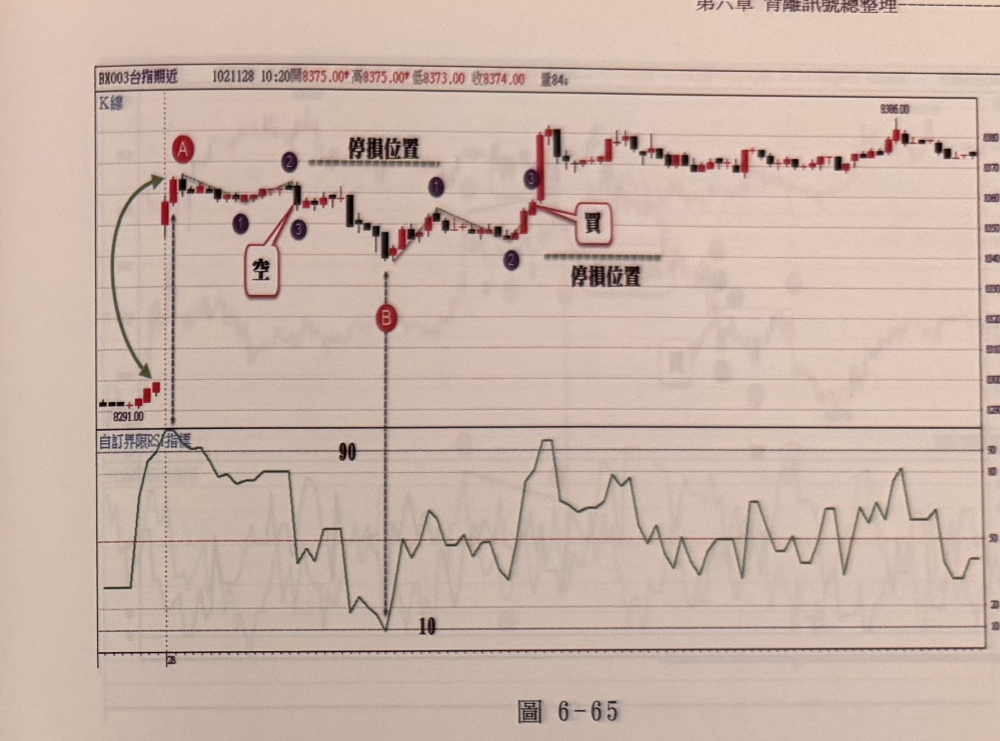

## p.242

**圖 6-64**

> 圖說（figure notes）：台指期近分時走勢圖，左上角報價列標示「BX003台指期近 1021112 13:45開8216.00 高8217.00 低8215.00 收8216.00 量915」。上方為 K 線圖，下方為「自訂界限RSI指標」圖。K 線走勢自圖左高檔開始下跌，跌勢中標示紅色圓圈字母 B（一個反彈高點），其右側標示紫色圓圈數字「2」，B、2 右方以灰色虛線水平標示「停損位置」。價格續跌，中途標示紫色圓圈數字「1」，最低點（價位 8172.00）處有白底紅框文字方塊「空」與紫色圓圈數字「3」相鄰，並以紅線連接，代表放空進場訊號。最低點右側依序標示紅色圓圈數字「1」「3」（一個小反彈高點）、紅色圓圈數字「2」（拉回低點），並有白底紅框文字方塊「買」以紅線指向「2」與其右側回升的位置，另一條灰色虛線水平標示「停損位置」在下方 RSI 圖區塊上緣。價格自此止跌回升，一路走高至最高點 8224.00（標示紫色圓圈數字「2」），其左側另標示紫色圓圈數字「1」「3」，最終在圖右側高檔區間小幅震盪收尾。下方 RSI 圖中，對應 B 附近的位置標示紅色圓圈字母 A（數值觸及 10 以下的嚴重超賣區），其右側標示紅色圓圈字母 C（另一次觸及 10 附近），C 右下方標示紅色圓圈字母 D（RSI 再度觸及 10 以下）。RSI 曲線其後大幅反彈走高，在圖右段多次衝高至 80～90 附近的嚴重超買區。

在一個跌勢鈍化空訊出現，亦進場放空後，若不久遭遇 RSI 另一次觸及 10 以下嚴重超賣區，而價格自此處向上發展出 N 型買進步驟，那麼不管空單已存在多久，當訊號指向買進，則立刻平倉隨新的買進訊號建立多單部位，而在一個漲勢鈍化買訊發生時，自然進行多單操作，若不久亦發生 RSI 觸及 90 以上時，且價格亦從峰點向下形成倒 N 型放空步驟產生空訊，則多單立刻平倉，並加入空軍行列；如圖 6-64 例子，在標示 A 位置，RSI 觸及 10 以下，反彈出現 B 峰點後，向下形成倒 N 型放空步驟，自然進場操作空單，稍後不久，在 D 處 RSI 又再次觸及 10 以下，並以 C 為最低谷點向上行進，並符合 N 型買進 123 步驟，此時空單雖未被觸及停損位置，卻必須隨著買進訊號出現，立即將空單平倉，並加入買進操作。

## p.243

**圖 6-65**

> 圖說（figure notes）：台指期近分時走勢圖，左上角報價列標示「BX003台指期近 1021128 10:20開8375.00 高8375.00 低8373.00 收8374.00 量84」。上方為 K 線圖，下方為「自訂界限RSI指標」圖。K 線走勢自圖左低檔（價位標示 8291.00）以一條綠色雙向箭頭曲線連接至向上跳空後的起漲點，跳空後第一根 K 棒上方標示紅色圓圈字母 A。價格小段整理後標示紫色圓圈數字「1」、「2」（一個小峰點，右側以灰色虛線水平標示「停損位置」）、紫色圓圈數字「3」，並有白底紅框文字方塊「空」以紅線指向「3」附近，代表放空訊號位置。價格自此下跌至一低點（下方標示紅色圓圈字母 B），隨後止跌回升，途中標示紫色圓圈數字「1」（小峰點）、紫色圓圈數字「2」（拉回低點，右下方以灰色虛線水平標示「停損位置」），再上漲至紫色圓圈數字「3」，並有白底紅框文字方塊「買」以紅線指向「3」附近向上突破的長紅 K，代表買進訊號位置。此後價格持續走高，最高點標示價位 8396.00，最終在圖右側高檔區間小幅震盪收尾。下方 RSI 圖中，對應 A 附近位置 RSI 迅速攀升至 90 以上的嚴重超買區並持續高檔游移，其後隨價格拉回而下降，於對應 B 的位置（黑色虛線垂直標示）觸及 10 以下的嚴重超賣區，之後 RSI 反彈震盪走高，多次衝高至 80～90 附近。

在一分鐘 K 線圖裡，跳空開盤，常常促使 RSI 急速觸及 90 超買區或 10 以下嚴重超賣區，除非跳空後到頂點或者向下跳空到低點幅度大，一般至少跳空幅度須大於 30 點以上，甚至可以一概忽略開盤 15 分鐘內 RSI 觸及 10 或 90 的情況，皆能讓判斷上不至於產生困擾，但某些跳空幅度甚大的情況，是值得藉此發生買賣訊號。如在圖 6-65 的例子，開盤跳空約 50 點後，繼續向上推漲至 A 位置，計上漲約在 65 點以上，RSI 一直在 90 以上游移，價格開始自 A 峰點向下發展倒 N 型放空步驟，當 123 步驟皆符合時，即可放空，並設好停損位置，通常持空單後，RSI 觸及 10 以下，要有警覺行情有無反彈，隨時要做平倉動作，如果根據折返點數，則在價格從 B 谷點開始向上出現 N 型買進步驟 123 皆符合時，不論空單是否觸及停損點，立刻平倉轉向進多單操作。
