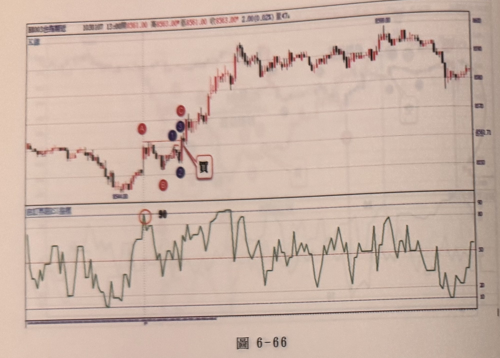
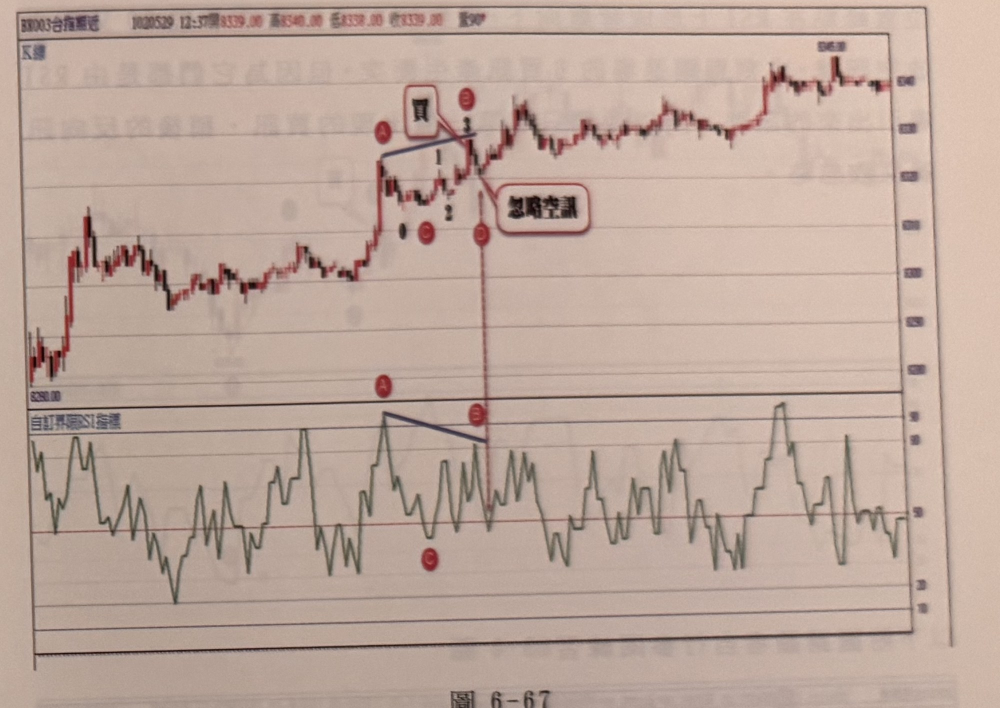

## p.244

**圖 6-66**

> 圖說（figure notes）：台指期近分時走勢圖，左上角報價列標示「BX003台指期近 …13:xx開8361.00 高8363.00 低8361.00 收8363.00 2.00(0.02%) 量47」（部分數字因相片模糊無法完全確讀 [?]）。上方為 K 線圖，下方為「自訂界限RSI指標」圖。K 線走勢自圖左低點（價位標示 8304.00）回升，於一段垂直虛線（代表開盤跳空分隔線）右側標示紅色圓圈字母 A，價格小幅整理後標示紅色圓圈字母 B（低點）、紫色圓圈數字「1」、「3」（B 上方兩個相鄰標記）、紅色圓圈字母 C（高點）、紫色圓圈數字「2」，並有白底紅框文字方塊「買」，以紅線指向「1」「3」附近向上突破處，代表買進訊號位置。突破後價格持續走高，一路盤堅上漲，最高點標示價位約 8598.00（圖右上方），其後在高檔區間小幅震盪，圖右側略為拉回收尾。下方 RSI 圖中，對應垂直虛線分隔處上方以紅色圓圈圈起一小段 RSI 波峰（約 80 附近），並標示黑色文字「90」，代表開盤跳空後 RSI 隨即進入接近嚴重超買的區域。RSI 其後在 20～90 區間反覆大幅震盪。

如果開盤跳空點數在 10 點以內，稱為無縫接軌昨天行情，RSI 若進入 90 超買區，後續若產生倒 N 型空訊步驟，通常會採取忽略，因為跳空幅度小，但如果發生向上 N 型鈍化買訊，反而可以採行操作多單，反之，向下跳空小於 10 點，RSI 在第一根即進入 10 以下之嚴重超賣區，則價格若出現向上 N 型買進步驟，採取忽略訊號，但若出現向下倒 N 型的鈍化空訊，則可以採行操作空單；當行情開盤跳高開出，代表消息或者氣勢傾向多方，因此若訊號呈現買進訊號，剛好與偏多符合，而若開盤跳低開出，代表市況感受壓力，則傾向對空方有利，因此若有空訊則可採行。圖 6-66 的例子，開盤跳高小於 10 點開出，RSI 卻進入 90 以上超買區，此時出現空訊，顯然當日高低幅度過小，說要反轉向下，有些牽強，但根據跳高開盤有利多頭立場，則當它出現向上 N 型鈍化買進步驟時，可以採行執行多單操作。

## p.245

**圖 6-67**

> 圖說（figure notes）：台指期近分時走勢圖，左上角報價列標示「BX003台指期近 1020529 12:37開8339.00 高8340.00 低8338.00 收8339.00 量90」。上方為 K 線圖，下方為「自訂界限RSI指標」圖。K 線走勢自圖左低點（價位標示 8290.00）急漲一段，漲勢中標示紅色圓圈字母 A（波段起漲附近），A 右上方有白底紅框文字方塊「買」，並有藍色斜線連接 A 與其右側的紅色圓圈字母 B（位於一個局部高點），A、B 一線之下另標示紫色圓圈數字「1」「2」（小幅整理波動）、紅色圓圈字母 C（低點）。B 附近價格出現小幅拉回，右側有白底紅框文字方塊「忽略空訊」，以紅線垂直向下指向 B 正下方一個紅色圓圈字母 D（位置明顯低於 B，在下方成交量／RSI 分界線附近）。此後價格持續走高，中途一次小段急拉後再度盤整，最高點標示價位約 8465.00（圖右上方），最終在圖右側高檔區間小幅震盪收尾。下方 RSI 圖中，對應 A 的位置為一波峰（紅色圓圈標示字母 A，數值超過 90），A 與其右側稍低的另一波峰（對應 B，紅色圓圈標示字母 B）之間以藍色斜直線連接，顯示 RSI 兩峰值遞減（背離向下型態），另有紅色圓圈字母 C 標示在 RSI 圖下方低點處（約 40 附近）。RSI 其後持續在 50～90 區間反覆震盪走高。

如果 RSI 的 N 型或倒 N 型訊號，與 RSI 背離訊號先前發生，產生訊號衝突，所謂衝突是指先出現買訊或空訊，稍後又出現反向的空訊或買訊時，是要立刻轉向依新訊號反手，還是選擇忽略新訊號呢？因為他們都是由 RSI 導引出現的交易訊號，因為只取第一個產生的訊號，代表利用 RSI 指標尋找訊號的任務已經完成，就不必再理會第二個反向訊號。

例如在圖 6-67 的情況中，當標示 A 位置的 RSI 觸及嚴重超買區 90 以上，立刻會預期它可能會產生倒 N 型的空訊，或出現拉回一波再向上 N 型鈍化買訊，或者進行背離走勢，這三種走勢任一種出現，就立刻進場操作，稍後即使再出現新訊號，皆選擇忽略，因此當 A 拉回形成谷點 0 或 C，再從此點向上出現 N 型過 A 峰點，形成超買區 N 型鈍化買點，立即進場操作多單，而代表買訊的 B 位置，與 A
