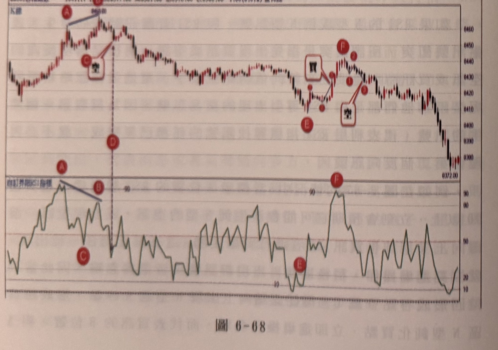
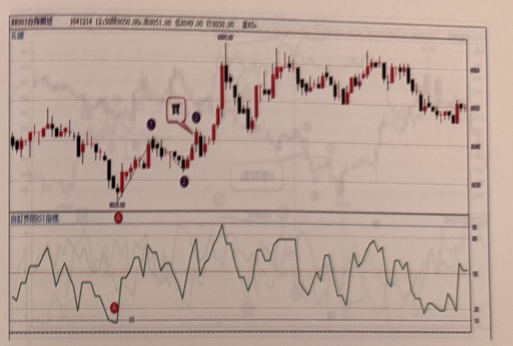
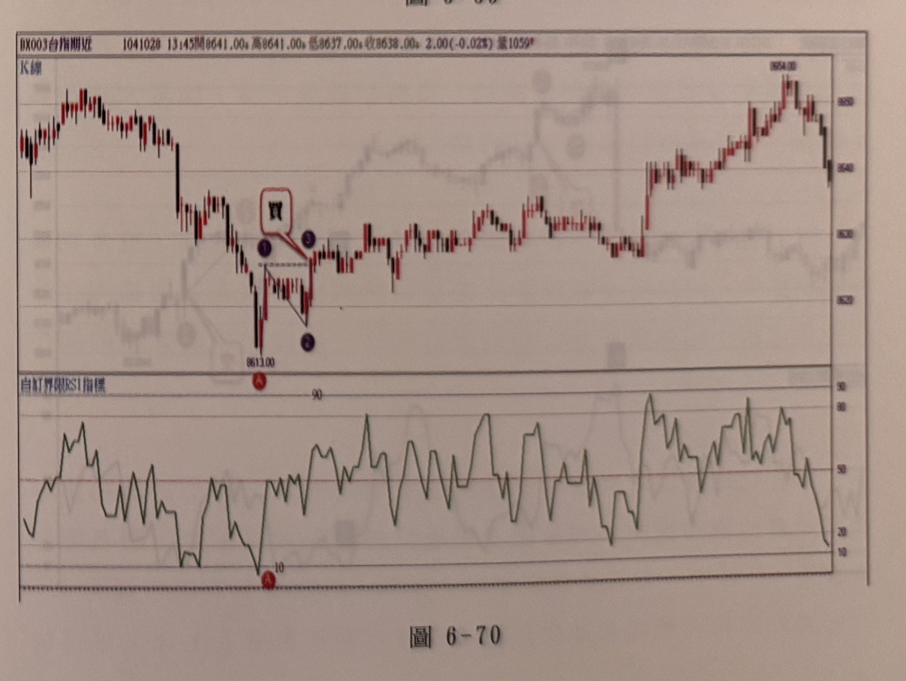

## p.246

位置峰點在 RSI 上形成背離向下，以致於在 D 位置 RSI 破 50 又產生放空訊號，立刻與剛進場的 B 買訊產生衝突，但因為它們都是由 RSI 導引出來的訊號，所以我們只取第一個出現的買訊，稍後的反向訊號採取忽略。

以下附圖請讀者自行參閱練習

**圖 6-68**

> 圖說（figure notes）：台指期近分時走勢圖，左上角報價列標示「BX003台指期近 1041111 1?:??開8377.00 高8381.00 低8376.00 收8380.00 1.00(0.01%) 量1822」（部分數字因相片模糊無法完全確讀 [?]）。上方為 K 線圖，下方為「自訂界限RSI指標」圖。K 線走勢自圖左段上漲，標示紅色圓圈字母 A，A、其右側最高點（價位標示 8468.00，標示紅色圓圈字母 B）之間以藍色斜直線連接，B 下方另標示紅色圓圈字母 C，並有白底紅框文字方塊「空」以紅線指向 C 附近，代表放空訊號位置。B 正下方有黑色虛線垂直向下延伸至下方紅色圓圈字母 D。價格自 B 反轉下跌，一路下探，中途小幅反彈整理，再下跌至一低點附近標示紅色圓圈字母 E，隨後反彈至一小峰位，有白底紅框文字方塊「買」以線條指向該處的反彈起漲點，其右側依序標示紅色圓圈（無字母）、紫色圓圈數字「1」「3」、紅色圓圈字母 F（波峰）；F 右下方另有白底紅框文字方塊「空」以紅線指向 F 之後價格回落處。此後價格持續下跌，最終跌至圖右下角價位 8372.00 附近收尾。下方 RSI 圖中，對應 A、B 的位置分別為兩個波峰（紅色圓圈標示字母 A、B），A 較高、B 較低，兩點間以藍色斜直線連接，顯示 K 線圖上 A、B 創新高但 RSI 未同步創新高的背離向下現象；對應 C 的位置為一低點（紅色圓圈標示字母 C，約 30 附近）；對應 E 的位置為另一低點（紅色圓圈標示字母 E，接近 10）；對應 F 的位置為一波峰（紅色圓圈標示字母 F，超過 90 的嚴重超買區）。

## p.247

**圖 6-69**

> 圖說（figure notes）：台指期近分時走勢圖，左上角報價列標示「BX003台指期近 1041214 12:50開8050.00 高8051.00 低8049.00 收8050.00 量65」。上方為 K 線圖，下方為「自訂界限RSI指標」圖。K 線走勢自圖左高檔下跌至最低點 8025.00（下方標示紅色圓圈字母 A），隨後價格反彈回升，以一條紅色斜直線連接 A 與其右上方的一根上漲 K 棒，途中標示紫色圓圈數字「1」（小高點）、紫色圓圈數字「2」（拉回低點），並有白底紅框文字方塊「買」與紫色圓圈數字「3」相鄰，以線條指向該處向上突破位置，代表買進訊號。突破後價格急漲一根長紅 K 至最高點 8095.00，其後在高檔區間持續紅黑 K 交替、反覆震盪走高再拉回，最終在圖右側中段價位收尾。下方 RSI 圖中，對應 A 的位置為一波谷（紅色圓圈標示字母 A，數值觸及 10 以下的嚴重超賣區）。RSI 其後反彈走高，在 50 上下區間反覆大幅震盪，多次衝高至 80～90 附近，圖右段一度回落至 20 以下後再度回升。

**圖 6-70**

> 圖說（figure notes）：台指期近分時走勢圖，左上角報價列標示「BX003台指期近 1041028 13:45開8641.00 高8641.00 低8637.00 收8638.00 2.00(-0.02%) 量1059」。上方為 K 線圖，下方為「自訂界限RSI指標」圖。K 線走勢自圖左高檔下跌，跌勢中一根長黑 K 跌至低點 8613.00（下方標示紅色圓圈字母 A），A 上方有白底紅框文字方塊「買」，以線條指向 A 附近止跌後的第一根反彈 K 棒。價格自 A 反彈整理，途中標示紫色圓圈數字「1」（小高點）、紫色圓圈數字「2」（拉回低點，位置低於「1」），兩點間以黑色斜直線連接，隨後標示紫色圓圈數字「3」（再度回升至與「1」相近高度）。此後價格持續走高，中途一次跳空急漲，最高點標示價位 8654.00（圖右上方），最終在圖右側高檔區間小幅拉回震盪收尾。下方 RSI 圖中，對應 A 的位置為一波谷（紅色圓圈標示字母 A，數值觸及 10 以下的嚴重超賣區）。RSI 其後反彈走高，在 20～90 區間反覆大幅震盪，圖右段多次衝高至 80～90 附近的嚴重超買區。
