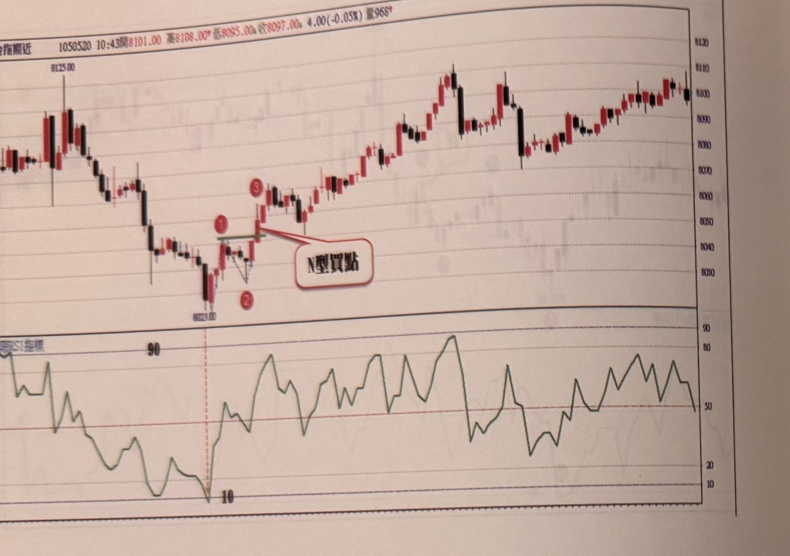
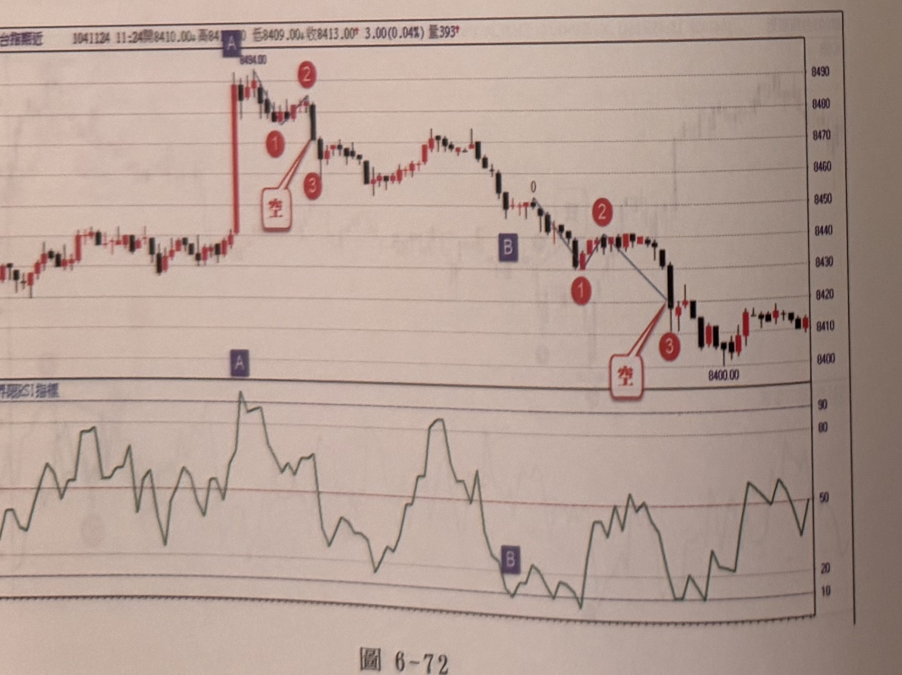
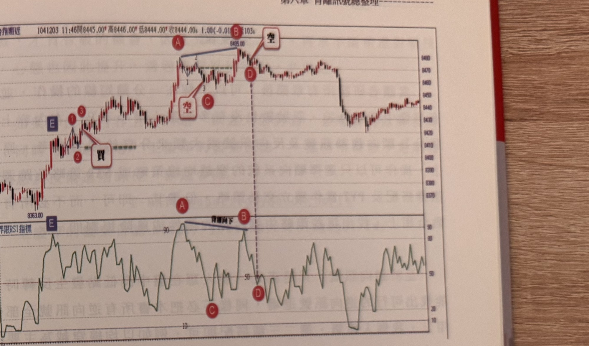

## p.248

[本頁承接前頁「以下附圖請讀者自行參閱練習」，僅有圖表，無正文段落]

**圖 6-71**

> 圖說（figure notes）：台指期近分時走勢圖，左上角報價列標示「…台指期近 1050520 10:43開8101.00 高8108.00 低8095.00 收8097.00 4.00(-0.05%) 量968」。上方為 K 線圖，下方為「…RSI指標」圖。K 線走勢自圖左高點（價位標示 8125.00）下跌至最低點 8023.00，隨後止跌反彈，途中標示紅色圓圈數字「1」（一個小高點，右側以墨綠色短橫線標示一水平參考位置）、紅色圓圈數字「2」（拉回低點），再上漲突破至紅色圓圈數字「3」，並有白底紅框文字方塊「N型買點」以紅線指向「1」附近向上突破處。突破後價格持續走高，中途數次紅黑 K 交替整理再上攻，最高點一度上探至 8110 附近，最終在圖右側高檔區間小幅震盪收尾。下方 RSI 圖中，左段自高點逐步下滑至接近 10 的嚴重超賣區（以紅色虛線垂直標示分隔點），隨後反彈走高，在 50～90 區間反覆大幅震盪，多次衝高至 80 以上。

**圖 6-72**

> 圖說（figure notes）：台指期近分時走勢圖，左上角報價列標示「…台指期近 1041124 11:24開8410.00 高8410.00 低8409.00 收8413.00 3.00(0.04%) 量393」。上方為 K 線圖，下方為「…RSI指標」圖。K 線走勢自圖左段急漲一根長紅 K 至最高點 8494.00（上方標示紫色圓圈字母 A），A 之後小幅整理標示紅色圓圈數字「1」、「2」（小高點）、「3」，並有白底紅框文字方塊「空」以紅線指向「1」附近向下跌破處，代表放空訊號位置。價格自此持續下跌，中途在標示「0」處止跌小幅反彈，再標示紅色圓圈數字「1」（反彈高點）、紫色圓圈字母 B、紅色圓圈數字「2」（另一波反彈高點，與「1」之間以藍色斜線連接），隨後續跌至紅色圓圈數字「3」，並有白底紅框文字方塊「空」以紅線指向「2」至「3」下跌處，代表第二次放空訊號位置，最低點標示價位 8400.00。此後價格在低檔小幅震盪回穩，最終在圖右側 8410 附近收尾。下方 RSI 圖中，對應 A 的位置為一波峰（紫色圓圈標示字母 A，數值超過 90 的嚴重超買區），RSI 隨後持續下滑，在對應「0」附近再度出現一個較低的波峰，最終回落至對應紫色圓圈字母 B 的位置（低點，接近 10），其後小幅反彈震盪於 20～50 區間，圖右段回升至 50 附近。

## p.249

[本頁圖 6-73 下方原有正文段落，但相片中僅能看到極淡且左右鏡像反轉的字跡（應為紙張背面第250頁內容透印所致），依規範略過不予轉錄；頁碼 249 清晰可辨]

**圖 6-73**

> 圖說（figure notes）：台指期近分時走勢圖，左上角報價列標示「…台指期近 1041203 11:46開8445.00 高8446.00 低8444.00 收8444.00 1.00(-0.01%) 量103」。上方為 K 線圖，下方為「…RSI指標」圖。K 線走勢自圖左低點（價位標示 8363.00）急漲，途中標示紫色圓圈字母 E（左側起漲點）、紅色圓圈數字「1」「3」（一個小高點）、紅色圓圈數字「2」（拉回低點），並有白底紅框文字方塊「買」以線條指向「2」附近向上突破處（突破位置另以墨綠色虛線水平標示），代表買進訊號位置。突破後價格持續上漲，至最高點 8495.00（上方標示紅色圓圈字母 B），B 左側另標示紅色圓圈字母 A，A、B 之間以藍色斜直線連接。B 附近另標示紅色圓圈數字「1」「3」（小整理）、紅色圓圈字母 C，並有白底紅框文字方塊「空」以紅線指向「1」附近向下跌破處，代表放空訊號位置。B 正下方另標示紅色圓圈字母 D，並有黑色虛線垂直向下延伸至下方 RSI 圖對應位置。價格自 B 反轉下跌一段後，於中段止跌小幅反彈整理，最終在圖右側回升至 8440～8450 區間震盪收尾。下方 RSI 圖中，對應 A、B 的位置分別為兩個波峰（紅色圓圈標示字母 A、B，均超過 90），A、B 之間以藍色斜直線連接並標示黑色文字「背離向下」（B 略低於 A）；對應 C 的位置為一低點（紅色圓圈標示字母 C，接近 20）；對應 D 的位置為 RSI 跌破 50 處（紅色圓圈標示字母 D）；另有紫色圓圈字母 E 標示於 RSI 圖左側邊緣。RSI 其後在 20～90 區間反覆大幅震盪，圖右段回升至 50～80 附近。
