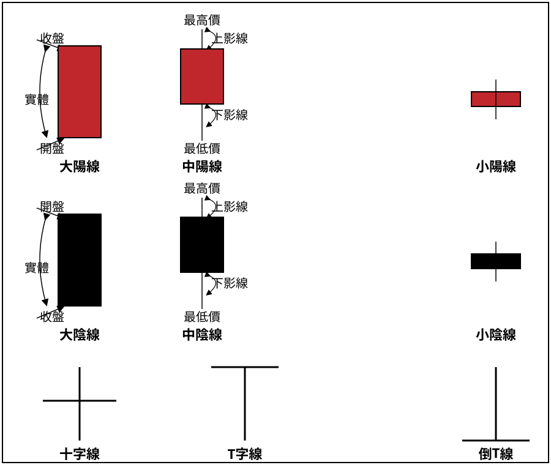
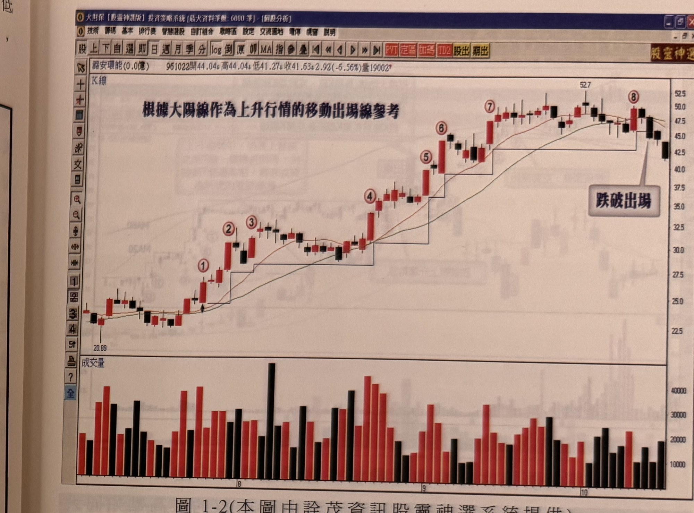

## p.2

陽線的低點來當作移動式的出場線，如圖 1-2 所示。當行情處於低檔盤旋或中段整理格局，呈現交投冷淡，K 線都屬短小 K 線居多，檔盤旋或中段整理格局，通常表示行情甦醒或重新攻擊。如果此時出現大陽線，通常表示行情甦醒或重新攻擊。

**圖 1-1**

> 圖說（figure notes）: 一張示意圖，白底黑框，分三列展示 K 線的組成與型態。第一列（紅色陽線）：左邊「大陽線」為紅色長方形實體，左側以「實體」加雙箭頭弧線標示實體範圍，右上以箭頭標示「收盤」指向長方形上緣，右下以箭頭標示「開盤」指向長方形下緣；中間「中陽線」為較短的紅色長方形，上方細線標示「上影線」指向最高價，下方細線標示「下影線」指向最低價，頂端標「最高價」、底端標「最低價」；右邊「小陽線」為扁平紅色長方形，上下各帶一小段影線。第二列（黑色陰線）：左邊「大陰線」為黑色長方形實體，左上箭頭標「開盤」指上緣，左下箭頭標「收盤」指下緣，左側「實體」雙箭頭弧線；中間「中陰線」為較短黑色長方形，同樣標示「上影線」「下影線」「最高價」「最低價」；右邊「小陰線」為扁平黑色長方形帶上下短影線。第三列（轉變線）：左邊「十字線」為十字形（垂直線與水平線等長交叉，無實體）；中間「T字線」為上方一橫線、下方一長豎線，呈倒T形但標為「T字線」（帶下影線無上影線）；右邊「倒T線」為上方一長豎線、下方一橫線（帶上影線無下影線）。此圖對應本文說明 K 線的實體、影線、開盤收盤位置定義，以及十字線、T字線、倒T線三種轉變線的形狀。

## p.3

陰線代表摜壓，任何形態的跌破都會有一根跌破 K 線，如果跌破 K 線是屬於大陰線，下殺的可靠度相對提高，大陰線的最高點代表賣方防禦的制高點，可當作放空停損防守線；在下跌行情過程，可以根據大陰線的高點來當作放空操作的移動式出場線，如圖 1-3 所示。當行情處於高檔盤旋或中段整理格局，呈現交投冷淡，K 線都屬短小 K 線居多，如果此時出現大陰線，通常表示行情進一步下跌走勢開始。

**圖 1-2**（本圖由詮茂資訊股靈神選系統提供）

> 圖說（figure notes）: 一張股票日 K 線走勢圖（軟體介面：大財神【股盡神選版】投資策略系統，頁首標示「豁安環能(0.0億) 961022開44.04↓高44.04↓低41.27↓收41.63↓2.92(-6.56%)量19002」），圖上方標題文字「根據大陽線作為上升行情的移動出場線參考」。走勢從左下角 20.89 起漲，以階梯狀連續上攻，沿途以紅色圓圈數字①至⑧標示各次「根據前一根大陽線最低點」設定的移動出場水準（以黑色階梯狀折線表示），股價持續墊高突破前波高點；行情推升至⑧位置（最高 52.7 附近）後轉弱，出現黑 K 線收盤跌破前一根大陽線最低點（階梯線），以白底黑框圓角矩形標註「跌破出場」並以線指向該處。下方為成交量柱狀圖，隨行情上攻同步放大。此圖對應本文：以大陽線的最低點作為多頭移動式出場線，出場點在標示 8 之後、K 線收盤跌破階梯支撐處。
