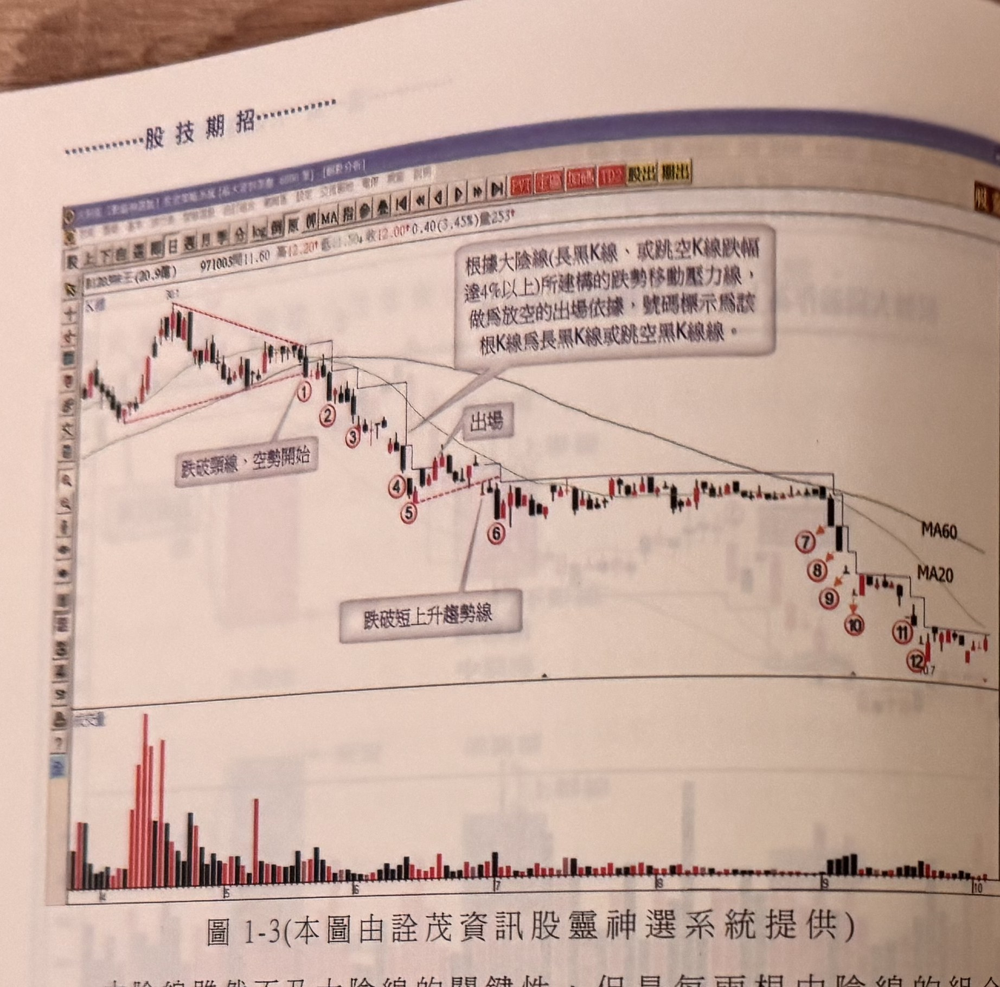

## p.4

同樣是透過量縮方式，達到籌碼穩定的效果，但量的退潮卻是隱憂，因為這是頭部區域形成的重要特徵，在標示 4 位置，長紅 K 線突然呈現爆量於平常水準，隔天開高下殺，收盤侵入長紅 K 線實體中點以下，另一次的覆蓋線反轉組合，行情三峰成形，上檔反壓不言而喻，行情自此反轉走跌，顯見高檔的反轉 K 線組合，不一定能夠一箭穿心地使多頭崩解，但警訊的暗示，操作者應提高警覺。任一反轉組合的最高點，若被後續行情加以突破，這裡突破須是 K 線收盤突破，則可以化解頭部的疑慮。但突破 K 線不宜再出現突破逆轉的現象。

**圖 1-3**（本圖由詮茂資訊股靈神選系統提供）

> 圖說（figure notes）: 一張台股個股日 K 線走勢圖（頁首標示「B203瑞士(30.9億) 971003開11.60↑高12.20↑低11.50↓收12.00↑0.40(3.45%)量253」）。走勢左側先上攻至高點，以紅色虛線標出上緣頸線（下斜）與下緣水平線構成的三角收斂區，右上以灰底文字框註記「根據大陰線(長黑K線、或跳空K線跌幅達4%以上)所建構的跌勢移動壓力線，做為放空的出場依據，號碼標示為該根K線為長黑K線或跳空黑K線。」，並以線指向標示①附近。價格自標示①（頸線跌破點，灰底文字框「跌破頸線、空勢開始」）向下經②③，續跌至標示④⑤（另一組紅色虛線壓力小三角，文字框「出場」指向該處），再向下至⑥（文字框「跌破短上升趨勢線」指向此段），其後行情進入長時間低檔橫向盤整，均線 MA60、MA20 在圖右側標示，隨後行情再度轉弱，以紅色圓圈數字⑦⑧⑨⑩⑪⑫依序標示逐波下殺過程，K 線持續收在 MA20、MA60 之下。下方為成交量柱狀圖，於左側高點附近爆量。此圖對應本文：以連續的大陰線（長黑K線或跳空黑K線）高點所連成的移動壓力線作為放空出場依據，行情自標示①頸線跌破後展開一路下殺至⑫。

## p.5

進一步下跌；當上升的漲勢爆量後，出現轉變線的最低點被跌破將形成一個賣出訊號（如圖 1-5）。

**圖 1-4**（本圖由詮茂資訊股靈神選系統提供）

> 圖說（figure notes）: 一張個股日 K 線走勢圖（頁首標示「B1702明泰(29.4億) 960824開10.10↑高10.85↑低10.5↓收10.65↓量1401」），左上角標示「K線、倒T反轉實點」。灰底文字框註記「上升趨勢中，遇長上影線之倒T線，價格折回後，突破倒T線最高點，將形成買進訊號的重要參考。」以線指向左下方一根帶長上影線的紅 K 線（以「倒T線」文字框＋直角線標示其位置，下方另有水平虛線標示其最低點）。其後行情持續上攻，中段出現一根長黑帶長上下影線的 K 線（標「73.9」高點），隨後在相對高檔區呈現數根紅黑夾雜、上下影線皆長的 K 線（其中一根以黃底標示），行情隨後反轉向下持續走低。下方為成交量柱狀圖，於倒T線出現後不久爆出全圖最大量（約12000）。此圖對應本文：倒T線在上升趨勢中出現，其最高點被後續 K 線收盤突破時，形成買進訊號的重要參考。

**圖 1-5**（本圖由詮茂資訊股靈神選系統提供）

> 圖說（figure notes）: 一張個股日 K 線走勢圖（頁首標示「B8163達方(30.0億) 971003開34.50↑高36.40↑低33.00↑收36.40↑1.40(4.00%)量921」），左上角標示「T字線反轉實點」。行情自左側低檔上攻，中途出現帶長下影線的 T 字線（灰底文字框「爆大量」以線指向此處，並以垂直雙箭頭直線連接該 T 字線與其下方成交量圖之最大量柱，標示成交量於此爆出全圖最大量），股價續攻至最高點 66.2，隨後在高檔呈現數根紅黑夾雜 K 線（其中一根黃底標示），另一灰底文字框註記「T字線的最低點被跌破，表示多方防守界線的瓦解，空方主勢往跌勢發展。」以線指向此高檔區。此後行情反轉一路走跌，中途在「31.3」附近小幅反彈後再破底。下方成交量圖顯示爆大量後量能逐漸萎縮。此圖對應本文：當上升的漲勢爆量後，出現轉變線（T字線）的最低點被跌破，將形成一個賣出訊號。
