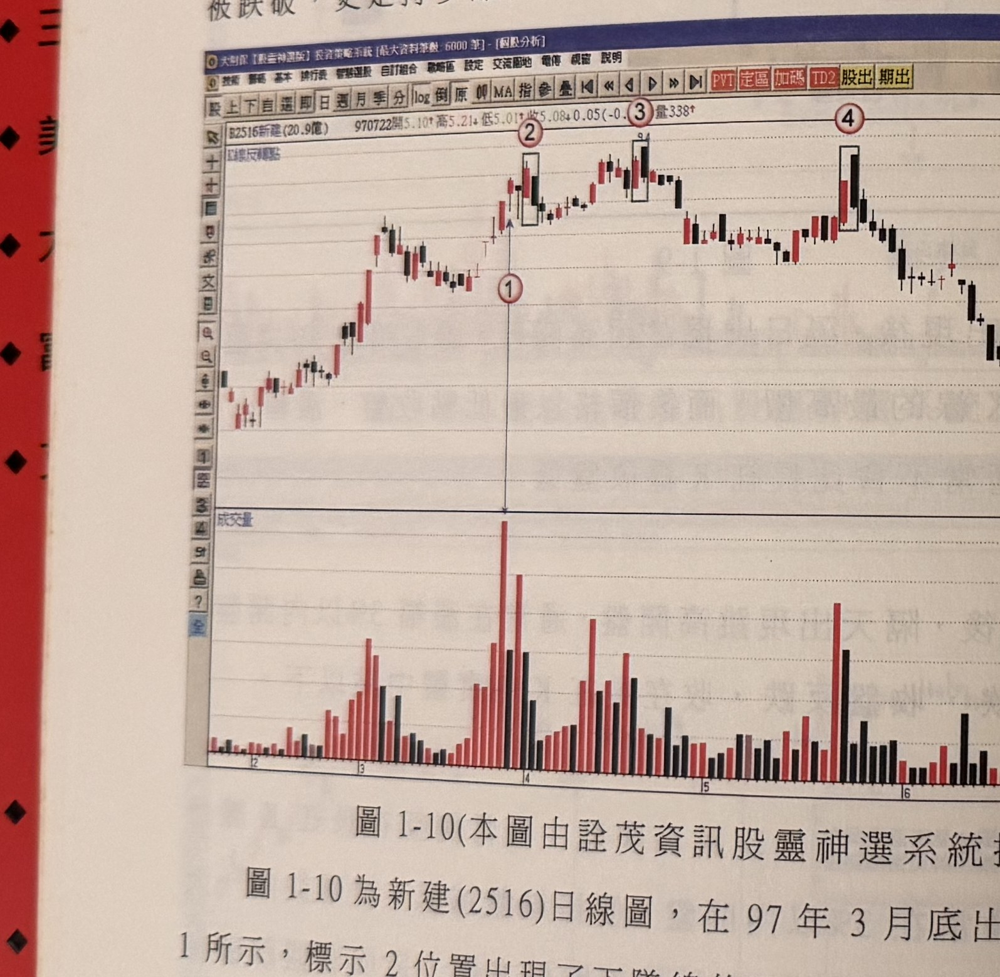
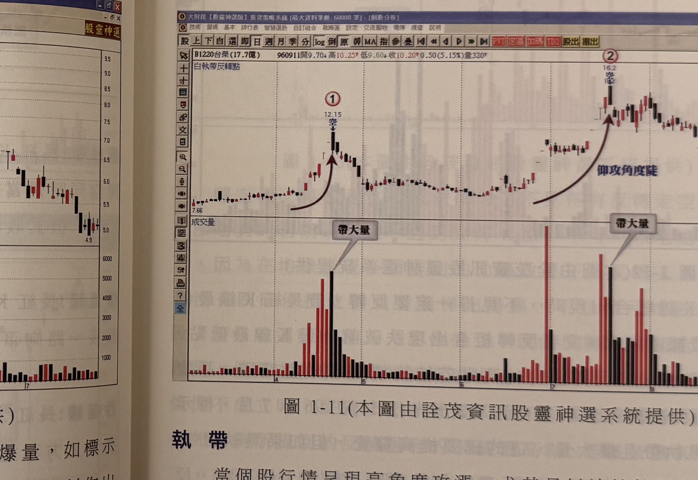

## p.10

氛，頓時消散轉為戒慎恐懼，但買盤的消散，加上短線籌碼連開高出脫的機會都喪失，自然在價格跌破長紅 K 線實體中點後，停損紛出，殺破長紅 K 線最低點作收。

反轉 K 線在高檔大部份是呈現爆量狀，有時是長紅 K 線先爆量，表現籌碼交換激烈，穩定度低，隔天再出現長黑 K 線，不管是否跳空，只要震幅相當大，更能表示短線籌碼慌亂的事實；有時長黑 K 線出最大量，更顯價量背離的意涵，反轉的機會大幅增加，如果長紅 K 線的真實低點（取其最低點與前一天 K 線收盤孰低）進一步被跌破，更是持多部位出場的訊號。

**圖 1-10**（本圖由詮茂資訊股靈神選系統提供）

> 圖說（figure notes）: 一張個股日 K 線走勢圖（頁首標示「B2516新建(20.9億) 970722開5.10↑高5.21↓低5.01↑收5.08↓0.05(-0.98%)量338」），左上角標示「反轉點」。行情自左下方逐波上攻，於標示①（垂直箭頭直線指向成交量圖最大量柱）之後出現標示②（黑框圈出一組反轉 K 線組合），隨後行情持續墊高至標示③（另一黑框圈出的反轉組合），再攻高後於標示④（第三個黑框圈出的反轉組合，含一根長紅K線與長黑K線）處見高後反轉，行情持續走跌至圖右側低檔。此圖對應本文：新建(2516)日線圖，97年3月底出現爆量（標示1），標示2位置出現下墜線反轉組合但未立即大幅回檔，成交量急速萎縮後，四月中旬（標示3）再出現覆蓋線反轉組合，成交量未較標示1進一步擴增，同樣未造成大幅回檔；直到標示4位置的反轉才確認回檔加深。

圖 1-10 為新建（2516）日線圖，在 97 年 3 月底出現爆量，如標示 1 所示，標示 2 位置出現了下墜線的反轉組合，但並沒有立刻作出大幅回檔的現象，透過量急速萎縮方式，使得爆量的籌碼沒有進一步下殺，四月中旬再出現覆蓋線的反轉組合，如標示 3 所示，成交量並沒有較之標示 1 位置進一步擴增，同樣沒有造成大幅回檔，也

## p.11

同樣是透過量縮方式，達到籌碼穩定的效果，但量的退潮卻是隱憂，因為這是頭部區域形成的重要特徵，在標示 4 位置，長紅 K 線突然呈現爆量於平常水準，隔天開高下殺，收盤侵入長紅 K 線實體中點以下，另一次的覆蓋線反轉組合，行情三峰成形，上檔反壓不言而喻，行情自此反轉走跌，顯見高檔的反轉 K 線組合，不一定能夠一箭穿心地使多頭崩解，但警訊的暗示，操作者應提高警覺。任一反轉組合的最高點，若被後續行情加以突破，這裡突破須是 K 線收盤突破，則可以化解頭部的疑慮。但突破 K 線不宜再出現突破逆轉的現象。

**圖 1-11**（本圖由詮茂資訊股靈神選系統提供）

> 圖說（figure notes）: 一張個股日 K 線走勢圖（頁首標示「B1220台榮(17.7億) 960911開9.70↓高10.25↑低9.60↓收10.20↑0.50(5.15%)量320」），左上角標示「白執帶反轉點」。行情自左下方「7.66」起，以一道弧形箭頭指向標示①（價位「12.15」，標「空」字），此處對應成交量圖上灰底文字框「帶大量」標示的最大量柱。隨後行情回檔橫向整理一段時間，再以另一道弧形箭頭（旁註「仰攻角度陡」）指向標示②（價位「16.2」，同標「空」字），此處同樣對應成交量圖上另一個灰底文字框「帶大量」標示的大量柱。此圖對應本文：台榮在 96 年 4 月出現爆衝走勢，當標示 1 出現開超高盤，但無法延續前三天的鎖住漲停的慣性，一旦殺破平盤，兼之爆大量，籌碼逃竄造成反轉效應。

### 執帶

當個股行情呈現高角度攻漲，尤其是以連續性漲停方式上漲，要隨時注意價格的慣性中斷的現象，如圖 1-11 台榮在 96 年 4 月出現爆衝走勢，當標示 1 出現開超高盤，但無法延續前三天的鎖住漲停的慣性，一旦殺破平盤，兼之爆大量，籌碼逃竄造成反轉效應，
