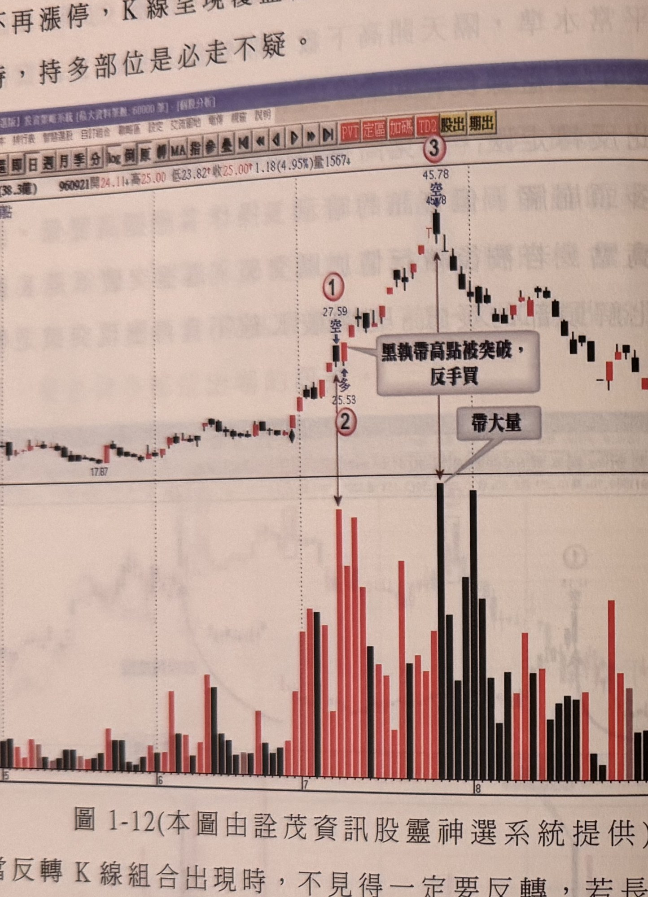
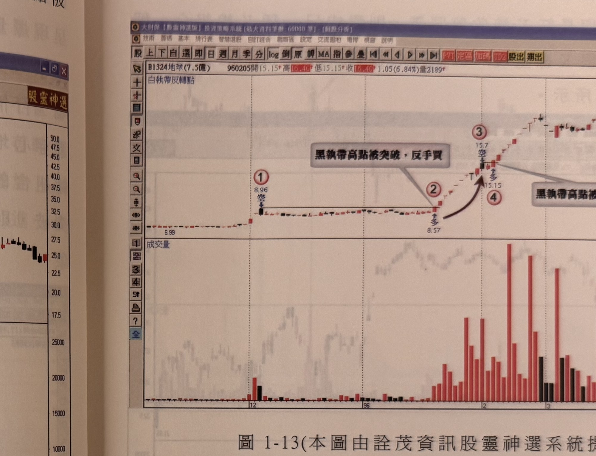

## p.12

再如 7 月中旬同樣出現連續漲停情況，當標示 2 位置，開高走低，收盤不再漲停，K 線呈現覆蓋線反轉組合，當長紅 K 線的最低點被收盤攻破時，持多部位是必走不疑。

**圖 1-12**（本圖由詮茂資訊股靈神選系統提供）

> 圖說（figure notes）: 一張個股日 K 線走勢圖（頁首標示「B1711永光(38.3億) 960921開24.11↓高25.00↓低23.82↑收25.00↑1.18(4.95%)量1567」），左上角標示「白執帶反轉點」。行情自左側「17.87」附近緩步上攻，至標示①（價位27.59，標「空」）出現一根黑K線後隔日反彈，標示②（價位25.53，標「多」）；灰底文字框「黑執帶高點被突破，反手買」以線指向標示①②之間的區域，另有灰底文字框「帶大量」以線指向成交量圖上的最大量柱（對應標示③附近）。行情持續上攻至標示③（價位45.78，標「空」），隨後反轉一路走跌至圖右側低檔。此圖對應本文：永光(1711)在96年7月，標示1位置出現黑執帶且爆大量，但黑執帶K線最高點被標示2的K線收盤突破，形成反軋買點，操作者可以標示2之K線最低點做為停損位置；直到標示3位置出現開高收低且爆超大量的K線，行情才正式反轉朝跌勢發展。

當反轉 K 線組合出現時，不見得一定要反轉，若長紅 K 線最低點被跌破，證據才明顯，或者反轉組合出現跌破前一天 K 線最低點，才能做確認動作，但反轉組合的高點若被後續 K 線收盤突破，那麼將創造一個反軋買點出現，如圖 1-12 永光(1711)在 96 年 7 月，標示 1 位置出現黑執帶且爆大量，這的確要提高警覺，但如果黑執帶 K 線最高點被突破，如標示 2 位置 K 線收盤突破了標示 1 最高點，反而值得追進，稱為反軋買點，操作者可以標示 2 之 K 線最低點做為停損位置；直到標示 3 位置出現開高收低且爆超大量時，另一個反轉 K 線出現，行情才正式反轉朝跌勢發展。圖 1-13 亦是黑執帶的例

## p.13

子及其反軋買點的運用，請參閱。

**圖 1-13**（本圖由詮茂資訊股靈神選系統提供）

> 圖說（figure notes）: 一張個股日 K 線走勢圖（頁首標示「B1324地球(7.5億) 960205開15.15↑高16.40↑低15.15↑收16.40↑1.05(6.84%)量2189」），左上角標示「白執帶反轉點」。行情自左側「6.99」附近平緩盤整，至標示①（價位8.96，標「空」）出現一根黑K線（黑執帶），隨後行情持續橫向盤整至標示②（價位8.57，標「多」）。灰底文字框「黑執帶高點被突破，反手買」以線指向標示①②之間、及右側標示③④附近（圖右側另有一處重複出現的「黑執帶高點被…」文字框，因反軋型態再次發生）。行情自標示②反彈上攻至標示③（價位15.7，標「空」）、標示④（價位15.15，標「多」），其後持續上攻走高。下方成交量圖顯示行情推升過程中放量。此圖對應本文：地球(1324)亦是黑執帶反軋買點的操作範例。

轉空的反轉 K 線在其他位階時，不見得有反轉走空的意義，在上漲趨勢的初期或中途，遇到反轉 K 線，不可一味地認為行情觸頂了，因為在均線呈現多頭排列的助漲效果下，反轉 K 線組合出現，若沒有跌破停損位置或者階梯出場線，不必杯弓蛇影急於出脫持股；價格的運動絕非人人想像得到，就像反轉 K 線組合雖代表反向訊號，但是在多頭趨勢的初期或中途出現反轉 K 線時，只要反轉的條件不成立時，反過來想，就變成另一個具有參考性的買進訊號，例如前例所提到的反轉組合的 K 線最高點，若被後續 K 線收盤突破了，就形成反軋買點訊號，原來潛在的頭部徵兆，在過其高點後，可能又是另一段漲勢的發動起點。因此，根據 K 線理論所觀察的市場現象，條件確認時應做出脫持股或採放空操作，若行情發展出現逆轉時，也應及時反應做追買動作，不能執著教條而不知應變，這
