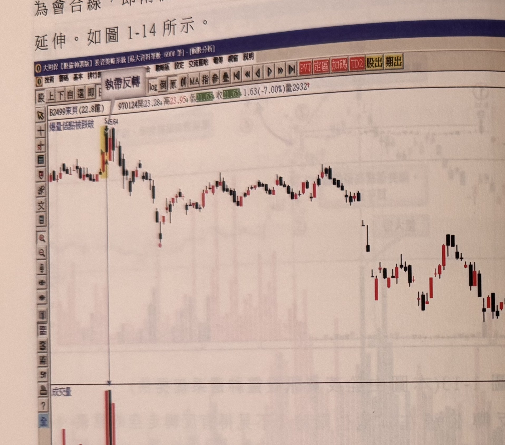
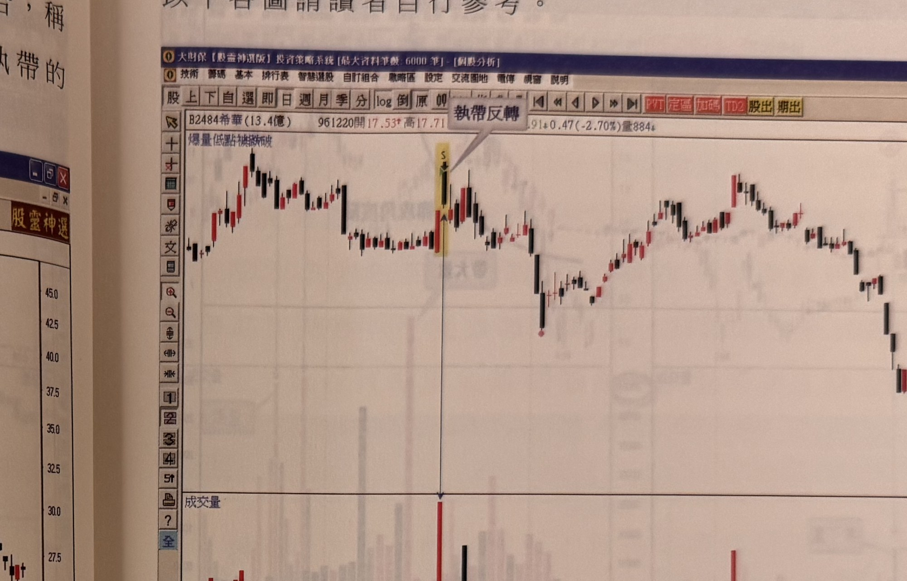
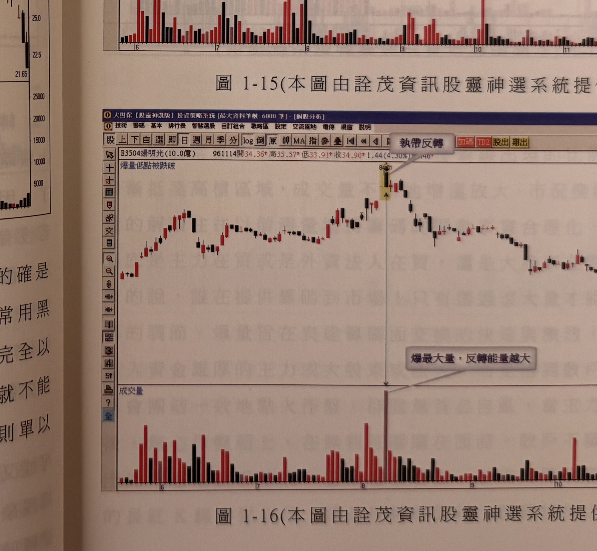

## p.14

才是操作上的彈性運用。

執帶若收盤與長紅 K 線收盤同價，則變成另一種 K 線組合，稱為會合線，即兩根 K 線呈現一紅一黑，收盤卻在同價，這是執帶的延伸。如圖 1-14 所示。

**圖 1-14**（本圖由詮茂資訊股靈神選系統提供）

> 圖說（figure notes）: 一張個股日 K 線走勢圖（頁首標示「B2499東貝(22.8億) 970124開23.28↓高23.95↓低21.65↓收21.65↓1.63(-7.00%)量2932」），左上角標示「執帶反轉」、「爆量低點被跌破」。行情自左側平緩區間，在一根黃底標示、標「S」「25.64」的黑K線處（灰底文字框「執帶反轉」以線指向此處）出現反轉，隨後行情持續下跌，中途一度反彈整理，最終續跌至圖右側低檔。下方成交量圖於執帶反轉當日出現明顯量柱。此圖對應本文：執帶K線收盤與前一根長紅K線收盤同價時，形成「會合線」，是執帶的延伸型態。

總之，黑執帶出現在連續性上漲的行情，配合爆大量，的確是個致命的反轉組合，通常在一些超飆的個股狂飆的尾聲，最常用黑執帶作為謝幕演出，不可不慎。黑執帶本身在不同位階不能完全以反轉視之，沒有大量來配合，無法篤定市場籌碼失控，那麼就不能以反轉視之，量的催化才能使反轉組合產生反轉的效應，否則單以 K 線論斷，有失週延。

## p.15

以下各圖請讀者自行參考。

**圖 1-15**（本圖由詮茂資訊股靈神選系統提供）

> 圖說（figure notes）: 一張個股日 K 線走勢圖（頁首標示「B2484希華(13.4億) 961220開17.53↑高17.71...↓0.47(-2.70%)量884」），左上角標示「爆量低點被跌破」。行情自左側低檔上攻，於一根黃底標示的黑K線（標「S」）處出現反轉，灰底文字框「執帶反轉」以線指向此處，並以垂直直線連接至下方成交量圖的對應量柱。反轉後行情下跌一段，中途橫向整理反彈，其後再度走弱，持續下探至圖右側低檔約17一帶。此圖僅列出作為執帶反轉的另一範例，供讀者自行參考。

**圖 1-16**（本圖由詮茂資訊股靈神選系統提供）

> 圖說（figure notes）: 一張個股日 K 線走勢圖（頁首標示「B3504揚明光(10.0億) 961114開34.36↑高35.57↑低33.91↑收34.90↑1.44(4.30%)量...」），左上角標示「爆量低點被跌破」。行情自左側低檔盤堅上攻，於一根黃底標示的黑K線（標「84.01」附近）處出現反轉，灰底文字框「執帶反轉」以線指向此處，並以垂直直線連接至下方成交量圖的最大量柱，另一灰底文字框「爆最大量，反轉能量越大」以線指向該量柱。反轉後行情一路走跌，中途小幅反彈後續跌至圖右側低檔。此圖同樣作為執帶反轉搭配爆大量、反轉能量更強的範例。
