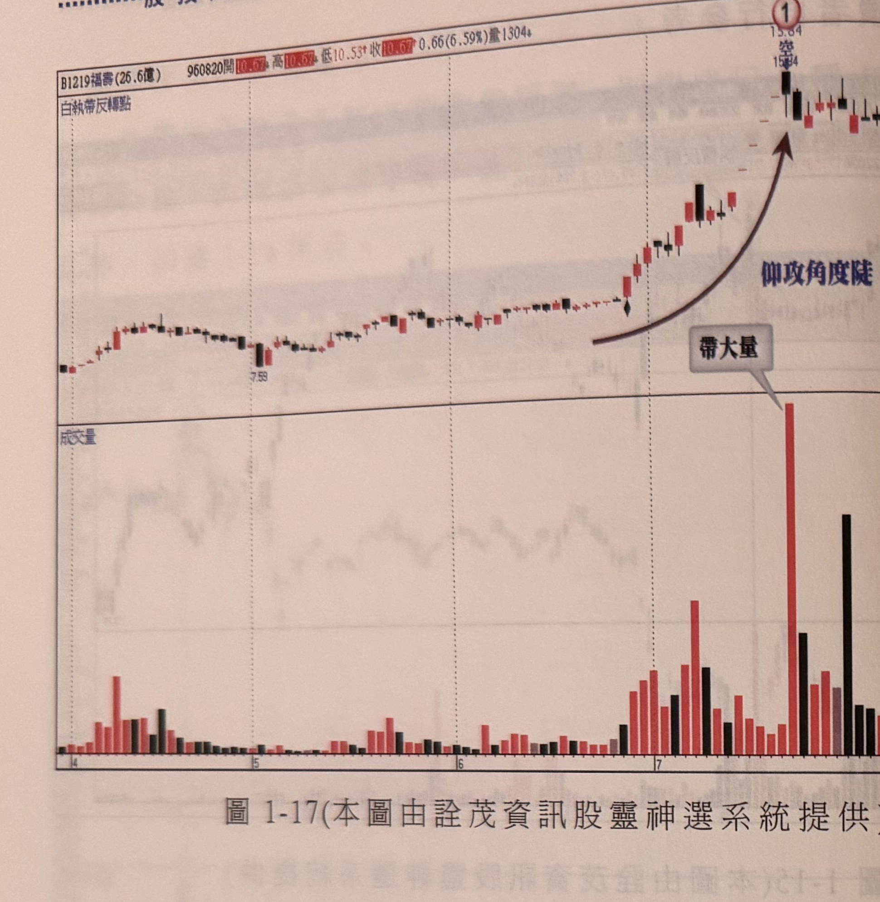

## p.16

**圖 1-17**（本圖由詮茂資訊股靈神選系統提供）

> 圖說（figure notes）: 一張個股日 K 線走勢圖（頁首標示「B1219福壽(26.6億) 960820開10.67↑高10.67↓低10.53↑收10.67↑0.66(6.59%)量1304」），左上角標示「白執帶反轉點」。行情自左側低檔「7.59」附近緩步盤堅，中後段以弧形箭頭（旁註「仰攻角度陡」）指向陡峭上攻至標示①（價位15.64，標「空」）處的長黑K線，灰底文字框「帶大量」以線指向該處對應成交量圖上的最大量柱。行情觸頂後小幅拉回整理。此圖為執帶反轉搭配陡峭仰攻角度、爆大量的另一範例。

## p.17

**圖 1-18**（本圖由詮茂資訊股靈神選系統提供）

> 圖說（figure notes）: 左右並排兩張同一檔個股（B3701大聚控）不同時期的日 K 線走勢圖，左上角均標示「覆蓋線反轉」。左圖（頁首標示「930521收5.77量5245」）：行情自左下方上攻，於標示①（一根黃底標示K線，價位8.52）處出現覆蓋線反轉，藍色虛線水平標示「覆蓋線最高點」，其下方以兩條垂直箭頭直線指向成交量圖上的兩根量柱，灰底文字框「爆量」標示。行情觸頂後反轉走跌至「4.94」附近。右圖（頁首標示「940725收4.15量2...」）：行情自左側低檔「2.84」附近上攻，於標示②（價位約4.83）處同樣出現覆蓋線反轉組合，右側另有紅圈標示的「45000」刻度線及灰底文字框「量不常」，並以紅圈標示對應右下方一根偏高的量柱，指出此處成交量並不如左圖爆量明顯。此圖對應本文覆蓋線反轉的說明，並比較同一檔股票不同時期覆蓋線反轉是否伴隨爆量的差異。

### 覆蓋線

高檔常見的 K 線反轉組合中，覆蓋線出現的比例最高，當行情漸漸抵達高檔區域，成交量不斷地增溫放大，市況樂觀而交投熱絡，量的解讀往往以價漲量增將籌碼的鬆動事實合理化，成交量的爆增到底是主力在買或是外資法人在買，還是大股東在買呢？應該反過來的說，誰在提供籌碼到市場！只有透過滾大量才能掩護大部位籌碼的調節，爆量旨在表達籌碼面交換的快速與激烈，一旦籌碼不是落入資金雄厚的主力或大股東或法人，而是落到散戶手中，散戶並不會團結一致地點火作盤，群龍無首必自亂，當主力透過爆量調節後，無心作盤朝上，在無利可圖擺在面前，散戶不驅自散，籌碼砍出的效應如滾雪球般，價格越殺越低，形成長黑收盤，跌破前一天的長紅 K 線中點以下，這是反轉的警訊；覆蓋線加上爆量，反轉的
