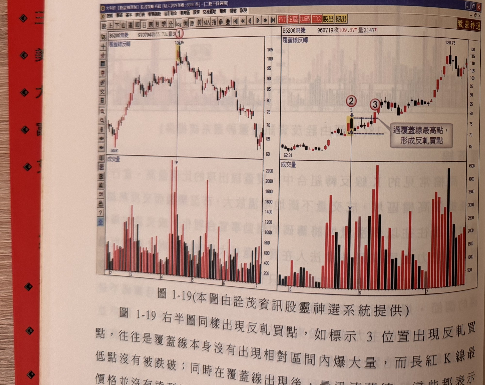

## p.18

機率大幅增高，如圖 1-18 左半圖所示，行情在連續推升後，爆量長紅後，接著開高走低，收盤收在長紅 K 線中點以下，覆蓋線一出，其最高點若未能被後續 K 線收盤克服，則轉空之勢難擋，右半圖覆蓋線出現，但成交量並沒有大幅爆增，而且回檔只呈小幅拉回，量也隨之萎縮，當覆蓋線的最高點被突破 K 線收復後，成為反軋買點，在本例中過高不久再遇爆量黑 K 線，造成行情無法推升而拉回量縮，當出現反軋買點進場買進後，後續 K 線收盤不可再跌破反軋買點之訊號 K 線最低點，可以此為停損位置。

**圖 1-19**（本圖由詮茂資訊股靈神選系統提供）

> 圖說（figure notes）: 左右並排兩張不同個股的日 K 線走勢圖，左上角均標示「覆蓋線反轉」。左圖（頁首標示「B6206飛捷 970704收65.72量3...」）：行情自左下角「60.81」附近逐波上攻，於標示①（一根黃底標示K線，價位約105附近）處出現覆蓋線反轉，隨後行情反轉一路走跌至圖右側低檔約65。下方成交量圖於標示①對應處出現明顯放量（以垂直箭頭直線指向）。右圖（頁首標示「B6206飛捷 960719收109.37量2147」）：行情自左側「62.31」附近盤整後上攻，於標示②（一根黃底標示K線）出現覆蓋線反轉，藍色虛線水平標示覆蓋線最高點；隨後標示③位置K線收盤突破該虛線水平（覆蓋線最高點），灰底文字框「過覆蓋線最高點，形成反軋買點」以線指向此處。行情其後持續攻高至「120.75」。下方成交量圖對應標示②③處放量情況。此圖對應本文：左半圖覆蓋線出現後轉空之勢確立；右半圖覆蓋線最高點被標示3的K線收盤突破，形成反軋買點。

圖 1-19 右半圖同樣出現反軋買點，如標示 3 位置出現反軋買點，往往是覆蓋線本身沒有出現相對區間內爆大量，而長紅 K 線最價格並沒有達到反轉的

## p.19

會爆量，也沒有反轉的威脅，在這位階反而要觀察 K 線收盤何時突破覆蓋線最高點，所產生的反向買進訊號。

大量 K 線通常出現在型態突破或價格衝高階段，行情推升會伴隨成交量漸次放大，這是一般所謂價漲量增的良性循環；但是，當遇到成交量突然爆增就得特別注意，成交量爆增的狀況，有一種是某段區間內，成交量一直呈現低量水平，通常是在橫向盤旋，突然爆量達平常水準的六、七倍以上，此時要特別注意個股過去價格歷史慣性，是否有爆量 K 線的隔天就出現開高走低，或者爆量當日的當沖率偏高達 30%以上，這種狀況呈現一日行情居多，低量水平的橫向盤整，若發生在長期下跌後的底部區域時，配合短中長均線糾結相互貼近，帶量向上突破，往往是難得買點，尤其在大盤未突破新高，個股以這種模式突破創新高，更具有領頭羊的強勢股表徵；如果爆量 K 線是收長紅 K 線，而且把某段區間最高價突破了，那麼爆量可能是籌碼交換激烈所造成的，後續只要長紅 K 線未被跌破，那麼向上的機會大增。
