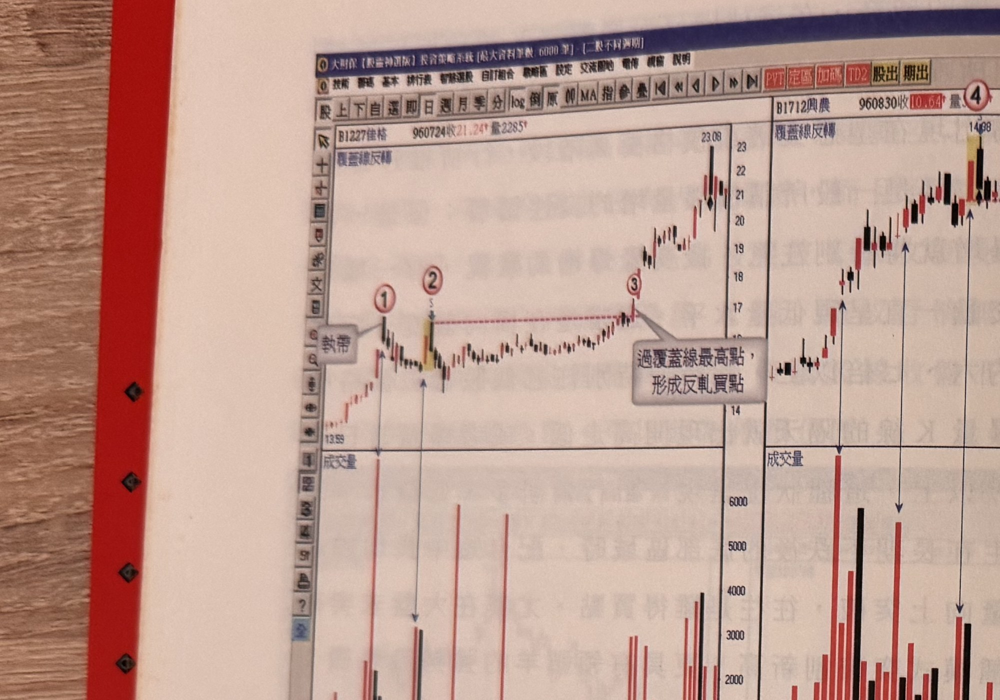
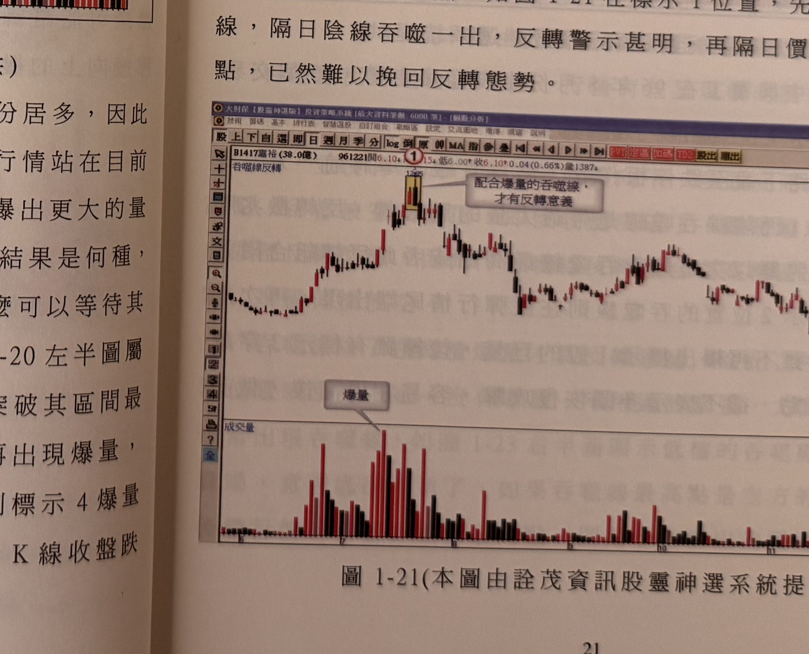

## p.20

**圖 1-20**（本圖由詮茂資訊股靈神選系統提供）

> 圖說（figure notes）: 左右並排兩張不同個股的日 K 線走勢圖，左圖（頁首標示「B1227佳格 960724收21.24量2285」，左上角標示「覆蓋線反轉」）：標示①處出現一根K線（灰底文字框「執帶」以線指向），標示②（黃底標示K線）為覆蓋線反轉低點，其後行情橫向整理，紅色虛線水平連接標示②至標示③（形成一段區間高點連線），灰底文字框「過覆蓋線最高點，形成反軋買點」以線指向標示③處，其後行情向上攻高至「23.08」。右圖（頁首標示「B1712興農 960830收10.64量」，左上角同樣標示「覆蓋線反轉」）：行情持續上攻，標示④處為一根黃底標示的K線（爆量反轉組合），下方成交量圖以多條垂直箭頭直線分別指向數個量峰。此圖對應本文：左半圖爆量反轉K線組合出現後，行情呈現橫向整理，其後突破區間最高點形成反軋買點可買進；右半圖行情推升中一再出現爆量K線並配合覆蓋線反轉組合，只要爆量K線最低點未被跌破即可續抱，直到標示4爆量破長紅K線最低點、標示5進一步K線收盤跌破，反轉訊號才獲得確認。

若爆量在行情推升一大段後出現，那麼危險的成份居多，因此爆量加上反轉 K 線組合，才會形成警示作用。未來的行情站在目前來說乃不可預知的，現在爆量後，也許後續行情還會爆出更大的量來，眼前的爆量可能造成反轉或者只是橫向整理，不管結果是何種，都應該謹慎看待，爆量後之行情若呈現橫向整理，那麼可以等待其果真突破了反轉組合的最高價壓力，再行買進，如圖 1-20 左半圖屬於爆量反轉 K 線組合出現後，行情呈現橫向整理，再突破其區間最高點時，可進行買進動作；右半圖在行情推升中，其爆量 K 線最低點，只要沒被跌破，就可以續抱，直到標示 4 爆量破長紅 K 線最低點，至此反轉訊號獲得確認。K 線又配合覆蓋線反轉組合出現，當標示 5 進一步出現 K 線收盤跌

## p.21

### 陰線吞噬

高檔出現爆量，長紅 K 線呈現價漲量增的攻擊態勢，隔天卻出現開高下殺至平盤下，收盤一舉摜破長紅 K 線開盤價，黑 K 線實體整個吞噬前一天的長紅 K 線實體，陰線吞噬通常出現在最高長紅 K 線的隔天，也會出現在高檔區域的第二高點位置，或者自最高峰點回檔超過 3 成後的反彈波尾端，在這些高檔位置出現時，爆量配合陰線吞噬線，反轉的威力十足；高檔爆量陰線吞噬線出現後，行情下墜比例非常高，某些行情在出現陰線吞噬後，呈現橫向震盪，甚至穿越吞噬反轉組合的最高點，卻極少發展成反軋買點，換言之，即使穿越吞噬組合最高點後，都發生突破逆轉的騙線行情居多，因此在執帶及覆蓋線反轉組合裡發生的反軋買點，極少發生在高檔的吞噬線，因此，在高檔爆量遇到吞噬線，隔日再跌破吞噬線最低點，幾可確認反轉之必然。如圖 1-21 在標示 1 位置，先是爆量的長紅 K 線，隔日陰線吞噬一出，反轉警示甚明，再隔日價格跌破陰線最低點，已然難以挽回反轉態勢。

**圖 1-21**（本圖由詮茂資訊股靈神選系統提供）

> 圖說（figure notes）: 一張個股日 K 線走勢圖（頁首標示「B1417嘉裕(38.0億) 961221開6.10↑高6.15↓低6.00↑收6.10↑0.04(0.66%)量1387」），左上角標示「吞噬線反轉」。行情自左側盤整後上攻，於標示①（一根黃底標示K線，價位12.85附近）出現吞噬線反轉，灰底文字框「配合爆量的吞噬線，才有反轉意義」以線指向此處，並向下連接成交量圖上的灰底文字框「爆量」標示的量柱。行情自此反轉一路走跌，中途歷經數次小幅反彈整理，持續探底至圖右側低檔。此圖對應本文：標示1位置爆量長紅K線後隔日出現陰線吞噬，反轉警示明確，再隔日價格跌破陰線最低點，反轉態勢難以挽回。
