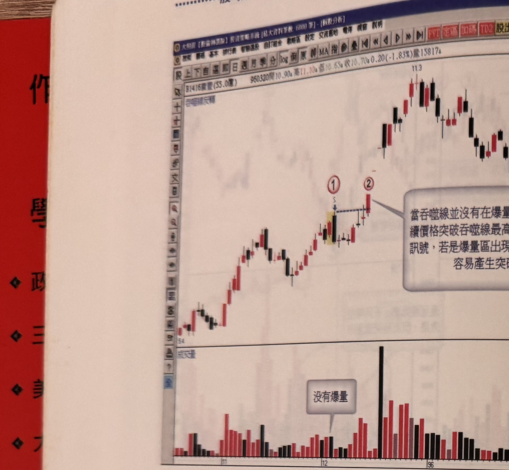
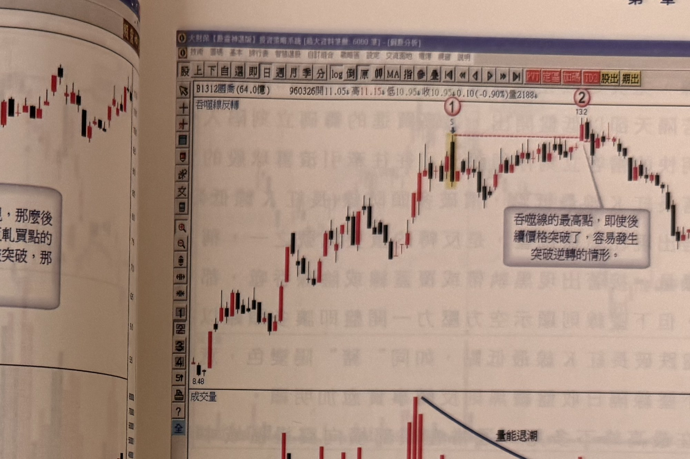
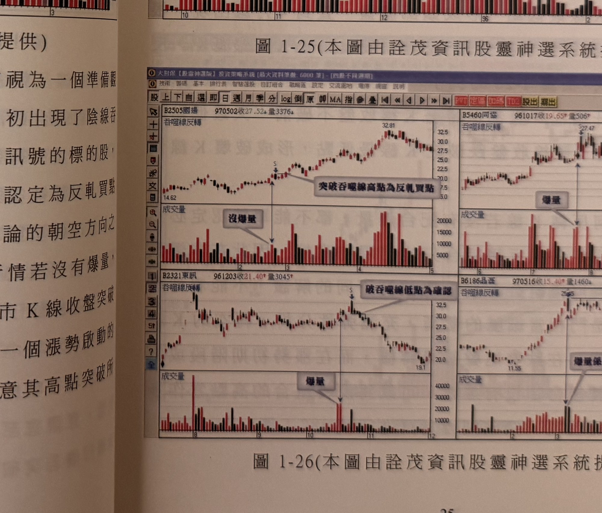

## p.24

**圖 1-24**（本圖由詮茂資訊股靈神選系統提供）

> 圖說（figure notes）: 一張個股日 K 線走勢圖（頁首標示「B1416廣豐(53.0億) 960320開10.90↓高11.10↓低10.65↑收10.70↓0.20(-1.83%)量15817」），左上角標示「吞噬線反轉」。行情自左下「5.4」附近上攻，於標示①（一根黃底標示K線，標「S」）出現陰線吞噬，藍色虛線水平自標示①延伸至標示②，標示②處K線收盤突破該虛線水平，灰底文字框「當吞噬線並沒有在爆量的區域裡出現，那麼後續價格突破吞噬線最高點，就形成反軋買點的訊號，若是爆量區出現吞噬線高點被突破，那容易產生突破…」以線指向此處。下方成交量圖以灰底文字框「沒有爆量」標示標示①附近量能並不突出。行情其後持續上攻至「11.3」附近再拉回整理。此圖對應本文：廣豐在95年12月初出現陰線吞噬但沒有爆量，應列為繼續觀察買進訊號的標的，後市K線收盤突破標示1吞噬線最高點，即可認定為反軋買訊號，如標示2所示。

只要不是爆量的位階，出現陰線吞噬不妨將它視為一個準備觀察買點的組合，以圖 1-24 廣豐為例，在 95 年 12 月初出現了陰線吞噬，但沒有爆量情形，應該把它列為繼續觀察買進訊號的標的股，後市只要 K 線收盤突破標示 1 吞噬線最高點，即可認定為反軋買點訊號，如標示 2 所示。從這個例子說明運用 K 線理論的朝空方向之反轉組合，當它出現時，對多方而言是個威脅，但行情若沒有爆量，反轉組合反成為一個確認買訊產生的濾網，只要後市 K 線收盤突破其最高點，就是多方攻克空頭所佈下的灘頭堡，另一個漲勢啟動的開始。因此，漲勢的中途出現陰線吞噬，宜密切注意其高點突破所帶來的買點契機。

以下附圖請讀者自行參考。

## p.25

**圖 1-25**（本圖由詮茂資訊股靈神選系統提供）

> 圖說（figure notes）: 一張個股日 K 線走勢圖（頁首標示「B1312國喬(64.0億) 960326開11.05↑高11.15↑低10.95↑收10.95↑0.10(-0.90%)量2188」），左上角標示「吞噬線反轉」。行情自左下「8.48」附近上攻，於標示①（一根黃底標示K線，標「S」）出現吞噬線反轉，紅色虛線水平自標示①延伸至標示②（「13.2」）處，灰底文字框「吞噬線的最高點，即使後續價格突破了，容易發生突破逆轉的情形」以線指向標示②處。下方成交量圖以弧形箭頭線標示「量能退潮」，指出量能自標示①附近高點逐漸萎縮。行情其後於標示②高點反轉走跌。此圖延續本文對吞噬線最高點即使被突破仍容易逆轉的說明。

**圖 1-26**（本圖由詮茂資訊股靈神選系統提供）

> 圖說（figure notes）: 四張個股日 K 線走勢圖以 2×2 排列，左上角均標示「吞噬線反轉」。左上圖（B2505國場，970502收27.52量3376）：於一根黃底標示K線（標「S」）處出現吞噬線反轉，灰底文字框「突破吞噬線高點為反軋買點」以線指向此處，下方成交量圖標「沒爆量」，行情其後持續上攻至「32.81」。右上圖（B5460同響，961017收19.65量506）：於高點「27.47」附近出現吞噬線反轉，成交量圖標「爆量」，以垂直箭頭直線指向對應量柱。左下圖（B2321東訊，961203收21.40量3045）：於一根黃底標示K線（標「S」）處出現吞噬線反轉，灰底文字框「破吞噬線低點為確認」以線指向後續K線跌破處，成交量圖標「爆量」，行情其後反轉一路走跌至「19.1」。右下圖（B6186晶豪，970516收15.40量1460）：於高點「25.5」附近出現吞噬線反轉，灰底文字框（部分文字被裝訂遮擋，約為「爆量峰點先前行情來比較」）以線指向對應成交量圖的量柱。此圖提供四個吞噬線反轉搭配爆量與否的實例，供讀者比較。
