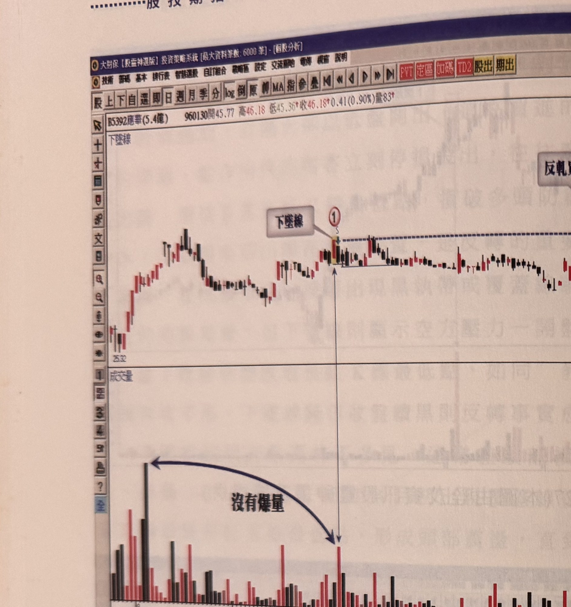
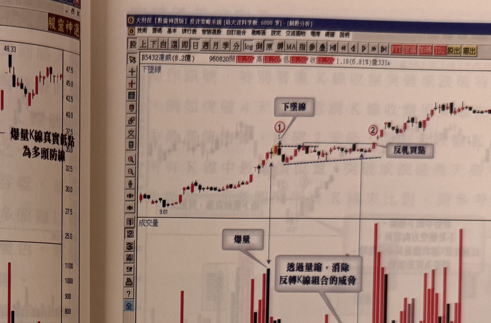

## p.28

**圖 1-29**

> 圖說（figure notes）: 一張個股日 K 線走勢圖（頁首標示「B5392應華(5.4億) 960130開45.77高46.18↓低45.36↑收46.18↑0.41(0.90%)量83」），左上角標示「下墜線」。行情自左側「25.32」附近上攻至高點，隨後回檔整理，在標示①（一根黃底標示K線，標「S」）處出現下墜線，灰底文字框「下墜線」以線指向此處，藍色虛線水平自標示①延伸向右。其後行情呈橫向盤整數週，在標示②（灰底文字框「反軋買點」，文字框「爆量K線真實低點為多頭防線」）處K線收盤突破標示①最高點，下方成交量圖以弧形箭頭線標示「沒有爆量」，指出此段期間量能並不突出（相對於左側8月初的高量），突破後成交量才明顯放大並持續上攻至「48.33」。此圖對應本文：應華(5392)在95年7月底發動快速上升漲勢，8月中旬拉回整理，9月中旬反彈時標示1位置出現下墜線反轉組合，但成交量未爆增，隔天及次二日K線收盤均未跌破前一根黑K線最低點，接著進行一個多月盤整，標示2位置K線收盤突破標示1最高點，反而是買進訊號，可在此處進場操作，並以突破K線（標示2）最低點為最大停損位置。

圖 1-29 應華(5392)在 95 年 7 月底發動一波快速上升漲勢，8 月中旬開始呈現拉回整理，9 月中旬產生反彈走勢，在標示 1 位置出現下墜線反轉組合，但成交量比起 8 月初的量而言，並沒有爆增現象，下墜線出現的隔天 K 線收盤也沒有進一步收低，次二日收盤雖低於下墜線最低點，卻沒有跌破前一根黑 K 線最低點，接著進行二個多月的盤整，當標示 2 位置 K 線收盤突破標示 1 最高點，反而是一個買進訊號，可以在此處進場操作，並以突破 K 線（標示 2）最低

## p.29

點為最大停損位置。

**圖 1-30**（本圖由詮茂資訊股靈神選系統提供）

> 圖說（figure notes）: 一張個股日 K 線走勢圖（頁首標示「B5432達威(8.2億) 960820開18.50↑高18.50↑低18.50↑收18.50↑1.18(6.81%)量331」），左上角標示「下墜線」。行情自左側「9.81」附近上攻，於標示①（一根黃底標示K線，標「S」）出現下墜線，灰底文字框「下墜線」以線指向此處，並向下連接成交量圖上的灰底文字框「爆量」標示的量柱。其後行情呈三角形收斂整理（藍色虛線標示上下邊界），成交量逐漸從爆量轉為量縮，灰底文字框「透過量縮，消除反轉K線組合的威脅」以線指向此段量縮區。標示②處K線收盤突破下墜線最高點，灰底文字框「反軋買點」以線指向此處。行情其後持續上攻至「31.39」。此圖對應本文：達威(5432)在96年4月呈現價量俱增的推升行情，標示1出現爆量下墜線，這的確是典型的反轉訊號，但後續發展並沒有出現大幅下挫，而是橫向震盪形成三角形整理型態，成交量也逐漸從爆量轉為量縮，當量縮的最低程度達到3月份發動漲勢前的低量水準時，價格突破下墜線最高點，形成反軋買點，立即做買進操作，並以突破K線最低點做為停損位置。

即使爆量的反轉組合，雖一開始是個標準的出脫訊號，但若市況發展卻沒有發生大幅下挫，而是呈現橫向震盪，其間的成交量持續萎縮至行情發動前籌碼穩定的低量水準，那麼反轉組合的危險被時間拉長而喪失威脅，如圖 1-30 的例子，達威(5432)在 96 年 4 月呈現價量俱增的推升行情，在標示 1 出現了爆量下墜線，這的確是典型的反轉訊號，但是後續發展並沒有出現大幅下挫，而是橫向震盪，形成三角形整理型態，成交量也逐漸從爆量轉為量縮，這顯示籌碼逐漸認同這個區間的價位，當量縮的最低程度達到 3 月份發動漲勢前的低量水準時，就要密切注意價格突破下墜線最高點的時機，只要突破 K 線一出現，便形成反軋買點，立即做買進操作，並以突破 K 線最低點做為停損位置，控制風險。
