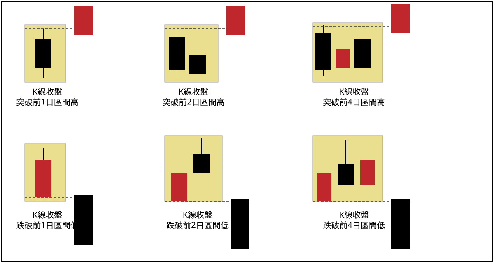

## p.30

**圖 1-31**（本圖由詮茂資訊股靈神選系統提供）

> 圖說（figure notes）: 一張個股日 K 線走勢圖（頁首標示「中視傳媒(0.0億) 970805開20.22↑高20.57↓低18.57↓收18.64↓2.00(-9.69%)量81172」），左上角標示「下墜線」。行情自左側高點持續下跌一波段，於標示①（一根黃底標示K線，標「S」，價位11.83）出現下墜線，藍色虛線水平自標示①延伸至標示②，灰底文字框「跌勢中的下墜線，不是朝空方向發展，反而注意K線收盤過其最高點時，轉變為買點訊號。」以線指向標示①附近。標示②處K線收盤突破該虛線水平。行情其後反轉大幅上攻。下方成交量圖顯示突破後成交量明顯放大。此圖對應本文：中視傳媒的下墜線發生在跌勢已發展一段時間之處，不必認為是空方威脅，反而是靠近底部的可能徵兆，可將下墜線最高點當作空方防守界限，一旦突破即成為買進訊號，如標示2位置。

圖 1-31 是發生在跌勢的狀況，出現下墜線沒有爆量，如標示 1 位置，而且位階是在跌勢已發展一段時間，此時的下墜線反轉組合，不必認為是空方的威脅，反而是靠近底部的可能徵兆，可以將下墜線的最高點，當做空方的防守界限，一旦後續行情突破此空方防線，則視為空方勢力瓦解，成為買進的訊號，如標示 2 位置。

## p.31

### 突破跌破的定義

在個人的系列內容裡，提到各種濾網結構來做為過濾雜訊，確認操作訊號，特別著重 K 線收盤突破或跌破特定天期區間的高低點，例如突破 4 天高，意謂 K 線收盤須突破先前 4 天區間內所有 K 線中最高價位置，跌破 2 天低，則表示收盤 K 線跌破先前 2 天區間內所有 K 線中最低價位置，突破或跌破幾天高非指特定某一天 K 線的最高點，而是期間所有 K 線來比對，請參考圖 1-32 說明。

**圖 1-32**

> 圖說（figure notes）: 一張示意圖，白底黑框，橫向兩排各三個子圖。上排標題依序為「K線收盤突破前1日區間高」「K線收盤突破前2日區間高」「K線收盤突破前4日區間高」：每個子圖以黃底方框圈出前 N 天的 K 線（分別為1根、2根、4根黑K線，方框上緣以黑色虛線標示其區間最高點），方框右側另有一根紅K線（實體及影線）其部分或全部高於該虛線，代表收盤突破前N日區間高點。下排標題依序為「K線收盤跌破前1日區間低」「K線收盤跌破前2日區間低」「K線收盤跌破前4日區間低」：同樣以黃底方框圈出前N天的K線（紅K線為主，1、2、4根），方框下緣以黑色虛線標示其區間最低點，方框右側一根黑K線其收盤低於該虛線，代表收盤跌破前N日區間低點。此圖對應本文：突破或跌破幾天高/低，並非指特定某一天K線的最高/最低點，而是該期間內所有K線比對出的最高/最低點。

### 第二節　K線慣性操作

行情的表現方式是眾多 K 線的結合，行情的推展透過 K 線觀察，存在某種慣性的軌跡，所謂"軌跡"可能是行情在漲跌過程呈現當根 K 線不跌破前一天 K 線最低點的方式在行進，或者（跌勢）當根 K 線無法突破前一根 K 線最高點，這種現象不斷地複製，形成 K
