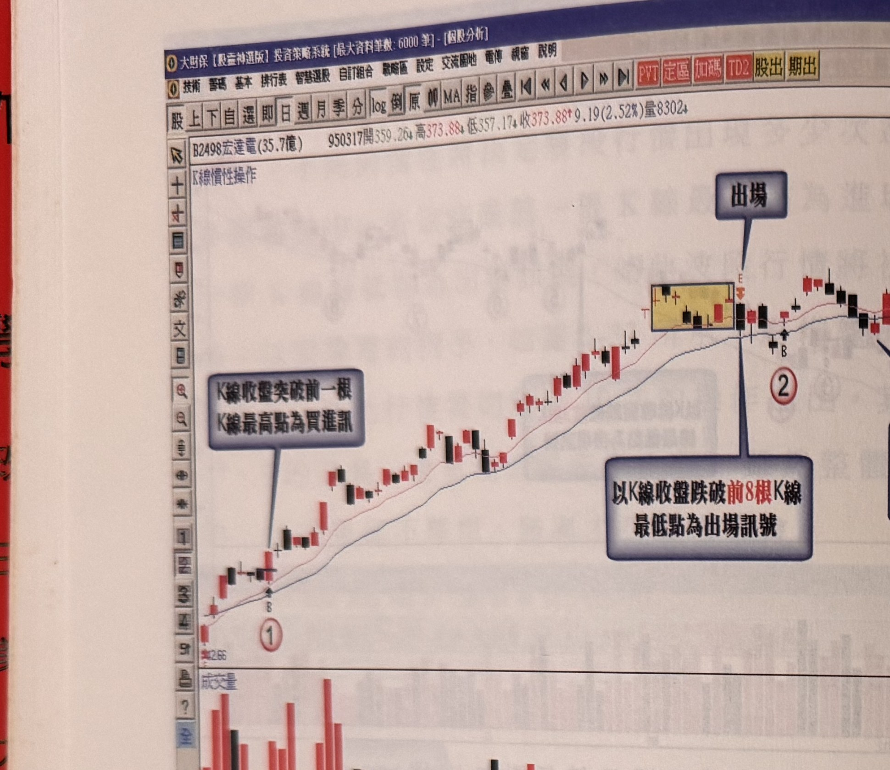

## p.34

**圖 1-36**（以跌破 8 根 K 線低點為出場）

> 圖說（figure notes）: 同一檔個股（B2498宏達電(35.7億) 950317開359.26高373.88↓低357.17↓收373.88↑9.19(2.52%)量8302）的日 K 線走勢圖，左上角標示「K線慣性操作」。行情自左下「42.66」起，標示①處（灰底文字框「K線收盤突破前一根K線最高點為買進訊」指向此處）為買進點。行情持續上攻，於一黃底方框標示的K線群處，灰底文字框「出場」以線指向其後的賣出K線（標E），另一灰底文字框「以K線收盤跌破前8根K線最低點為出場訊號」以線指向標示②附近的出場點。此圖對應本文：以跌破前8根K線最低點為出場訊號時，整段行情只被分為2次操作，似乎把整段行情獲利入袋。

同宏達電的例子，我們把進場訊號仍設定為突破前一根 K 線最高點，而把出場模式改為以跌破前 2 日 K 線最低點，其整個行情的操作次數將稍降為 8 次，如圖 1-34 所示，其中標示 3、5、7 將造成小虧的狀況，整體操作還是賺，已改善圖 1-33 的交易次數及虧損次數；再進一步討論，如果進場訊號仍維持以突破前一天 K 線最高價為訊號，出場模式則改為跌破前 4 天區間 K 線最低點為訊號，如圖 1-35 所示，交易次數降為 6 次，標示 3、4 及 5 位置仍出現小虧情形，不過標示 1、2 及 6 位置的買進操作獲利已大幅提升；當進場條件不變，把出場模式更改為跌破前 8 根 K 線區間最低點時，如圖 1-36 所示，整段行情只被分為 2 次操作，似乎把整段行情獲利入袋。從以

## p.35

上的例子，了解到當進場的模式固定下，出場機制設定的條件影響操作交易的次數及獲利的規模甚大，越不喜歡承受較長天數的跌破條件，其獲利反而縮小，風險也相對增加。也說明一個制定操作策略的方向，以突破某天期 K 線最高點為進場訊號，不見得要以相同天期為出場條件。

根據這種 K 線的慣性模式，只要制定多空趨勢的界定條件，就可以不斷地執行循環式的操作，其結果必然是獲利的，差別在於根據多少天期的出場設定將影響獲利的多寡；至於多空趨勢的判別，可以採取兩條均線的交叉狀況加以界定，例如以 MA10 和 MA20 之黃金交叉為多頭趨勢，以其死亡交叉為空頭趨勢，或者拉長為 MA20 和 MA60，均線計算基礎可以用簡單平均方式，或以平滑指數計算 EMA 模式，來擬定趨勢的判斷。

[本頁下半部為空白，僅見背面印刷透印之模糊痕跡（非本頁內容，未轉錄）]
