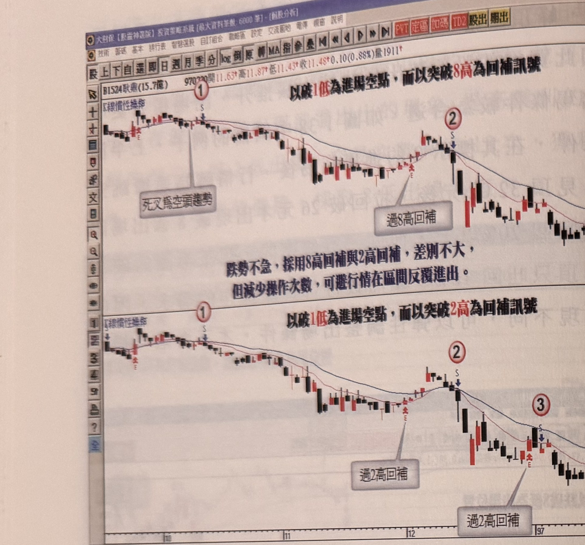
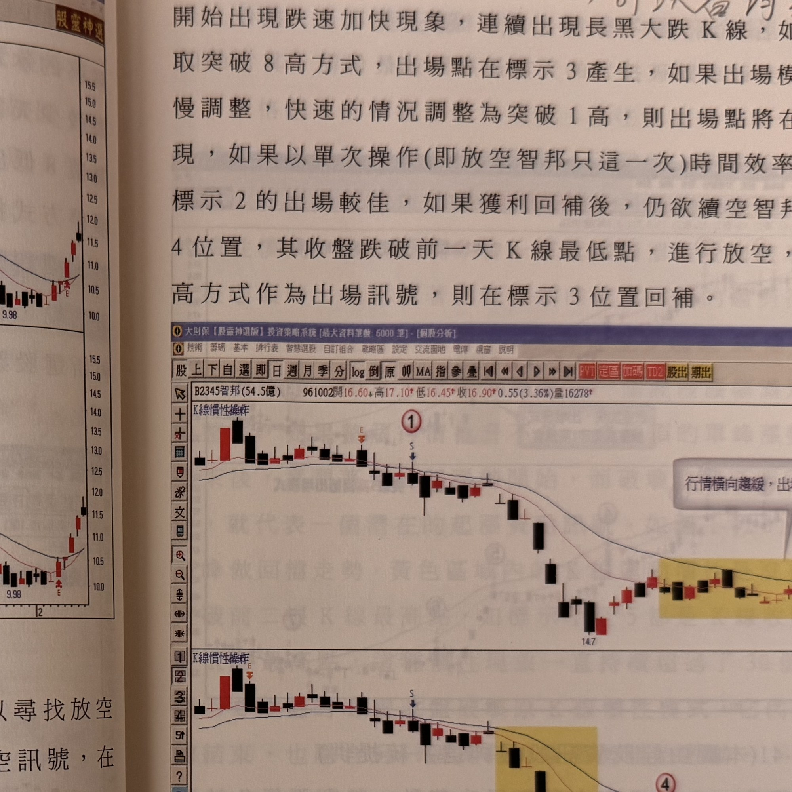

Note: p.39 top margin has a reader's handwritten annotation (not printed book text):
"進出場K線改以漲跌速度來判斷 → 可以看均線的斜率". Not transcribed into body text below.
Note: on p.38 two sentences are highlighted in orange by a reader ("當均線呈現死亡交叉時..." and
"出場模式仍然根據個別股跌速的快慢加以調整"); the highlighting itself is not book content and is
not reproduced, only the underlying printed text is transcribed.

## p.38

**圖 1-39**（本圖由詮茂資訊股靈神選系統提供）

> 圖說（figure notes）: 同一檔個股（B1524耿鼎(15.7億) 970220開11.63↑高11.87↑低11.43↑收11.48↑0.10(0.88%)量1911）的兩張日 K 線走勢圖上下並排，左上角均標示「K線慣性操作」。上圖標題「以破1低為進場空點，而以突破8高為回補訊號」：標示①（灰底文字框「死叉為空頭趨勢」，標S）為放空進場點，行情持續走跌後於標示②（灰底文字框「過8高回補」）處出現反彈回補訊號，行情其後止跌回升。灰底文字框補充說明：「跌勢不急，採用8高回補與2高回補，差別不大，但減少操作次數，可避行情在區間反覆進出。」下圖標題「以破1低為進場空點，而以突破2高為回補訊號」：同樣自標示①（標S）進場放空，此模式下回補點提前，沿途以紅圈數字②③④標示多次進出（灰底文字框「過2高回補」分別標示於標示②③附近）。此圖對應本文：耿鼎(1524)例子中跌速不快，用上半圖的8高出場，不會像下半圖2高出場模式出現標示3及4的反覆進出，可減少被盤整局反覆進出的次數。

當均線呈現死亡交叉時，操作方向轉為空頭操作，以尋找放空點為主，當死叉後 K 線跌破前一天 K 線最低點，形成放空訊號，在台股大部份個股都限制盤下不得放空，因此可利用隔天平盤進行放空動作，出場模式仍然根據個別股跌速的快慢加以調整，緩步走跌者，用突破 8 根 K 線最高點為出場訊號，較不被盤局擾亂進出，如果個別股出現跌速加快，以大黑 K 進行，則可以調整為突破 2 根 K 線最高點為出場訊號，若連續跌停板下墜，甚至以過 1 天高為出場訊號。如圖 1-39 為例，跌速不快，用上半圖的 8 高出場，不會像下半圖 2 高出場模式出現標示 3 及 4 進出，減少被盤整局反覆進出的次數。再如圖 1-40 智邦為例，標示 1 為均線死亡交叉後，收盤跌破前一天 K 線最低點，形成一個放空訊號，之後行情橫向震盪 6 天後

## p.39

開始出現跌速加快現象，連續出現長黑大跌 K 線，如果出場模式採取突破 8 高方式，出場點在標示 3 產生，如果出場模式依據跌速快慢調整，快速的情況調整為突破 1 高，則出場點將在標示 2 位置出現，如果以單次操作（即放空智邦只這一次）時間效率而言，自然用標示 2 的出場較佳，如果獲利回補後，仍欲續空智邦，可以在標示 4 位置，其收盤跌破前一天 K 線最低點，進行放空，重新以突破 8 高方式作為出場訊號，則在標示 3 位置回補。

**圖 1-40**（本圖由詮茂資訊股靈神選系統提供）

> 圖說（figure notes）: 同一檔個股（B2345智邦(54.5億) 961002開16.60↓高17.10↑低16.45↑收16.90↑0.55(3.36%)量16278）的兩張日 K 線走勢圖上下並排，左上角均標示「K線慣性操作」。上圖標題涉及「以突破8高為出場訊號」：標示①（標S）為均線死亡交叉後跌破前一天K線最低點的放空點，行情持續走跌至「14.7」附近，其後於一段黃底標示的橫向盤整區（灰底文字框「行情橫向趨緩，出場模式採突破8高較合適」）處以突破8高方式標示③回補。下圖標題涉及「以突破1高為出場訊號」：同樣自標示①放空，灰底文字框「跌速加快，出場模式調整為突破1高」以線指向一段跌速加快的區域，標示②（標S）為突破1高提前回補點，其後標示④為再次進場放空點。此圖對應本文：智邦(2345)例子中，若出場模式採突破8高方式，出場點在標示3產生；若依跌速快慢調整為突破1高，出場點則提前在標示2位置出現，單次操作以標示2出場較佳；獲利回補後若仍欲續空，可在標示4位置（收盤跌破前一天K線最低點）重新放空，並以突破8高方式出場，則在標示3位置回補。

用均線的交叉決定多空方向時，可以使用一般的簡單平均計算基礎，也可用平滑指數型的計算基礎，個人習慣用平滑指數型的兩條均線來作為判斷工具，天期的設定可以用 10 日均線對 20 日均線，或者用 20 日均線對 50 日均線，這是習慣性問題，沒有硬性規定。在使用 K 線慣性操作，訊號 K 線並沒有限制多頭訊號必為紅 K 線，
