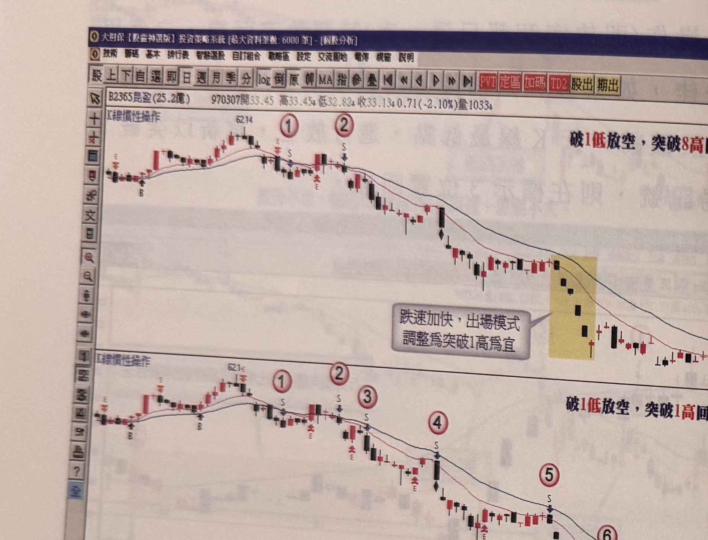
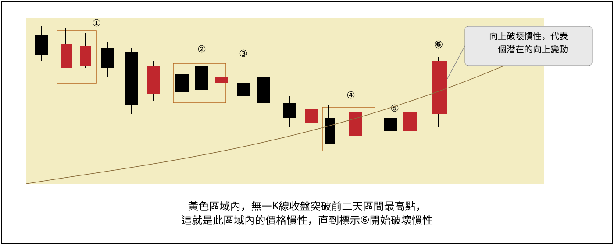

## p.40

或空頭訊號必為黑 K 線，亦不限制 K 線影線長短，因此，操作上只問收盤是否符合突破或跌破採定的天期最高點或最低點，其它的限制可以忽略。

**圖 1-41**（本圖由詮茂資訊股靈神選系統提供）

> 圖說（figure notes）: 同一檔個股（B2365昆盈(25.2億) 970307開33.45高33.45↓低32.82↓收33.13↓0.71(-2.10%)量1033）的兩張日 K 線走勢圖上下並排，左上角均標示「K線慣性操作」，標題分別為「破1低放空，突破8高回補出場模式」及「破1低放空，突破1高回補出場模式」。上圖：行情自左側高點「62.14」附近，標示①②為放空/出場相關點位（標S/E），行情持續走跌，於一段黃底標示區（灰底文字框「跌速加快，出場模式調整為突破1高為宜」）後止跌，標示③回補，最低約「28.96」。下圖：同樣自「62.14」附近，沿途以紅圈數字①②③④⑤⑥⑦標示更多次進出操作（各標S/E），操作次數明顯較上圖多。此圖對應本文：昆盈(2365)例子中，上半圖採取8高出場模式，整段跌勢出現3次操作訊號；下半圖為採取1高出場的短線模式，整段跌勢操作次數達7次，兩者都可以獲利，差別只在於獲利的多寡。

對於行情的變化，有些投資人稍微風吹草動，就緊張得急於要出場，那出場模式設為 8 高，恐怕會倍感壓力沉重，忍耐的承受度不能一概而論，可能短進短出的方式，比較符合其容易緊張的個性，但相對地獲利的規範較小，這並非不可行，時間累積久了，仍是贏家；從圖 1-41 中可看出，上半圖採取 8 高出場模式，整段跌勢出現 3 次操作訊號，而下半圖為採取 1 高出場的短線模式，整段跌勢操作次數達 7 次，兩者都可以獲利，差別只在於獲利的多寡。你適合哪一種出場模式，自己的屬性是沉穩型還是緊張型，應該儘早定位，以選定合適的作戰策略。

## p.41

### 第三節　慣性破壞的買訊介紹

價格陷入回檔整理的格局時，往往會被突然的一根上漲 K 線引誘進場，但後續行情卻仍然脫離不了盤整，造成停損或者苦等真正突破，行情處於整理格局，價格上上下下的過程中，也會存在 K 線的慣性模式，而這種現象會一直延續到慣性受到破壞為止，而當慣性被破壞時，也意謂著盤整區間的結束，新的趨勢行情啟動。

而這種慣性持續的時間，先界定至少超過 20 個交易日，代表盤整持續超過一個月，這顯然是處在一個波段漲幅滿足後，進行的中段整理，如果整個行情推升不是一波到頂的單峰漲勢，那麼當盤整結束後，意謂著另一個漲勢開始，而破壞整理區間所存在的 K 線慣性，就代表一個潛在的起漲買點訊號。如圖 1-42 的說明，在從某個高峰做回檔走勢，黃色區域內的 K 線運動慣性是沒有一根 K 線收盤突破前二根 K 線最高點，如標示 1 至 5 都是 K 線收盤沒有突破前二根 K 線最高點，這種慣性現象一直持續超過了 30 個交易日，直到標示 6 位置的 K 線收盤破壞原 K 線慣性模式，它代表一個盤整格局的結束，也隱含另一個具有明顯漲勢開始啟動。

**圖 1-42**

> 圖說（figure notes）: 一張示意圖（無價格座標軸、無軟體視窗外框，屬概念性排版圖），黃色區域內畫出一段連續下跌的 K 線階梯，多處以細框線圈出相鄰兩根 K 線組合，並以紅圈數字①②③④⑤依序標示，代表「K線收盤沒有突破前二根K線最高點」的慣性持續區間；行情末端出現一根紅K線突破黃色區域上緣，標示⑥，右側灰底文字框「向上破壞慣性，代表一個潛在的向上變動」以線指向此處。圖下方文字說明：「黃色區域內，無一K線收盤突破前二天區間最高點，這就是此區域內的價格慣性，直到標示6開始破壞慣性」。此圖對應本文：從某高峰回檔走勢中，黃色區域內K線運動慣性是沒有一根K線收盤突破前二根K線最高點（標示1至5皆符合），此慣性持續超過30個交易日，直到標示6位置K線收盤破壞原慣性模式，代表盤整結束、新漲勢可能啟動。
