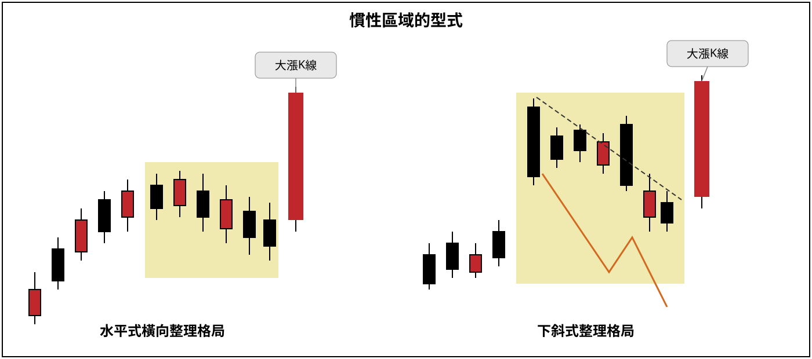
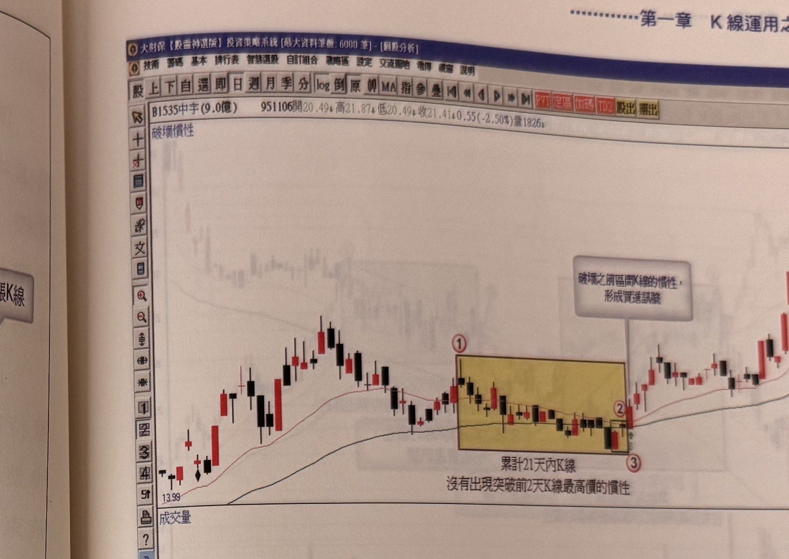

## p.42

**圖 1-43**

> 圖說（figure notes）: 一張示意圖，白底黑框，標題「慣性區域的型式」，左右兩組 K 線示意圖。左圖「水平式橫向整理格局」：K 線先呈階梯狀上攻，接著進入一段黃色底色標示的區間，其中 K 線上下界距離不大，呈水平橫向整理，區間右端一根紅底方框標示「大漲K線」的長紅K線向上突破。右圖「下斜式整理格局」：K 線同樣先階梯狀上攻，進入黃色底色標示的區間後，區間上緣以黑色虛線連接數個高點形成一條向右下傾斜的下降趨勢線，區間內另有一條橙色「倒N字型」折線（先下、後小反彈、再下）代表三段式修正走勢，區間右端一根紅底方框標示「大漲K線」的長紅K線向上突破（同時突破下降趨勢線）。此圖對應本文：盤整格局分為水平式橫向整理（上下界距離不大，維持在二成以內空間擺盪，幅愈小愈好）與下斜式整理格局（其上界峰點可連成下降趨勢線，價格拉回呈現三段式修正，形狀像倒"N"型，此格局宜突破其下降趨勢線）兩種類型。

盤整格局分為二種類型，如圖 1-43 所示，左圖水平式橫向整理格局，上下界距離不大，維持在二成以內的空間擺盪，上下區間震幅愈小愈好，則當慣性被破壞後的突破效果愈好。另一種如右圖的下斜式整理格局，價格拉回呈現三段式修正，形狀像〝N〞型，其上界峰點可連成下降趨勢線，在這種下斜式整理格局出現破壞慣性現象時，最好能夠突破其下降趨勢線。

而在慣性破壞時，要注意改變慣性的 K 線的品質，應以大漲 K 線為佳，幅度過小的 K 線則需要在二日內出現大漲 K 線為宜，再者買進操作的同時，以該根大漲 K 線最低點做為停損位置，或者運用階梯出場模式移動停損停利位置。

## p.43

以圖 1-44 中宇日線圖為例，95 年 7 月底價格從階段頂峰開始進行回跌，8 月上旬出現短暫性反彈，從標示 1 至標示 2 位置，累計 21 個交易日內 K 線不曾出現突破前 2 日 K 線最高價，這就是此期間的 K 線運動慣性，慣性未被破壞之前，行情可能繼續維持這個不過 2 日高的模式，直到標示 3 位置改變狀態，破壞慣性，意謂價格即將打破 7 月底以來的沉悶盤整，這提供一個操作買進的機會，只要後續價格 K 線收盤沒有跌破標示 3 之 K 線最低點，或者沒有跌破以標示 3 之 K 線收盤向下 7%為停損位置，另一段大漲行情就值得期待。

**圖 1-44**（本圖由詮茂資訊股靈神選系統提供）

> 圖說（figure notes）: 一張個股日 K 線走勢圖（頁首標示「B1535中宇(9.0億) 951106開20.49↑高21.87↑低20.49↑收21.41↑0.55(-2.50%)量1826」），左上角標示「破壞慣性」。行情自左側「13.99」附近上攻，於標示①處開始進入一段黃底方框標示的橫向整理區（文字「累計21天內K線，沒有出現突破前2天K線最高價的慣性」標示於方框下緣），區間持續至標示②，灰底文字框「破壞之前區間K線的慣性，形成買進訊號」以線指向標示③（方框右下角），標示③的K線收盤向下突破區間，改變原有慣性。其後行情反轉上攻，持續墊高至「23.07」附近。下方成交量圖顯示突破後量能放大。此圖對應本文：中宇(1535)日線圖，95年7月底價格從階段頂峰回跌，8月上旬短暫反彈，標示1至2累計21個交易日內K線不曾突破前2日最高價，直到標示3位置破壞此慣性，形成操作買進機會，只要K線收盤不跌破標示3最低點或向下7%停損位置，另一段大漲行情值得期待。
