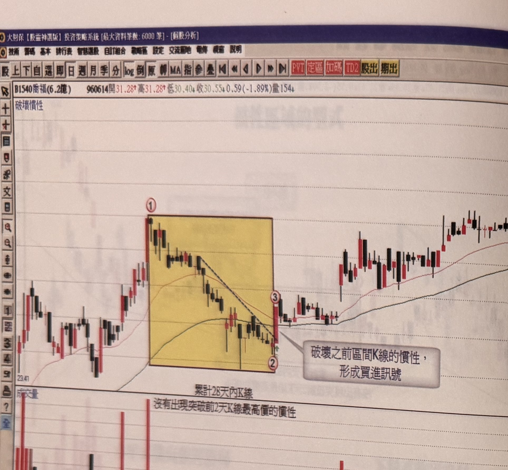
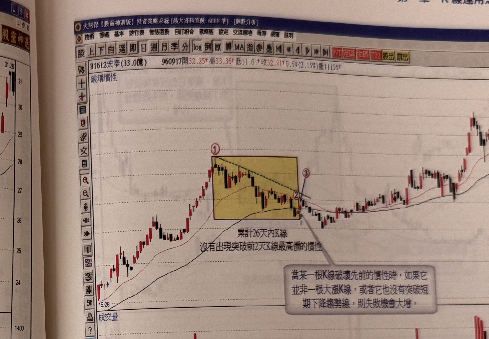

## p.44

**圖 1-45**（本圖由詮茂資訊股靈神選系統提供）

> 圖說（figure notes）: 一張個股日 K 線走勢圖（頁首標示「B1540喬福(6.2億) 960614開31.28↑高31.28↑低30.40↓收30.55↓0.59(-1.89%)量154」），左上角標示「破壞慣性」。行情自左側「23.41」附近上攻，於標示①（價位「31.28」）進入一段黃底方框標示的整理區間，區間內以黑色虛線連接高點形成下斜趨勢線，區間下緣延伸至標示②，灰底文字框「破壞之前區間K線的慣性，形成買進訊號」以線指向標示③（區間右端），文字「累計28天內K線，沒有出現突破前2天K線最高價的慣性」標示於區間下方。標示③的K線收盤同時突破區間、突破下斜趨勢線，其後行情反轉上攻，持續墊高至圖右側高點。下方成交量圖顯示末段放量走高。此圖對應本文：喬福(1540)在96年1月底長紅爆量後拉回整理，從標示1的28元越盤越低，至標示2為止累計28天內K線不曾收盤突破2日高，整理格局呈現下斜狀況，在標示3位置出現大漲K線，收盤一舉突破11天高，並且突破整理區間內形成的下降趨勢線，破壞之前區間K線的慣性，產生買進訊號。

圖 1-45 喬福(1540)在 96 年 1 月底長紅爆量後，開始進行拉回整理，從標示 1 位置的 28 元越盤越低，至標示 2 為止累計 28 天內 K 線不曾收盤突破 2 日高，整理格局呈現下斜狀況，在標示 3 位置出現大漲 K 線，收盤一舉突破 11 天高，並且突破整理區間內形成的下降趨勢線，破壞之前區間 K 線的慣性，慣性的買點，只要標示 3 的大漲 K 線最低點沒被跌破，就應該持波段的角度去持有，好好賺一波。

## p.45

前面提到整理格局若非水平式震盪，那麼它的整理區間可能採取倒"N"字修正，這種狀況若後續 K 線破壞區間的 K 線慣性，也最好同時突破區間內的下降趨勢線，才是理想的買進訊號。如圖 1-46 的例子，從標示 1 至標示 2 的區間，共累計了 26 天 K 線收盤無法過 2 日高，改變 26 天以來的慣性時，先觀察它是不是一根大漲 K 線，再觀察它是否突破區間內所形成的下降趨勢線，如果二者都無法符合，那麼它的買進訊號失敗機會就大增，透過這層濾網結構，可以有效地摒除錯誤的訊號。

**圖 1-46**（本圖由詮茂資訊股靈神選系統提供）

> 圖說（figure notes）: 一張個股日 K 線走勢圖（頁首標示「B1612宏泰(33.0億) 960917開32.25↑高33.36↑低31.61↑收32.81↑0.69(2.15%)量11156」），左上角標示「破壞慣性」。行情自左側「15.26」附近上攻，於標示①進入一段黃底方框標示的整理區間，區間內以黑色虛線連接高點形成下斜趨勢線，延伸至標示②，標示③位於區間右上緣，文字「累計26天內K線，沒有出現突破前2天K線最高價的慣性」標示於區間下方，灰底文字框「當某一根K線破壞先前的慣性時，如果它並非一根大漲K線，或者它也沒有突破短期下降趨勢線，則失敗機會大增。」以線指向標示②③附近。標示③的K線收盤同時突破區間、突破下斜趨勢線，其後行情反轉上攻，持續墊高至「35.49」附近。下方成交量圖顯示末段放量走高。此圖對應本文：宏泰(1612)例子中，標示1至標示2的區間共累計26天K線收盤無法過2日高，改變此慣性時，須先觀察標示3是否為大漲K線、是否突破區間內的下降趨勢線，二者皆須符合才是理想買進訊號，否則失敗機會大增。
