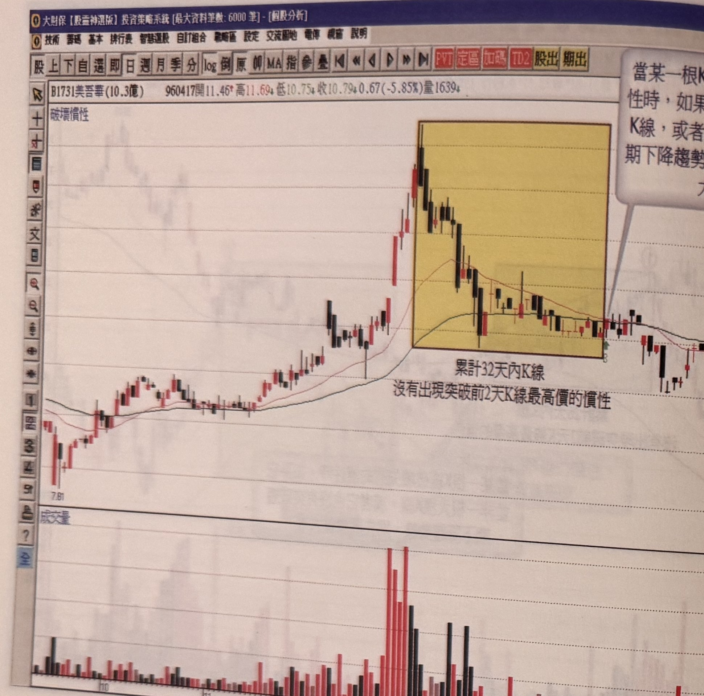
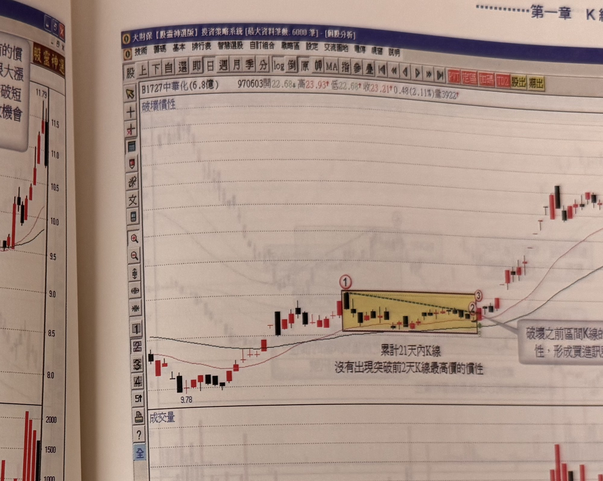

## p.46

**圖 1-47**（本圖由詮茂資訊股靈神選系統提供）

> 圖說（figure notes）: 一張個股日 K 線走勢圖（頁首標示「B1731美吾華(10.3億) 960417開11.46↑高11.69↓低10.75↓收10.79↓0.67(-5.85%)量1639」），左上角標示「破壞慣性」。行情自左側「7.81」附近上攻，於一段黃底方框標示的整理區間（文字「累計32天內K線，沒有出現突破前2天K線最高價的慣性」標示於區間下方）內呈下斜狀盤整，區間右上角灰底文字框（延伸自上頁內容，續接「當某一根K線破壞先前的慣性時，如果它並非一根大漲K線，或者它也沒有突破短期下降趨勢線，則失敗機會大增。」）以線指向區間右緣（標「B」）。區間右緣的K線收盤雖突破2日高，但只是小漲K線，且未穿越均線、未突破區間內下降趨勢線，其後行情僅呈小幅反彈整理，未出現大漲確認。此圖對應本文：美吾華(1731)拉回整理格局中，標示"B"的買進訊號K線收盤雖突破2日高，但因其僅是小漲K線，且後續也沒有跟隨出大漲K線來補強、也沒有穿越均線、未對下降趨勢線做出突破動作，多項濾網都不符合，因此不宜貿然進場做買進動作。

當拉回整理格局的 K 線運動慣性被破壞時，絕對需要檢視破壞慣性的 K 線品質，除了它必須是大漲 K 線外，另一個值得注意的細節，破壞慣性之 K 線收盤宜突破均線壓力，最好突破下降趨勢線，如圖 1-47 所示，標示"B"的買進訊號雖其 K 線收盤突破 2 日高，但是它是一根小漲 K 線，同時其後續也沒有跟隨出大漲 K 線來補強小漲 K 線的不足，再者它並沒有穿越均線，仍受均線壓力掣肘，它同時也沒有對區間內的下降趨勢線做出突破動作，它同不符合，自然不宜貿然進場做買進動作，因此，幾項濾網都不符合。

## p.47

**圖 1-48**（本圖由詮茂資訊股靈神選系統提供）

> 圖說（figure notes）: 一張個股日 K 線走勢圖（頁首標示「B1727中華化(6.8億) 970603開22.68↓高23.93↑低22.68↑收23.21↑0.48(2.11%)量3922」），左上角標示「破壞慣性」。行情自左側「9.78」附近上攻，於標示①進入一段黃底方框標示的窄幅水平整理區間（區間內以黑色虛線連接高點形成一條微幅下斜趨勢線），延伸至標示②，灰底文字框「破壞之前區間K線的慣性，形成買進訊號」以線指向標示③（區間右端）。標示③的K線收盤同時突破2日高、突破區間內下降趨勢線，其後行情反轉大幅上攻，持續墊高至「34.76」附近。下方成交量圖顯示突破後量能明顯放大。此圖對應本文：中華化(1727)在97年3月至4月之間的整理格局即屬於窄幅橫向整理，長達21天的區間內K線不曾出現收盤突破2高的情形，因此當標示3破壞慣性的K線出現，它是一根大漲K線，即代表其通過濾網結構，可以在其收盤前進行買進動作，並以該K線最低點做為停損，或以固定7%為停損位置。

在價格盤整型態中，窄幅區間且呈現水平式整理是最好的觀察目標，窄幅區間代表不管獲利回吐的賣壓或持續抱股的籌碼，都是和緩而穩定的，只要整理形狀是呈現橫向窄幅區間盤整者，其突破不須再以區間內之下降趨勢線檢定，只須觀察破壞慣性模式之 K 線是否為大漲 K 線；如圖 1-48 中華化(1727)在 97 年 3 月至 4 月之間的整理格局即屬於窄幅橫向整理，長達 21 天的區間內 K 線不曾出現整理格局收盤突破 2 高的情形，因此當標示 3 破壞慣性的 K 線出現，它是一根大漲 K 線，即代表其通過濾網結構，可以在其收盤前進行買進動作，並以該 K 線最低點做為停損，或以固定 7%為停損位置。
