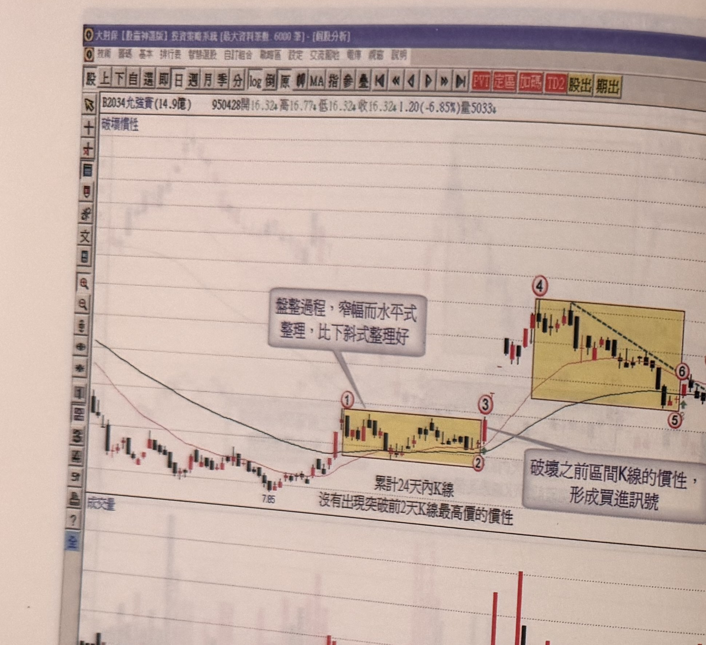
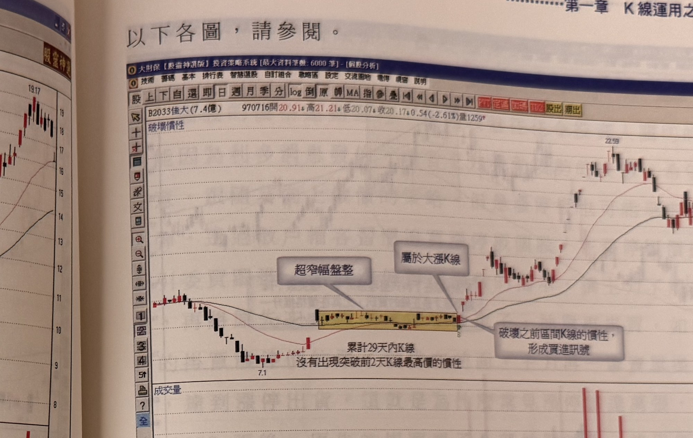
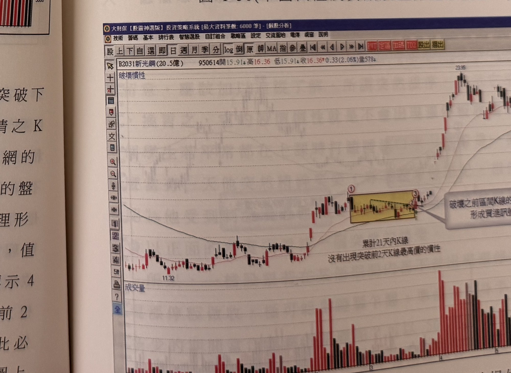

## p.48

**圖 1-49**（本圖由詮茂資訊股靈神選系統提供）

> 圖說（figure notes）: 一張個股日 K 線走勢圖（頁首標示「B2034允強實(14.9億) 950428開16.32↓高16.77↓低16.32↓收16.32↓1.20(-6.85%)量5033」），左上角標示「破壞慣性」。行情自左側高點下滑至「7.85」附近止跌回升，於標示①進入一段黃底方框標示的窄幅水平整理區間（文字「累計24天內K線，沒有出現突破前2天K線最高價的慣性」標示於區間下方），灰底文字框「盤整過程，窄幅而水平式整理，比下斜式整理好」以線指向此區間，延伸至標示②。標示③的K線收盤突破區間，其後行情快速上攻至標示④，再進入第二段黃底方框標示的下斜式整理區間（區間內以黑色虛線連接高點形成下降趨勢線），延伸至標示⑤，灰底文字框「破壞之前區間K線的慣性，形成買進訊號」以線指向標示⑥，但標示⑥K線收盤未突破區間內下降趨勢線，須待其後標示⑦之K線收盤才突破該下降趨勢線、突破標示⑥K線最高點，呈現"N"字形狀的突破。其後行情反轉大幅上攻，持續墊高至「18.17」附近。此圖對應本文：允強實(2034)在95年1月呈現橫向水平式整理格局，累計24天K線收盤沒有突破2日高的慣性，標示3以大漲K線改變慣性時值得追進做多，快速上升後2月初進行另一波拉回（下斜式整理），至標示5呈現不過2高的慣性，直到標示6之K線收盤突破了前2高，而且是一根大漲K線，但是它沒有突破其下降趨勢線，因此必須等到標示7之K線收盤突破了標示6之K線最高點，呈現"N"字形狀的突破，方可進場做買進動作。

如果出現破壞區間慣性之 K 線，雖屬大漲 K 線，但沒有突破下降趨勢線，最好再做進一步的確認檢定，換言之，其後續行情之 K 線收盤有無進一步呈現"N"字形狀的突破，使原先不符合濾網的訊號獲得再確認。如圖 1-49 允強實在 95 年 1 月呈現突破均線後的盤整格局，累計有 24 天 K 線收盤沒有突破 2 日高的慣性，且整理形狀屬於橫向水平式整理，因此，標示 3 以大漲 K 線改變慣性時，值得追進做多，快速上升後，2 月初進行另一波的拉回動作，從標示 4 至標示 5 呈現不過 2 高的慣性，直到標示 6 之 K 線收盤突破了前 2 高，而且是一根大漲 K 線，但是它沒有突破其下降趨勢線，因此必須等到標示 7 之 K 線收盤突破了標示 6 之 K 線最高點，方可進場做買進動作，使得線圖上呈現"N"字形狀的突破。

## p.49

以下各圖，請參閱。

**圖 1-50**（本圖由詮茂資訊股靈神選系統提供）

> 圖說（figure notes）: 一張個股日 K 線走勢圖（頁首標示「B2033佳大(7.4億) 970716開20.91↓高21.21↓低20.07↓收20.17↓0.54(-2.61%)量1259」），左上角標示「破壞慣性」。行情自左側高點下滑至「7.1」附近止跌，其後上攻進入一段黃底方框標示的超窄幅水平整理區間（灰底文字框「超窄幅盤整」以線指向此處，文字「累計29天內K線，沒有出現突破前2天K線最高價的慣性」標示於區間下方），區間右端K線收盤突破，灰底文字框「屬於大漲K線」及「破壞之前區間K線的慣性，形成買進訊號」分別以線指向突破點。其後行情反轉大幅上攻，持續墊高至「22.59」附近後回落整理。此圖為窄幅水平整理格局經大漲K線突破、直接構成有效買進訊號的範例（不需等待N字形二次確認）。

**圖 1-51**（本圖由詮茂資訊股靈神選系統提供）

> 圖說（figure notes）: 一張個股日 K 線走勢圖（頁首標示「B2031新光鋼(20.5億) 950614開15.91↓高16.36低15.91↓收16.36↑0.33(2.06%)量578」），左上角標示「破壞慣性」。行情自左側「11.32」附近盤整後上攻，於標示①進入一段黃底方框標示的窄幅整理區間（區間內以細虛線連接形成微幅下斜通道，文字「累計21天內K線，沒有出現突破前2天K線最高價的慣性」標示於區間下方），延伸至標示②，標示③處K線收盤突破區間，灰底文字框「破壞之前區間K線的慣性，形成買進訊號」以線指向此處。其後行情反轉大幅上攻，持續墊高至「23.95」附近。此圖同樣為窄幅整理格局遭大漲K線突破、形成買進訊號的範例。
