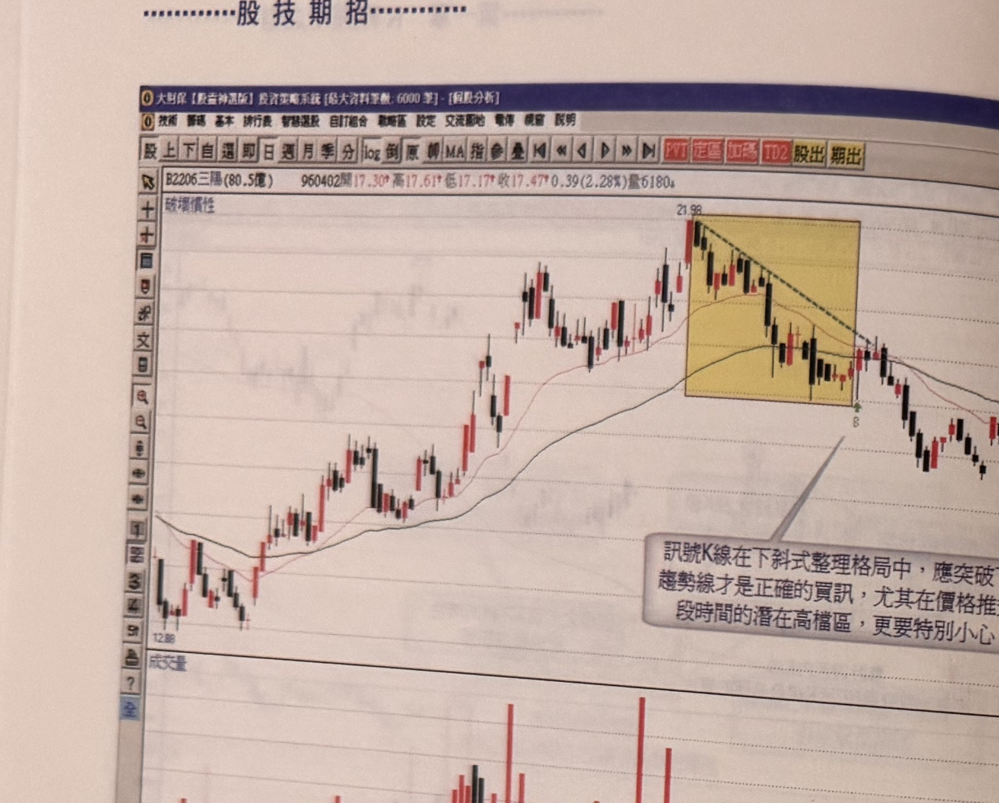
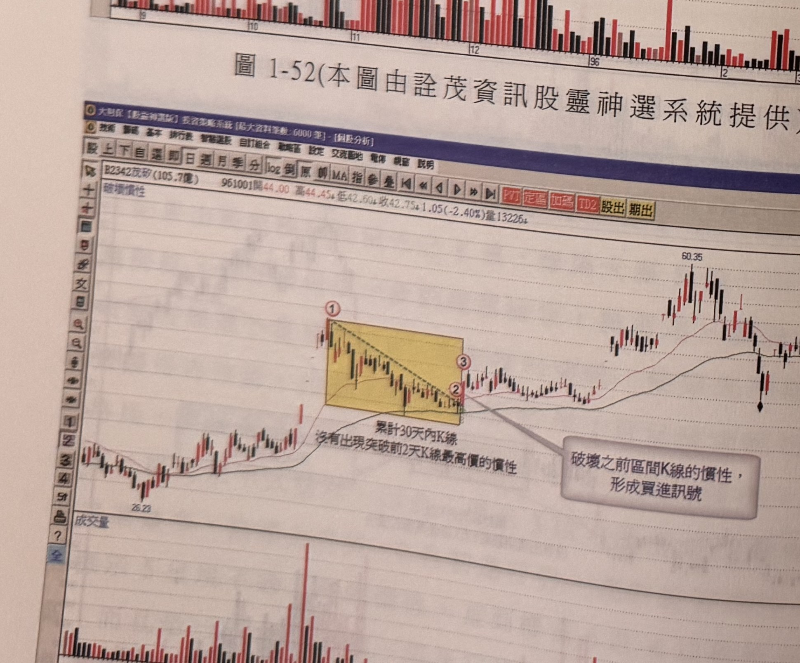

## p.50

**圖 1-52**（本圖由詮茂資訊股靈神選系統提供）

> 圖說（figure notes）: 一張個股日 K 線走勢圖（頁首標示「B2206三陽(80.5億) 960402開17.30↑高17.61↑低17.17↑收17.47↑0.39(2.28%)量6180」），左上角標示「破壞慣性」。行情自左側「12.88」附近上攻，於高點「21.98」處進入一段黃底方框標示的下斜式整理區間（區間內以黑色虛線連接高點形成下降趨勢線），區間右下角標「B」，灰底文字框「訊號K線在下斜式整理格局中，應突破下降趨勢線才是正確的買訊，尤其在價格推升一段時間的潛在高檔區，更要特別小心。」以線指向標「B」處的K線（該K線收盤雖突破區間下緣但未突破下降趨勢線）。其後行情並未延續上攻，反而反轉走跌。此圖為反例：說明訊號K線在下斜式整理格局中，若僅突破區間、未突破下降趨勢線，並非正確買訊，尤其在價格推升一段時間後的潛在高檔區更要特別小心，本例後續行情即反轉下跌，印證此一警示。

## p.51

**圖 1-53**（本圖由詮茂資訊股靈神選系統提供）

> 圖說（figure notes）: 一張個股日 K 線走勢圖（頁首標示「B2342茂矽(105.7億) 961001開44.00高44.45↓低42.60↓收42.75↓1.05(-2.40%)量13226」），左上角標示「破壞慣性」。行情自左側「26.23」附近上攻，於標示①進入一段黃底方框標示的下斜式整理區間（區間內以黑色虛線連接高點形成下降趨勢線），延伸至標示②，標示③處K線收盤同時突破區間與下降趨勢線，灰底文字框「破壞之前區間K線的慣性，形成買進訊號」以線指向標示②③附近，文字「累計30天內K線，沒有出現突破前2天K線最高價的慣性」標示於區間下方。其後行情反轉大幅上攻，持續墊高至「60.35」附近後回落整理。此圖為正例：與圖1-52對照，說明訊號K線同時突破區間與下降趨勢線時，才是正確有效的買進訊號。

### 第四節　首度漲停的買進思考

個股的價格運動過程，漲停收盤往往令投資人關切的焦點，它可能因為利多消息發佈，或者主力發動攻勢的表態，希望引起散戶注意，跟隨其向上做價的策略，但是漲停板也可能是主力出貨的煙幕彈，透過散戶帽客習慣追買漲停板個股，在漲停板價採取鎖住，吸引委買跟進，由於漲停掛進張數的揭示，讓主力了解多少單子跟進，再將原先主力鎖漲停的委賣單子，抽單再掛買，如此一來，散戶的掛買漲停價的單子就排在前面，主力再一筆賣單掛出，如此一來，達到漲停出貨，這就是為什麼常見漲停鎖達萬張，突然一筆掛出 2000 張後，原先的掛買單子全部抽單消失，終場極少還能收漲停，因此漲停板要看在什麼位階發生，以及成交量是否增爆過快過大，低檔爆不爆量的漲停價，往往價比量重要，而高檔爆量漲停往往量的失控比價格更具觀察價值。

一些平常表現不受到投資人注意的股票，突然出現漲停板是值得留意的，應該加以追蹤了解，所謂突然漲停，表示它平常不習慣漲停，換言之，它的股價慣性就是不會出現漲停板收盤的狀況，如同一個學生若平常都在上課時打瞌睡流口水，這若是一種常態現象，那麼當有一天他突然精神奕奕，專心聽課做筆記，相信每個人會直覺認為他受到刺激或者他受到開悟了，不管背後有何種原因促成，都會以正面的角度去看待一個突然的轉變。

所以，一檔股票若在某個期間內都不曾出現漲停板收盤，突然出現漲停板做收，極可能是睡獅乍醒，準備大展身手的宣告，而應以多少的期間當作觀察的基礎呢？可以 50 個交易日做為慣性期間的判斷，如果股價在 50 天以上都不曾出現漲停，那麼當它首度出現漲停時，這個訊號往往是它展開快速上漲的號角，但要注意以下二
