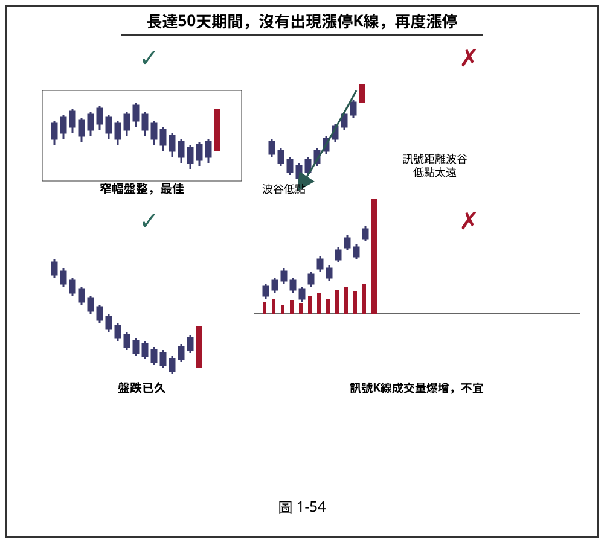
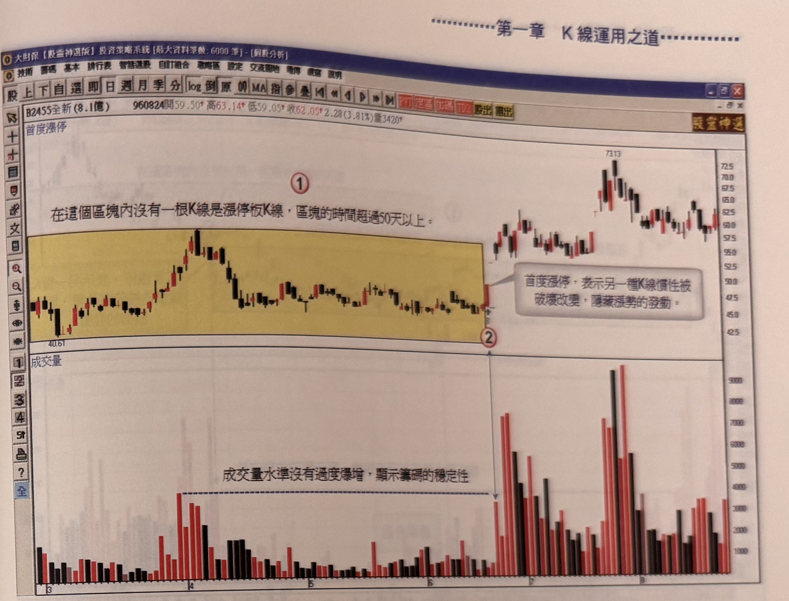

## p.52

點濾網結構：一、訊號產生的成交量不宜爆量，不宜激增超過一整年的最大量 1.5 倍以上，因為一檔籌碼穩定的個股，發生漲停時，不應出現急著獲利了結的籌碼釋出。二、首度漲停的位階不宜離最近一個波谷低點過遠，應該在 20% 的範圍內發生，距離波谷低點過遠，容易變為最後長紅線，反而不是買點，而是出貨調節的時機。請見圖 1-54 說明。

**圖 1-54**

> 圖說（figure notes）：schematic 示意圖，標題「長達50天期間，沒有出現漲停K線，再度漲停」。共四個示意小圖，各以打勾（✓）或打叉（✗）標示好壞：左上圖標「窄幅盤整，最佳」（✓），畫出一段窄幅盤整的黑紅K線區間，末端出現一根長紅K線並以箭頭指向，箭頭旁文字「訊號距離波谷低點太遠」（此為反例說明文字誤植於好例上方，實際上該箭頭指向的是右上圖）；右上圖呈現價格自「波谷低點」緩步爬升一段後才出現長紅K線，標示「訊號距離波谷低點太遠」（✗，因距離波谷過遠）；左下圖標「盤跌已久」（✓），股價持續下跌後末端出現長紅K線；右下圖標「訊號K線成交量爆增，不宜」（✗），末端長紅K線下方成交量柱明顯爆量放大。四圖用意在對比首度漲停K線出現時機與成交量狀況的好壞。

圖 1-54 標示首度漲停的狀況，最好是股價經過一段期間的橫向窄幅盤整，區間內成交量呈現逐漸收斂現象；左下圖盤跌已久，在某一價位後，價格呈現緩跌緩彈現象，這兩種狀況下，出現首度漲停板的效果最好，它表示溫吞的走勢即將因漲停板 K 線出現而改觀，值得做為理想的切入買進訊號。右上圖首度漲停出現在距離波谷低點太遠，是較具風險的切入點，右下圖如果爆量而且盤中漲停價數度開開關關，則主力出貨調節跡象愈明顯；因此，首度漲停板出現在位階上的判斷及爆量都要小心評估。

## p.53

**圖 1-55(本圖由詮茂資訊股靈神選系統提供)**

> 圖說（figure notes）：大財神【股霸神選版】投資策略系統軟體截圖，左上報價列標示「B2455全新(8.1億) 960824開59.50 高63.14 低59.05 收62.05 2.28(3.81%)量3420」。上方為 K 線圖，左側標示「首度漲停」，黃色區塊內以文字說明「①在這個區塊內沒有一根K線是漲停板K線，區塊的時間超過50天以上。」黃色區塊涵蓋一段先上漲至高點又緩步下滑、隨後窄幅盤整的K線走勢（起點價位40.61）；區塊右緣標示紅色圓圈數字「②」，該處出現一根K線並以線條指向白底文字框「首度漲停，表示另一種K線慣性被破壞改變，隱藏漲勢的發動。」此後價格續漲，中途一度拉回整理（出現一根帶下影線的十字線），再急漲至最高點7313附近，隨後高檔震盪收尾（右緣價位約60-62）。下方成交量圖中，黃色區塊對應期間成交量普遍偏低，並以水平虛線及文字「成交量水準沒有過度爆增，顯示籌碼的穩定性」標示；標示②之後（首度漲停當日起）成交量明顯放大，出現多根遠高於虛線水準的紅色與黑色量能柱，其中在後段另有一波更高的量能高峰（黑紅相間的爆量區）。

以圖 1-55 全新(2455)為例，在 96 年標示 1 的黃色區域內，超過 50 個交易日不曾出現漲停板 K 線，成交量也自 4 月起逐漸收斂，在 4 月中旬後，價格一直處在窄幅區間內來回震盪，只要一上漲出現紅 K 線，即伴隨緩步拉回，極度沉悶難搞，直到標示 2 位置突然出現收盤漲停板，它就可能不再像先前只是一日行情的窘況，而是打破以往的慣性，宣告它的攻勢自此開始，標示的漲停板 K 線就是打破慣性的重要關鍵，投資人往往會忽略這樣的發動訊號，認為它可能又是另一次的一日行情，雖然在先前總是騙人，但是當紮紮實實能又是另一次的一日行情，雖然在先前總是騙人，但是當紮紮實實的漲停板出現時，務必要睜開心眼，想獲利的機會點就在此，風險是一支停板，獲利卻是不可限量，操作原來就是尋找可以獲利的潛在機會，加以風險管理而已。漲停在每一天都容易看到，但是當它累積超過 50 天來的首度漲停，要好好掌握。
